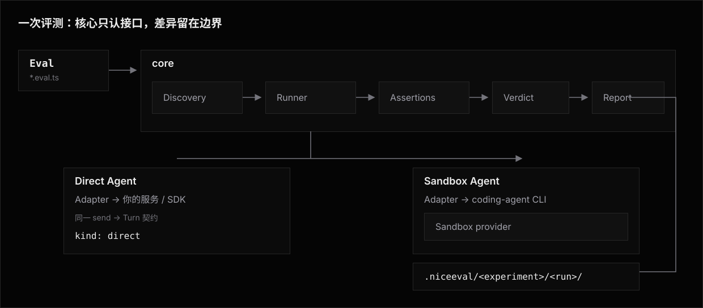

# Architecture

NiceEval 把一个评测过程拆成四段职责:**发现**要跑什么、**驱动**被测对象产生结果、**评分**得出判定、**封存与检查**事实并按需交付。
核心拥有这四段里对所有被测对象都一样的部分;被测对象的差异被收进 `Agent`(契约)/ `Adapter`(你写的实现)/ `Sandbox` 三层。

本篇给出这条边界的模块分层、数据流,以及一次运行的端到端时序。

## 系统总览



四段职责是**单向数据流**。
发现产出一批 `Eval`，运行器逐个对 Agent `send` 得到 `Turn`，Assertion collector 形成检查结果。
判定规则把执行错误与全部断言折叠成一个互斥 Verdict。Experiment Host 再通过 Record Host
封口不可恢复的事实；Verdict、Score 和采用理由都是 Core、Assertions 或运行 outcome 的语义，
不各自形成 durable family。Assertion 和 Judge 不知道 transport 是 HTTP 还是沙箱 CLI，只消费
`Turn` 与显式材料。

## 模块分层

模块按职责分层,`agents/` 与 `sandbox/` 是两个「特殊性收容所」:

```
src/
├─ index.ts                 # 公开导出:defineEval / defineConfig / defineExperiment
├─ define.ts                # define 一族的家(eval / config / experiment / agent / sandbox)
├─ types.ts                 # 核心类型的汇聚出口(各域类型的家在各自目录)
│
├─ context/                 # `t` 上下文的构建(TestContext / SessionHandle / TurnHandle)
├─ expect/                  # 值断言库(includes / equals / matches / similarity …)
├─ assertions/              # Assertion collector、作用域检查与证据完整性
├─ judge/                   # 裁判模型配置、调用与响应解析
├─ verdict/                 # Assertion 结果到 Attempt 四态的折叠
│
├─ agents/                  # —— 连到哪个被测对象、协议怎么说,全部特殊性在这里 ——
│                           #   Agent 接口、内置 adapter、官方转换器、拼装件
├─ sandbox/                 # —— 在哪里跑、如何隔离,全部特殊性在这里 ——
│                           #   Sandbox 接口、resolve、各 provider
│
├─ o11y/                    # transcript 归一化 → 标准事件流;OTLP 接收与归一;派生事实与成本
├─ eval/{host,cli}/         # Eval catalog Host 与 list contribution
├─ experiment/host/         # experimentHost；公开 Host SDK 与 Experiment CLI contributions
├─ runner/                  # experimentHost 后的调度、生命周期、缓存与 receipt 实现
├─ coordination/            # coordinationHost；execution claim 与 Record lease 协调
├─ record/                  # recordHost + Record CLI；SQLite 持久布局、Definition 与 publication owner
├─ inspection/              # 固定第一方 operations；query/view 的唯一业务语义 owner
├─ view/                    # 第一方 runtime browser shell；不提供作者组件层
├─ project/                 # projectHost + init contribution
├─ docker/cli/              # Docker 专属 profile/cache/BuildKit 命令树
│
└─ cli/                     # 中立 router、应用 capability、bootstrap 与唯一 runtime
```

逐个能力落到哪个文件,查 [Source Map](source-map.md) ——那份表是源码定位的单一出处,本图只表达分层。

边界规则一句话:**`agents/` 和 `sandbox/` 之外的任何文件,都不应出现 agent 名字或 sandbox 名字的行为分支。
** 核心拿到的是接口,不是名字。

## 程序设计边界：纯函数、完整 ADT 与 Effect

NiceEval 的内部实现只有两类计算。
不读取外部世界的身份、选择、链接、规划、指纹和结果折叠保持为纯函数；文件、网络、进程、动态 import、并发、取消与资源生命周期进入 `Effect`。
公共作者 callback 与 Provider SDK 按 ABI 返回的 `Promise`，只在最外层以 `Effect.tryPromise` 或 `Effect.promise` 适配一次。
内部调用链不再传递 `Promise`、`try/catch` 或 `Effect.runPromise`。

数据从作者输入依次流经 Definition、Discovered、Linked、Planned、Attempt 与 Record。
每个阶段只接收上一个阶段的完整输出，并用判别联合表示互斥状态；可选字段只表示该业务事实确实可以缺席，不能同时承担“尚未计算”“不适用”“失败”或旧版本占位。
阶段推进只创建新值，不回写前一阶段，也不在下游重新选择、重新链接或猜默认值。

`unknown` 只允许出现在 JavaScript、动态 import、JSON、文件格式、SDK 返回和第三方 throw 这些真实的不可信边界。
边界用 Effect Schema 或等价的品牌守卫立即解码成领域类型；解码失败进入具名的 tagged error，解码成功后的内部函数不再接收 `unknown`、手写字段探测或双重类型断言。

资源由 `Scope.Scope` 持有，并以 `Effect.acquireRelease` 或 `Effect.addFinalizer` 登记在 `Effect.scoped` 所关闭的生命周期中。
成功、typed failure、defect 与 interruption 都会关闭同一作用域，但在单个 Attempt 封口前保持分离。

Sandbox acquire、Sandbox lifecycle、Agent ensure、作者执行和逆序 finalizer 都在这条结构化生命周期里组合。
Effect-native Library API 继续返回 Effect；只有 CLI / application 入口可以启动 runtime。
作者与 Provider 的公开 callback 若按其 ABI 返回 Promise，只能在 callback 最外层适配一次；内部模块不得保留 Promise facade 或自行启动第二套 runtime。

## 哪些层稳定，哪些层允许变化

稳定不是靠“业务最近没变”，而是靠每层只承诺自己的最小 identity，并让变化停在真正的 owner：

| 层 | 长期承诺 | 允许怎样变化 | Effect 的角色 |
|---|---|---|---|
| Host composition SDK | `experimentHost`、`coordinationHost`、`recordHost` 与 `inspectionHost` 各拥有窄操作面 | CLI 与深度应用集成只组合这些入口，不穿透到 Runner、reader、SQLite schema 或 browser transport | 在 Host 边界组合 Layer、`Scope.Scope`、typed error 与 interruption |
| Record Core 与 family | Record identity、Run/Slot 分母、Attempt origin/reference、Member action、Logical Seal 与 family identity | Core 或某个 family 的持久语义变化时发布相邻 data migration；physical schema 独立演进 | 精确解码、closure 校验、worker、lease、short transaction 与 Scope-bound I/O |
| family 读取结果 | `available`、`not-recorded`、`invalid` 三态；unknown/future bytes 在 session 前形成 `unsupported-format` | 新字段只能在所属固定 family 的契约内演进 | 单项问题保持局部，不把 Root 或其它 family 伪造为失败 |
| Producer / behavior | 产生所属固定事实，并维护 input/config/reuse identity | Assert-first evaluator、Plugin、matcher 与 Sandbox chain 可以独立变化 | 承接执行、并发与 interruption |
| Inspection | 固定 operation ID、穷尽 request/result、分母、missing、Evidence 与三种 comparison | NiceEval 为新的第一方问题增加 operation；用户不能注册公式、SQL 或统计 descriptor | 每次 operation 在短 Record reader 内关闭 plain-data result；Scope 外没有 reader 或 Content capability |
| Delivery | machine query codec 与 runtime View active revision | 第一方 UI 可以变化，不形成 Page、component、theme、route 或 renderer ABI | query 与 View 各自拥有呈现层，不共享 session lifecycle |

## 公开 Host composition SDK

下面各 package export 都是公开、受支持的高级 Host composition SDK。NiceEval CLI 是它们的一个调用者；
深度应用集成者也可以按相同边界组合。普通 Eval 与 Record 作者通常不导入这些 Host entry。

| 导入面 | Host 操作 | CLI 映射 | 不授予的能力 |
|---|---|---|---|
| `niceeval/eval/host` | `evalHost.catalog` | `list` | Eval definition、discovery loader 或 Runner 类型 |
| `niceeval/experiment/host` | `catalog`、`check`、`invocation.plan/run`、`debug`、`rename`、`teardown`、`accept`、project-current 与 Invocation status 操作 | `check`、`exp`、`debug`、`accept`、`session` | 重新拼装 selector、Runner、lease 或 adoption 内部状态 |
| `niceeval/coordination/host` | `coordinationHost.claimExecution`、`coordinationHost.enterRecordRead`、`coordinationHost.enterRecordAppend`、`coordinationHost.enterRecordMaintenance` | dispatch claim 与 Record lease | generic lock 或 portable Record writer |
| `niceeval/record` / `niceeval/record/host` | Definition、batch/stream write、bounded/stream read、Seal、snapshot 与显式 migration | Record I/O、snapshot、maintenance | SQLite schema、raw connection、family SQL 或 writable published facts |
| `niceeval/inspection/host` | 固定 discovery、runs/attempt detail 与 comparison operations | `query`、`view` | 任意 SQL、Analysis DSL、Page、component、theme 或 browser transport |
| `niceeval/project/host` | `projectHost.initialize` | `init` | Node filesystem、manifest loader 或模板写入细节 |

“公开、受支持”只说明这些高层操作可由外部 Host 调用并受契约保护，不把 durable schema 变成开放扩展面。
`defineRecordAttachment` 与 `defineRecordAttachmentPersistence` 是可组合 SPI；Host 只接受 exact definition brand
绑定的 persistence。它们不组成另一个总管式应用框架：每个入口只拥有表中所属层的操作和资源边界。

## CLI feature composition

CLI 是命令的中立 host，不是所有命令背后领域能力的 owner。根程序只拥有 argv 的根命令切分、稳定 help 顺序、
重复命令拒绝、统一输出端口和唯一 Effect runtime。Core 与每个具体 feature 各自导出不可变的 command
contribution；Node composition edge 显式组合这些值，并提供 handler 所要求的 Layer。

```ts
interface CliCommandContribution<R, E> {
  readonly name: string;
  readonly summary: string;
  readonly options: Readonly<Record<string, CliOptionDefinition>>;
  readonly run: (argv: readonly string[]) => Effect.Effect<number, E, R>;
}
```

Contribution 是纯值，不是 `Context.Service`、全局 registry 或模块加载副作用。
它也不携带或私自提供 Layer。

Host SDK 同样是普通冻结对象：operation 是返回 `Effect` 的函数，不因为“属于一个领域”就变成 Service。
只有需要由应用替换或注入的外部 I/O、平台能力和有状态资源才使用 `Context.Service`，例如文件系统、终端、Docker
client 或 Record coordination。`Layer` 只负责在 bootstrap 组合这些 service；真正持有连接、lease 或 finalizer
的实现才使用 scoped Layer。一个 Feature 可以依赖另一个 Host 或 Service，但不能在 handler 内自行 `provide`
一套 Live Layer，也不能启动内层 runtime。

每个 contribution 连同 parser shape、help metadata 和 handler 一起冻结。根 router 聚合这些 schema，只为让
`parseArgs` 在不知道命令位置时取得 indexed tokens；第一个 positional token 是 root，投影时只删除这一个
token，root 前后的 option 与 `--` 都保持原顺序。聚合 parse 不是 option 的语义验收：命令取得投影后的 argv
后必须用自己的 schema 再做语法检查。因此其它命令也拥有的 `--json` 不会让 `sandbox list --json` 合法，它会在
Sandbox 读取凭据、配置或 Provider 之前以 unknown option 失败。

Feature 自己拥有子命令、有效 option、command help、human/JSON presentation 与 typed failure。应用级
`--help` / `--version`、最终 failure/exit、OS signal 和唯一 Effect runtime 仍由 CLI core/bootstrap 拥有。
因此中央 CLI 不知道 `docker profile`、`docker cache inventory` 或 `docker cache gc` 的参数。

Docker CLI contribution 和 Docker Sandbox adapter 可以依赖同一个 Docker-owned client capability；
这不把 Docker image、BuildKit、profile 或 GC 提升为通用 Sandbox 能力。E2B、Vercel 与未来 provider 可以
贡献完全不同的命令树，也可以不贡献命令。命令描述和路由保持纯函数；无状态 client 使用普通 Layer，
真正持有连接、builder 或 finalizer 的实现才使用 scoped Layer。提供 Layer 不得使 `niceeval --help`
或普通 core command 在启动时探测 Docker。

`niceeval debug` 有独立的只读命令数据流：

```text
argv
  ↓
experimentHost.debug()
  ↓
Host 内部：唯一选择 → link → physical planning
  ↓
commandPlan
  ↓
terminal / JSON
```

CLI 只调用 `experimentHost.debug()` 并呈现闭合 commandPlan，不构造或直连 Runner。该 Host 操作不创建
Invocation、Run、Record、lease、Sandbox 或 build。

Record Core 只证明磁盘导航、引用和 Member action 成立，不证明 Attempt 适合当前算法。固定 family
只保存各自的不可恢复事实；family 消费方穷尽四态。旧 Record 需要升级时，只有
`recordHost.current.openRead()` 的 `record-migration-required` 错误引导用户运行 migrate，不把迁移伪装成
某个 family 的值。

完整分层见 [Record · 三个演进边界](feature/record/architecture.md#三个演进边界)。

## 一个授权面，宽接口与能力守卫

NiceEval 只有一个写 eval 的入口 `defineEval`。
Direct 与 Sandbox 不是两个 Eval 函数；同一份 Eval 可以被两类 Agent 运行，因此 `test(t)` 始终收到同一个宽 `TestContext`。
只有 `t.sandbox` 需要运行时能力守卫：

| | Direct Agent | Sandbox Agent |
|---|---|---|
| 典型目标 | 进程内函数、SDK、HTTP / RPC 服务 | coding-agent CLI + Sandbox |
| Task 形态 | `t.send(...)` 序列 | 同左——沙箱型的任务照样写在 `t.send(...)` 里,没有另一种任务格式 |
| `t` 可用什么 | `send`/`reply`/`calledTool`/`judge`;调用 `t.sandbox` 立即报能力错误 | 同一宽接口,且 `t.sandbox` 可用(文件 IO / 命令执行 / 结果断言 / 归因断言) |
| 评分手段 | expect + 作用域断言 + judge | 上述 + 手工在沙箱里跑命令,再用 `t.check(result, commandSucceeded())` 判定 |
| 共享 | **Assertion、Judge、Verdict、Runner、Reporter、Config、Record 格式全部共享** | 同 → |

这张表是整个架构的中心论点:**两种范式只在"Agent 的构造证据(`kind` 与 `send` 实际做到了什么)"上不同,在"如何判分、如何调度、如何写入"上完全一致。
** 所以它们能住在同一个入口、同一个库里,而不是两个入口或两个库。

## `t` 上下文：宽接口与构造证据

`test(t)` 收到的 `t` 对每个 Agent 都暴露同一套宽接口(`TestContext`),但每个方法**实际能不能读到数据**由 Agent 的构造证据决定,不是声明式的能力位——这是唯一的运行时守卫例外:

- 任何 Agent → `t.check(value, match)`、scope Assertion、`t.log`、`t.skip`、`t.signal`、`t.judge`，以及 `t.send` / `t.reply` / `t.newSession`。多轮取决于 `send` 是否接上 `ctx.session` 的续接存取器，不取决于声明。
- `send` 吐出 `action.*` 事件 → `turn.calledTool` / `turn.toolOrder` / `turn.usedNoTools` 有数据可断；跨 Turn 的顺序断言放在 `session`，`t` 只保留全 Attempt 的出现与计数聚合。没吐事件时，正断言自然不命中，负断言按事件出处的完整性证明判断可信度（见[断言证据与完整性](feature/adapters/architecture/evidence.md)）。
- `defineSandboxAgent` 构造(`kind: "sandbox"`)→ `t.sandbox`:文件 IO、宿主传输与归因断言。
  `writeText` / `readText` / `writeBytes` / `readBytes`、`upload*` / `download*`、`runCommand` / `runShell`,以及 `fileChanged` / `notInDiff` 等归因断言都收在这一个命名空间下。
  评文件内容先 `readText` 读成字符串,再在根级 `t.judge` 显式传 `{ input, output }`;是否改过该文件由 `fileChanged` 判定。
  非沙箱型 agent 调用这组方法会立即报错(`capabilityGuard`)——这是唯一仍需要运行时拦截的能力。

## 一次 Invocation,端到端

以 Sandbox Agent 的 Eval 为例。
Direct Agent 跳过 Sandbox 创建、变更分类账与 diff 采集：

1. **加载配置。
   ** 对支持 Eval 替换的字段按 CLI → experiment → eval → `niceeval.config.ts` → 默认值求值。
   不支持 Eval 替换的字段按各自专题声明的层级求值；见[配置与凭据的边界](#配置从代码来凭据从进程变量来)。
2. **发现。
   ** 扫 `evals/`,收集 `*.eval.ts` 与 `*.eval.tsx`;据路径推导 id,排序;按过滤器(id 前缀 / `--tag`)筛。
3. **由 Experiment Host 建立运行。
   ** CLI 调用 `experimentHost.plan()` 或 `experimentHost.run()`。Host 计算带 domain 的
   input/config identity，并在其实现内通过 `recordHost.current.createRun()` 建立带 `startedAt` 与完整
   expected SlotId 的目标 Run draft。draft 没有完成标识，因此不是已发布 Run。
4. **reuse planning。
   ** `experimentHost` 在内部把当前 ProjectTarget、ExecutionTarget 和 Record Host 交给 Runner。
   具名 policy 把每个 Slot 穷尽判为 reuse 或 gap。source barrier、禁止回扫、`reuseContract`、
   Verdict、fingerprint、timeout、`--rerun` 与 `--keep-sandbox` 都属于该 policy，不属于 Record。
   完整契约见 [Execution reuse planning](feature/experiments/cache.md)。

   planner/scheduler 只接收 gaps；Host 保留完整 Slot decision。
5. **有界并发调度。
   ** 全局至多 `maxConcurrency` 个 gap execution 在飞(全局信号量);设了 `maxConcurrency` 的实验另有一道实验级信号量,自己排队、不影响同批其它实验(见 [Runner](runner.md#调度有界并发))。
   重试不是 attempt 级耗时启发式：turn 重试只包 `agent.send` 且受受理证据门约束，Sandbox provisioning 与幂等文件 IO 各守自己的执行体；完整边界见[执行失败分类](feature/error-classification/architecture.md)与[Sandbox](feature/sandbox/architecture.md#provisioning-失败与重试)。
6. **准备 Sandbox,交给 `test(t)`。**
   沙箱型按固定顺序完成下面几步:
   - Provider 按配对唯一的 template 启动 Sandbox 实例。
   - 按 owner 顺序执行两层作者 layer 的 `prepare()` 命令(template owner 先、另一 owner 后,装二进制、预热、题目准备;这一步在变更分类账参照点之前,准备输出不进入任何归因视图)。
   - `agent.ensure` 循环安装 Agent CLI:探测、缺失时配对安装层 install、复检。
   - 打变更分类账参照点(runner 私有 git ledger,见 [Sandbox · 变更归因](feature/sandbox/architecture.md))。
   - 跑 agent 的 runtime `SandboxAgent.setup`(写鉴权与运行时配置)。
   之后全部交给这条 eval 自己的 `test(t)`。
   作者按自己的顺序调 `t.sandbox.writeText` / `writeBytes` / `uploadDirectory`(准备起始文件)与 `t.sandbox.runCommand(..., { cwd })`(手工跑校验命令)。
   `t.send()` 驱动 agent——adapter 在沙箱里跑 CLI、抓 transcript、归一化成标准事件流。
   顺序、次数、要不要对 agent 隐藏某些文件,全部是 `test(t)` 里的普通代码决定;核心不插手,也不预设"先上传什么、后上传什么"这种固定编排。
7. **封口 agent 归因轨迹。
   ** `test(t)` 跑完后从分类账取得每个 send 区间自己的 before/after 端点，按 send 顺序形成完整轨迹，供
   `fileChanged` / `notInDiff` 等归因断言的 finalize 与固定 file-changes family 使用。它不把跨 send 区间的
   路径合成并集、`net` 或 hunk。fixture 写入和 agent 跑完后手工写入的校验材料都不在其中。
8. **断言求值。
   ** `test(t)` 里写入的作用域断言、值断言与 Judge，连同手工校验命令的结果断言，全部形成结构化 assertion 结果。
9. **判定。
   ** assertion 结果、执行错误与跳过原因共同形成一个互斥 Verdict（`passed` / `failed` /
   `errored` / `skipped`，没有中间态）。它由 Assertions 与 Attempt outcome 解释，不另建持久
   family；未来 reuse planning 按自己的 policy 决定是否采用。
10. **首过即停。
   ** 若该 Attempt 形成 `passed` Verdict 且开了 `earlyExit`,`abort()` 掉同一 eval 的其余 Attempt。
11. **收尾与留存。
    ** finally 里按 `SandboxAgent.teardown` → 两层作者 layer 已登记 cleanup(按全局准备顺序逆序)→ Provider finalizer 的顺序收尾。
    收尾只能追加 diagnostic event，不改已经形成的 Verdict；随后按留存决策销毁或留存沙箱(`--keep-sandbox`,见 [Sandbox · 留存](feature/sandbox/architecture.md#留存keep与注册表))。
12. **经 Host 封口 Record，并返回 receipt。
    ** `experimentHost` 把 ExecutionTarget、reuse intents 与 executed outcomes 交给内部 Runner。
    reuse 与 explicit adoption 形成 reference Member，实际执行形成新 Attempt 及唯一 origin
    anchor；采用动作是 Member Core 事实，不另设 provenance family。

    固定 collector 先封口所属事实，再由 `recordHost` 验证 Core、九个固定 family 的 closure 与引用，
    最后创建 Run 完成标识并返回窄 `InvocationReceipt`。普通 `TestContext` 没有 Record 方法。

    Inspection 不参与采集或落盘。Machine `query` 与 runtime `view` 都调用同一具名
    `inspectionHost` operation。Operation 在短 Record reader 内关闭 selection、分母、missing、Evidence
    与 comparison；Delivery 只消费这份 plain-data result，不重新读取 Record 或执行统计。
13. **退出码。
    ** 有 `failed` Verdict 或 `errored` Verdict → 非零退出；报告里两者分开列，供 CI 判红和诊断。

## 配置从代码来,凭据从进程变量来

进程变量在 NiceEval 里只有两个合法用途,两个之外的一切都从代码读:

| 类别 | 从哪来 | 说明 |
|---|---|---|
| **Attempt 配置**(`timeoutMs`、Judge) | CLI flag → experiment → eval → `niceeval.config.ts` → 内置默认 | eval 可以声明自己的完成条件；config 只是默认出处 |
| **其它运行配置**(attempts、并发、预算、报告、Adapter 与 Sandbox 参数) | 按所属专题声明的层级求值 | 没有进程变量层；`--dry` 打印的求值结果就是真正生效的值 |
| **凭据**(API key、provider token) | 进程变量,变量名由代码声明 | adapter / sandbox 工厂各自声明它的官方变量名(`ANTHROPIC_API_KEY`、`CODEX_API_KEY`、`BUB_API_KEY` + `BUB_API_BASE`、`E2B_API_KEY`、`VERCEL_API_TOKEN`)；judge 用 `judge.apiKeyEnv` 指定变量名,不指定时读 `NICEEVAL_JUDGE_KEY`。**只读自己家族那一个名字**,不跨家族回落,不做"进程变量里有哪个 key 就用哪个"的探测 |
| **终端输出事实**(`NO_COLOR`、TTY) | 进程变量 | 这些描述的是"输出到哪个终端",不是 niceeval 的配置 |

CLI 与 Node runtime 的人读文案是英语。浏览器 view 自己提供中英切换，不读 `niceeval.config.ts`，也不读系统 locale。

CLI 启动时仍加载项目根的 `.env`(不改写已有进程变量)——那是凭据的投递方式,不是配置层。

CLI application 通过窄的 `ProjectConfiguration` facade 固定执行 `prepare → load`。

- `ProjectCredentials` 只投递缺失的 `.env` 凭据，并按规范 cwd 缓存。
- `ConfigModuleLoader` 只提供串行的 `loadOnce` 与 `rebuild`。
- application 与公开 Library Host 不隐式选择 Node Layer，也不以 `.env` 作为 Config layer。

命令的 argv parse、选择、render 与 Effect 编排留在 platform-neutral command program。
它只读取不可变的 `InvocationFacts`，并依赖 `CliOutput`、`ProjectInitializer`、
`PackageMetadata`、`BrowserLauncher`、`CliArguments` 与 `CliPath` 等具名 capability。
Node adapter 不拥有命令选择；所有 Live Layer 只在 bootstrap runtime edge 组合。

**配置是代码,所以"从进程变量注入某个配置值"这条路一直开着**:私有网关地址这类不便签入的值,在自己的 `niceeval.config.ts` 里写 `process.env.MY_GATEWAY` 即可(`.env` 已经加载完)。
区别在于变量名由项目自己起、自己读,NiceEval 不内置任何配置类变量名、也不去进程变量里猜——这正是这条边界要保住的东西。

这条边界的理由:配置有三条来路时,「为什么本地和 CI 跑出不同结果」要靠翻进程变量才能回答,而进程变量不进 Run、不进指纹、复现时也不在手边。
凭据反过来——它不能进签入 git 的代码,所以只能来自进程变量;NiceEval 能做的是不去猜它叫什么名字。

## 错误隔离

三类错误被分开处理,避免一个 case 拖垮整批:

- **断言失败** ——正常路径，形成 `failed` Verdict，不抛。
- **执行器异常**(超时、网络、沙箱起不来)——在单 eval 边界被捕获，写结构化执行错误并形成 `errored` Verdict；其余 eval 照跑。
- **作者错误**(`test` 里抛了非断言异常)——同样写执行错误与 `errored` Verdict，不污染别人。

## 相关阅读

- [Record](feature/record/README.md) ——第 12 步写入的 durable immutable facts；分析选择与 reuse planning 由各自 owner 定义。
- [Runner](runner.md) ——调度、并发、重试、首过即停、缓存的细节。
- [Agents 与 Adapters](feature/adapters/README.md)、[Sandbox](feature/sandbox/README.md) ——三层的契约。
- [Assertions](./feature/assertions/README.md) ——检查、作用域与证据。
- [Judge](./feature/judge/README.md) ——裁判模型调用。
- [Verdict](./feature/verdict/README.md) ——Assertion 结果与四态折叠。
