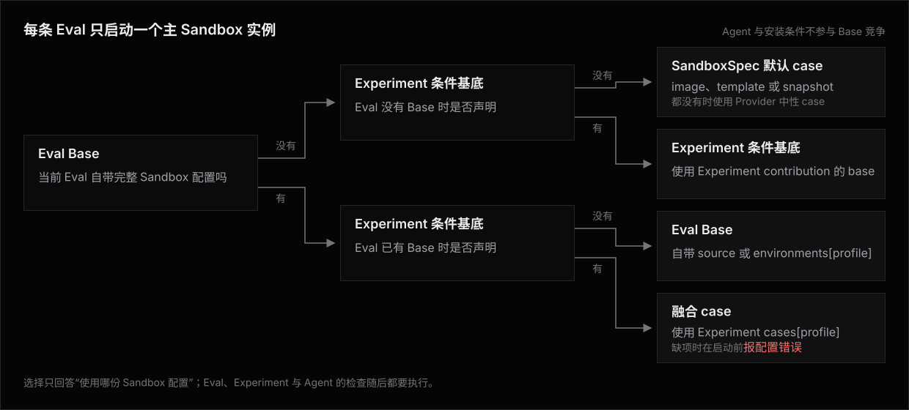

# PLAN-11 —— Lifecycle

**相关文档**:[方案](README.md) · [Library](library.md) · [Architecture](architecture.md) · [Use Cases](use-case/README.md) · [CASES](../CASES.md)

本篇只回答四个运行问题:

1. Eval、Experiment 与 Agent 分别贡献什么。
2. image、template、snapshot、Dockerfile 与 Compose 同时出现时,到底从哪一个启动。
3. Base build/start、Requirement 安装、状态、Fixture 与 Agent runtime setup 按什么顺序执行。
4. `sandboxReuse` 打开后,哪些步骤每复用周期一次,哪些步骤仍然每 Attempt 执行。

## 先分清起点与安装

Base Case 是一条 Attempt 唯一启动的完整 Sandbox 实例。
它可以来自 Eval、Experiment、融合表或 SandboxSpec 默认配置,物理输入可以是 image、template、snapshot、Dockerfile 或 Compose。

Requirement 与 Agent 安装不参与起点竞争。
Runner 先启动 Base Case,再在这个 Sandbox 中逐项检查并补齐 Eval、Experiment 与 Agent 条件。
预装只让检查命中,不会改变起点归谁或从哪里启动。

## 三方声明

| Owner | 可以贡献 Base | 安装与运行职责 |
|---|---|---|
| Eval | Eval Base | Eval Requirement 描述题目 Sandbox 事实;turn 前 Fixture 准备可见工作区,隐藏判分材料只在 turn 后挂载 |
| Experiment | 条件基底与按 profile 声明的融合 case | Experiment Requirement 描述实验条件;ExperimentStateLifecycle 独立载入和回存外部状态 |
| Agent | 不可以 | AgentProvisioner 确保 CLI;Agent runtime lifecycle 收敛并验证鉴权、配置、Plugin、Skill 与 MCP |
| SandboxSpec | 默认 case 与 `environments[profile]` | 选择 Provider、Sandbox source builder、普通默认起点与早期 setup/teardown Hook,不拥有实验条件 |

Agent CLI 可以预装在任意一种 Base Case 中。
预装只会让 AgentProvisioner 检查命中,不会把 Agent 变成 Base owner。

`environments[profile]` 是对应 Eval Base 的 Provider-native 预制替代实现。
它不是 Experiment 条件基底,也不是融合 case。

## Base 选择



Agent、Requirement、Hook、Fixture 与状态都不参与这个优先级。
Base 选择只决定从哪份完整 Sandbox 启动,不能删除任何 owner 的后续检查。

## 一条 fresh Attempt

```text
三方声明
  -> 选择唯一 Base Case
  -> 构建或定位所选 Base Case 引用的全部产物
  -> 创建完整 Sandbox Case
  -> 等待全部服务与资源 ready
  -> SandboxSpec setup
  -> 初次验证 Eval 与 Experiment Requirement
  -> 只准备、安装并复检未满足的 Requirement
  -> 完整复检 Eval 与 Experiment Requirement
  -> 建立 workspace baseline
  -> AgentProvisioner 检查、准备、安装与复检 CLI
  -> ExperimentStateLifecycle.load
  -> 创建 turn 前可见的 Eval Fixture
  -> Agent runtime setup 与 verify
  -> 最终验证 Eval、Experiment、Agent CLI 与 Agent runtime
  -> 完成全部 Agent turn
  -> 挂载 turn 后隐藏判分材料
  -> scoring 与 evidence
  -> 清理隐藏判分材料
  -> Agent runtime teardown
  -> ExperimentStateLifecycle.save 或记录 skipped / unavailable
  -> Eval teardown
  -> SandboxSpec teardown
  -> Sandbox Case finalizer 与 stop
```

Agent 被拆成两段。
AgentProvisioner 负责有身份、可预装、可检查的 CLI 与启动条件。
Agent runtime lifecycle 负责每 Attempt 的连接与配置,也必须提供 identity 和 verify。
这条拆分允许状态恢复发生在 Agent CLI 已经可用之后,同时让鉴权和扩展贴着 Agent turn 收敛并进入最终检查。

Agent runtime setup 一旦进入,后续任一阶段失败都在 `finally` 中执行对应 teardown。
未到达的 runtime check 与最终检查不伪造成功值;活动写入终止阶段与收尾结果。

Fixture 不属于安装。
Eval Fixture 在 Agent turn 前可见,隐藏判分材料只能在 turn 后出现,避免把测试泄给 Agent。

Eval / Experiment Requirement install 位于 baseline 前,可以成为复用周期重置点的一部分。
AgentProvisioner 位于 baseline 后,因为状态恢复必须能使用已经就位的 Agent CLI。
Experiment state load 位于 baseline 后;开启 reuse 时,要跨 reset 演化的状态必须位于 workdir 外。

turn 前 Eval Fixture 与 turn 后隐藏判分材料都随 Attempt 重建。
隐藏判分材料的 cleanup 作用于 workdir 外路径、mount 与进程。
它必须在 state save、reset 或下一条 Attempt 前成功;失败会退休该复用周期并停止依赖该状态的序列。

| 生命周期节点 | 默认 fresh Sandbox | `sandboxReuse: true` |
|---|---|---|
| Base 选择与 BuildKey 构建 | 每个 Eval 规划;Run 级按所有 BuildKey 协调 | 相同;复用周期只消费 locator |
| Case create / ready、SandboxSpec setup | 每 Attempt 一次 | 每复用周期一次 |
| Eval 与 Experiment Requirement Ensure | 每 Attempt 一次 | 每 Attempt 一次 |
| workspace baseline / reset | 每 Attempt 建立一次 | 首条建立,后续每 Attempt reset |
| AgentProvisioner Ensure | 每 Attempt 一次 | 每 Attempt 一次 |
| Experiment state load | AgentProvisioner 后每 Attempt 一次 | 首条 AgentProvisioner 后每复用周期一次 |
| turn 前 Eval Fixture、Agent runtime 与最终屏障 | 每 Attempt 一次 | 每 Attempt 一次 |
| Agent turn、隐藏判分、断言求值、判分 cleanup 与 runtime teardown | 每 Attempt 一次 | 每 Attempt 一次 |
| Experiment state save / skip | runtime teardown 后、Eval teardown 前 | 关窗时一次 |
| Eval teardown | state save / skip 后每 Attempt 一次 | 每 Attempt 一次 |
| SandboxSpec teardown、Case finalizer 与 stop | 每 Attempt 一次 | 每复用周期一次 |

## `sandboxReuse` 生命周期

```text
Run preparation
  -> 为每条 Eval 选择 Base Case
  -> 按 BuildKey 构建尚未存在的产物

window open
  -> 使用 locator 启动所选 Base Case
  -> 等待服务与资源 ready
  -> 执行一次 SandboxSpec setup
  -> first Attempt:
       Ensure Eval 与 Experiment Requirement
       -> 建立 workspace baseline
       -> AgentProvisioner Ensure
       -> 执行一次 Experiment state load
       -> 创建 Eval Fixture
       -> Agent runtime setup / verify
       -> 最终验证三方条件
       -> 完成全部 Agent turn
       -> 挂载隐藏判分材料并 scoring
       -> 清理隐藏判分材料
       -> Agent runtime 与 Eval teardown

later Attempt
  -> ensureLifetime
  -> reset workdir
  -> 再次 Ensure Eval 与 Experiment Requirement
  -> 再次执行 AgentProvisioner Ensure
  -> 沿用窗口中的活状态,不再 load
  -> 重建 Eval Fixture
  -> Agent runtime setup / verify
  -> 再次最终验证三方条件
  -> 完成全部 Agent turn
  -> 挂载隐藏判分材料并 scoring
  -> 清理隐藏判分材料
  -> Agent runtime 与 Eval teardown

window close
  -> 执行一次 Experiment state save,或记录 skipped / unavailable
  -> 执行一次 SandboxSpec teardown
  -> Sandbox Case finalizer 与 stop
```

一个复用周期只承接同一 Experiment、同一 profile 与同一 CaseKey。
不同 Eval Base、Experiment 条件基底或融合 case 不共享活 Sandbox。

`sandboxReuse` 复用的是启动后的实例,不是上一次 Attempt 的检查结果。
三方 Ensure 与最终验证每 Attempt 都执行;前次安装通常只让本次 check 命中。

要跨 Attempt 演化的活状态必须位于 workdir 外。
fresh 模式的 load 可以写 workdir;reuse 模式只 load 一次,写入 workdir 的内容会在下一次 reset 时被清除。
依赖确定顺序或单份累积状态时必须使用 `maxConcurrency: 1`;否则会产生多条独立复用周期。

Experiment state load 成功后,Runner 进入一条统一 outer-finally。
fresh 在本 Attempt 收尾时按 state 的 `saveOn` 策略决定是否 save。
reuse 必须使用 `saveOn: "after-load"`,并在复用周期关闭时执行一次 save。
`sandboxReuse: true` 与 `attempt-succeeded` 的组合在创建 Sandbox 前报配置错误。

fresh 的顺序是“隐藏判分 cleanup → Agent runtime teardown → state save/skip → Eval teardown → SandboxSpec teardown → finalizer/stop”。
这个顺序保证 state save 仍能读取 workdir。

reuse 每条 Attempt 执行“隐藏判分 cleanup → Agent runtime teardown → Eval teardown”。
复用周期关闭才执行“state save/skip → SandboxSpec teardown → finalizer/stop”。
reuse state 必须位于 workdir 外;Eval teardown 只能释放自己的 Fixture,不得触碰 state owner 的路径或服务。

任一收尾失败都不能阻止后续收尾;Provider 已经硬丢实例时,不能执行的步骤写入为 `unavailable`。
隐藏判分 cleanup 失败是唯一无条件禁止 state save 的软实例错误。
它避免把判分材料写入 checkpoint,并停止状态序列;实例硬丢同样无法 save。

## 各 Case 到底用哪个 Base

表里的“启动起点”是一份完整 Sandbox 实例。
它可以由 Compose、Dockerfile、image、template 或 snapshot 兑现,不是只能写成 template。

| Case | 输入里有哪些 Sandbox 起点 | PLAN-11 实际启动哪个 Sandbox | 其它条件怎样进入 |
|---|---|---|---|
| C1 评估 Sandbox 较重 | Eval 自带 Compose 或 Dockerfile;SandboxSpec 可以另有默认 case | 当前 profile 有 `environments[profile]` 时用该预制 Eval 起点,否则按 source 构建并启动 Eval 自带起点;默认 case 不启动 | 启动后验证题目条件,再 Ensure 实验与 Agent 条件 |
| C2 实验 Sandbox 较重 | Eval 不带 Base;Experiment 只声明可安装条件 | SandboxSpec 默认 case;没有默认配置时用 Provider 中性 case | 每条 fresh Attempt 检查并补齐实验与 Agent 条件 |
| C3 双方较重,实验条件可安装 | Eval 自带 Compose;Experiment 只声明可安装条件 | Eval 自带起点或同 profile 的预制替代起点 | 在题目起点中准备、上传、安装并复检实验条件,不生成题目 × 实验 template 矩阵 |
| C3 双方较重,实验条件不可叠加 | Eval 与 Experiment 各带一份完整起点 | 当前 profile 的融合 case;缺表项就在启动前报配置错误 | 启动后仍分别验证题目、实验与 Agent 条件 |
| C4 组合多个条件 | 起点仍按 C1–C3 判断;Experiment 同时声明多项 Requirement | Requirement 数量不改变已经选中的 Base Case | 用依赖与资源图调度安装,最后复检全部条件 |
| C5 预装稳定条件 | 慢工具可以预装在默认 case、Eval Base、条件基底或融合 case | 仍按两侧是否贡献 Base 选择,不因为“已经预装”改走另一份起点 | 检查命中就省掉安装;漂移时补齐或在 Agent 前报不兼容 |
| C6 新 Sandbox 外部状态 | 起点按 C1–C5 判断;另有外部 Experiment state | 每条 Attempt 重新启动同一种已选 Base Case;state 不参与选择 | Agent CLI 就位后 load,Attempt 收尾时 save |
| C7 复用 Sandbox 活状态 | 起点按 C1–C5 判断;显式开启 reuse | 每个复用周期只启动一次已选 Base Case,后续 Attempt 沿用同一 CaseKey 的实例 | 每 Attempt 重查三方条件;每复用周期 load/save state 一次 |
| C8 Experiment 提供条件基底 | Eval 没有自己的 Base;Experiment 声明条件基底 | Experiment 条件基底;SandboxSpec 默认 case 不启动 | 验证实验条件,再验证或补齐题目与 Agent 条件 |
| C9 双方都有不可叠加基底 | Eval Base 与 Experiment 条件基底同时存在 | 当前 profile 的融合 case;不会隐式选边或合并两份起点 | 缺融合表项时一次列出全部配置错误;有表项仍分别验证三方条件 |
| C10 混合批次,没有条件基底 | 一部分 Eval 自带 Base,其余没有;SandboxSpec 有默认 case | 自带 Base 的 Eval 启动自己的起点;其余 Eval 启动默认 case | 同一个 SandboxSpec 服务两组 Eval,但运行实例不互用 |
| C10 混合批次,有条件基底 | 一部分 Eval 自带 Base,其余没有;Experiment 另有条件基底 | 自带 Base 的 Eval 启动对应融合 case;其余 Eval 启动 Experiment 条件基底 | SandboxSpec 默认 case 不制造冲突;缺融合表项时启动前报错 |

这张表也是 PLAN-11 相对 PLAN-4 的核心差异。
SandboxSpec 默认 case 只作 fallback。
只有明确绑定 Experiment Requirement 的条件基底,才会与 Eval Base 触发融合。
