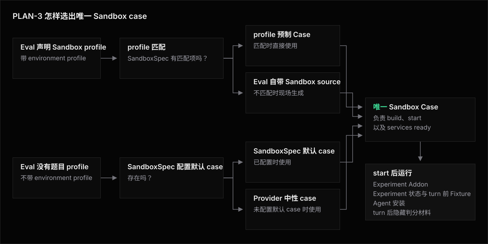

# PLAN-3 —— Lifecycle

**相关文档**:[方案](README.md) · [Library](library.md) · [Architecture](architecture.md) · [Use Cases](use-case/README.md) · [CASES](../CASES.md)

本篇把 PLAN-3 的运行语义摊成一条时间线,只回答四个问题:

1. Eval、Experiment、Agent 与 SandboxSpec 分别拥有哪一段。
2. template、Compose 与其它起点同时出现时,哪一份负责 build 和 start。
3. Addon 安装、状态 Hook、Fixture 与 AgentProvisioner 按什么顺序执行。
4. `sandboxReuse` 打开后,哪些步骤每窗口一次,哪些步骤仍然每 Attempt 执行。

类型与错误语义仍以 [Library](library.md) 和 [Architecture](architecture.md) 为准。
本篇不为方案补造 Experiment Base、Eval Addon 或新的状态协议。

template 只是 SandboxSpec 默认环境或 profile 预制环境的一种物理形态。
Dockerfile、Compose、image 与 snapshot 使用同一套启动环境选择规则。

PLAN-3 不允许 Experiment 提供启动环境。
Experiment 只能贡献 Experiment Addon,不能让一份 template 以 Experiment owner 身份参与选择。

## Owner 模型

| Owner | 可以贡献启动环境 | 安装、状态与运行职责 |
|---|---|---|
| Eval | 完整的 Eval 自带环境 | Case source、ready 与伴随资源归 Case;Eval 还负责 turn 前 Fixture 和 turn 后隐藏判分材料 |
| Experiment | 不可以 | Experiment Addon 描述主 Sandbox 中应成立的实验工具;Experiment 状态负责载入和回存 |
| Agent | 不可以 | Agent 安装负责检查、准备并安装 Agent CLI、配置与启动条件 |
| SandboxSpec | SandboxSpec 默认环境与 profile 预制环境 | 选择 Provider、提供普通默认起点,或替换某个 Eval 自带环境的现场生成结果 |

profile 预制环境虽然写在 SandboxSpec 中,语义上仍是对应 Eval 自带环境的预制实现。
它不成为 Experiment 启动环境,也不表示实验条件已经预装。

Agent CLI 或 Experiment Addon 可以碰巧预装在任一种启动环境中。
预装只会让对应检查命中,不会改变 owner。

Eval 没有独立的可移植 Ensure。
题目条件只能随完整的 Eval 自带环境出现,或由 turn 前 Fixture 为当前 Attempt 准备。

## 启动环境与 template 选择

当 Eval 声明题目环境时,Runner 先按 environment profile 查找 profile 预制环境。
找到匹配项就直接使用该预制环境;找不到就从 Eval 的 folder-local source 现场生成 Eval 自带环境。
这条分支不会查看 SandboxSpec 默认环境。

当 Eval 没有声明题目环境时,Runner 使用 SandboxSpec 默认环境。
如果 SandboxSpec 也没有配置默认环境,Runner 最后选择 Provider 中性环境。



四条路径最终只能汇入一个 Sandbox Case,由它负责 build、start 和 services ready。
Experiment Addon、Experiment 状态、turn 前 Fixture、Agent 安装与 turn 后隐藏判分材料都不参与这次选择。
它们只能在唯一 Sandbox Case 启动并 ready 后运行。

## Build、start、install 与 Fixture

| 阶段 | Owner | fresh Attempt | reuse window |
|---|---|---|---|
| 解析 source、profile 与运行实例身份 | Eval + SandboxSpec | 每个 Eval 规划一次 | 每个 Eval 规划一次 |
| build 或定位起点产物 | 选中的启动环境 | Run 级按构建身份协调 | Run 级共享;窗口只消费产物 locator |
| start、services ready | 选中的启动环境 | 每 Attempt 一次 | 每窗口一次 |
| Experiment Addon 检查、安装与复检 | Experiment | 每 Attempt 一次 | 每 Attempt 一次 |
| Experiment 状态载入与回存 | Experiment | 每 Sandbox 各一次 | 窗口打开时载入,关闭时回存 |
| 建立或恢复 workdir baseline | Runner / workspace | 每 Attempt 建立一次 | 每窗口建立一次,后续 Attempt reset |
| turn 前 Fixture | Eval | 每 Attempt 一次 | 每 Attempt 重建 |
| Agent 安装检查、准备、安装与复检 | Agent | 每 Attempt 一次 | 每 Attempt 一次 |
| Agent turn、turn 后隐藏判分与断言求值 | Eval | 每 Attempt 一次 | 每 Attempt 一次 |
| Eval / Agent teardown | Eval + Agent | 每 Attempt 一次 | 每 Attempt 一次 |
| Case finalizer | 选中的启动环境 | 每 Attempt 一次 | 每窗口一次 |

build 与 start 是两件事。
相同构建身份可以复用不可变产物,不同运行实例仍有各自的身份和清理责任。

Experiment Addon 安装不是 build。
它发生在已经 ready 的主 Sandbox 中,并且每条 Attempt 都从真实 `check` 开始。

Fixture 也不是安装。
turn 前 Fixture 可以写 workdir 并参与 reset 与 diff 归因。
Experiment Addon、Agent CLI 和跨 Attempt 状态不能依赖 Fixture 冒充。

## 一条 fresh Attempt

```text
声明与规划
  -> 按 Eval 声明选择唯一启动环境
  -> build 或定位该启动环境引用的全部产物
  -> 启动完整 Sandbox Case
  -> 等待 services 和其它资源 ready
  -> 检查每项 Experiment Addon
  -> 为未命中项准备 payload、安装并复检
  -> 复检整组 Experiment Addon
  -> 载入 Experiment 状态
  -> 建立 workdir baseline
  -> 执行 Eval setup 和 turn 前 Fixture
  -> 检查、准备、安装并复检 Agent
  -> 在状态与 Agent 修改后再次检查整组 Experiment Addon
  -> 执行全部 Agent turns
  -> 挂载 turn 后隐藏判分材料、scoring,然后 cleanup
  -> 执行 Eval 与 Agent 的配对 teardown
  -> 回存 Experiment 状态
  -> 执行 Case finalizer 并停止 Sandbox
```

Experiment 状态载入可以使用已经收敛的 Experiment Addon,因为 Addon 安装位于它之前。
但 Experiment 状态载入早于 Agent 安装。

因此需要 Agent CLI 才能恢复状态的 C6 无法满足精确顺序。
把 Agent CLI 重复包装成 Experiment Addon 会丢失 Agent 安装的 staged payload、安装模式与专有事实,不是本方案允许的修补。

Agent 安装后的屏障只重新检查 Experiment Addon。
完整 Eval Case 的 ready 与服务责任仍留在 Case 生命周期,不会被转换成可移植 Eval Requirement。

## `sandboxReuse` 生命周期

```text
window open
  -> 使用 Run 级产物 locator 启动一个 Sandbox Case
  -> first Attempt:
       检查、安装并复检整组 Experiment Addon
       -> 载入一次 Experiment 状态
       -> 建立 baseline 并执行 turn 前 Fixture
       -> 检查、准备、安装并复检 Agent
       -> 再次检查整组 Experiment Addon
       -> 执行全部 Agent turns
       -> 挂载 turn 后隐藏判分材料、scoring 和 cleanup
       -> 执行 Eval 与 Agent teardown

later Attempt
  -> ensureLifetime
  -> reset workdir to the window baseline
  -> 再次检查、安装并复检整组 Experiment Addon
  -> 继续使用活的 Experiment 状态,不再载入
  -> 重建 turn 前 Fixture
  -> 再次检查、准备、安装并复检 Agent
  -> 再次检查整组 Experiment Addon
  -> 执行全部 Agent turns
  -> 挂载 turn 后隐藏判分材料、scoring 和 cleanup
  -> 执行 Eval 与 Agent teardown

window close
  -> 回存一次 Experiment 状态
  -> 执行 Case finalizer 并停止 Sandbox
```

一个窗口只承接相同 Experiment 与相同运行实例身份的 Attempt。
profile 预制环境、现场生成的 Eval 自带环境与 SandboxSpec 默认环境不会共享运行实例。

复用的是 Case 实例与 workdir 外的活状态,不是前一条 Attempt 的检查结论。
Experiment Addon 和 Agent 安装每 Attempt 都重新检查;前一次安装通常只让下一次检查命中。

`$HOME`、系统目录、后台进程与外部状态可以跨 reset 存续。
依赖单份有序状态时,Experiment 还要把并发限制为一条窗口。

turn 后隐藏判分材料仍位于 Eval `test(t)` 内,cleanup 由作者自行用 `try/finally` 实现。
本候选没有受管 cleanup 注册或独立活动,Runner 不能保证 workdir 外路径、mount 与进程已经清除,也不能因 cleanup 失败自动退休窗口。

## C1-C10 的启动环境选择

| Case | 覆盖状态 | PLAN-3 选中的环境或 template | start 后发生什么 |
|---|---|---|---|
| C1 评估环境较重 | 部分覆盖 | 有匹配项时选择该 Eval profile 的预制环境;否则从 Eval 自带的 Dockerfile 或 Compose 现场生成环境。SandboxSpec 默认环境不参与 | Case ready,但 Agent 安装后不重验完整 Eval Case |
| C2 实验环境较重 | 部分覆盖 | Eval 没有题目环境时选择 SandboxSpec 默认环境;未配置默认环境时选择 Provider 中性环境 | 在启动环境中安装 Experiment Addon,最终屏障只检查这些 Addon |
| C3 双方都较重 | 部分覆盖 | 选择该 Eval profile 的预制环境;没有匹配项时选择现场生成的 Eval 自带 Compose。Experiment 不能另外提供 template | 使用离线 payload 安装 Experiment Addon,但 Agent 安装后不重验完整 Eval Case |
| C4 组合多个条件 | 部分覆盖 | 是否有 Eval 题目环境决定选择 Eval 自带环境还是 SandboxSpec 默认环境;Experiment Addon 的数量不改变选择 | Addon 有依赖与资源调度,但最终屏障不覆盖 Eval 和 Agent |
| C5 预装稳定条件 | 部分覆盖 | 有 Eval 题目环境时选择 profile 预制环境或现场生成环境;没有时选择 SandboxSpec 默认环境。预装工具不改变这条规则 | Experiment Addon 与 Agent 都实际检查,但完整 Eval Case 不参加最终复检 |
| C6 新 Sandbox 外部状态 | 部分覆盖 | 按该 Eval 是否声明题目环境,选择 profile 预制环境、现场生成的 Eval 自带环境、SandboxSpec 默认环境或 Provider 中性环境 | 先安装 Experiment Addon,再载入 Experiment 状态、执行 turn 前 Fixture 和 Agent 安装;状态早于 Agent |
| C7 复用活状态 | 部分覆盖 | 每个复用窗口固定使用一份已经选中的 profile 预制环境、Eval 自带环境、SandboxSpec 默认环境或 Provider 中性环境 | Experiment 状态每窗口载入和回存一次,但最终屏障仍不覆盖三方 |
| C8 Experiment 条件基底 | 无法表达 | Experiment template 只能改写成普通的 SandboxSpec 默认环境,不能保留“与实验条件绑定”的身份 | PLAN-3 没有 Experiment 条件基底入口 |
| C9 双方不可叠加 Base | 无法表达 | 只能选择 profile 预制环境或 Eval 自带环境;Experiment 不能提供另一份不可叠加环境,也不能声明双方融合环境 | Runner 无法按 profile 选择显式融合双方条件的完整 Case |
| C10 混合批次 | 部分覆盖 | 自带环境的 Eval 选择匹配的 profile 预制环境或现场生成环境;其余 Eval 选择 SandboxSpec 默认环境,没有默认环境时使用 Provider 中性环境 | 只覆盖普通默认环境分支,不覆盖 Experiment 条件基底分支 |

### C8 与 C9 的能力边界

PLAN-3 可以选择一份 Eval 自带环境启动 Sandbox,然后在其中安装 Experiment Addon 和 Agent。

PLAN-3 不能让 Experiment 条件 template 成为启动环境,也不能为 Eval 环境与 Experiment 环境声明一份显式融合环境。

把条件 template 填进 SandboxSpec 只会得到普通默认环境。
当某个 Eval 带自己的题目环境时,SandboxSpec 默认环境必须让位,所以这份 template 无法承担 C9 的实验条件。
