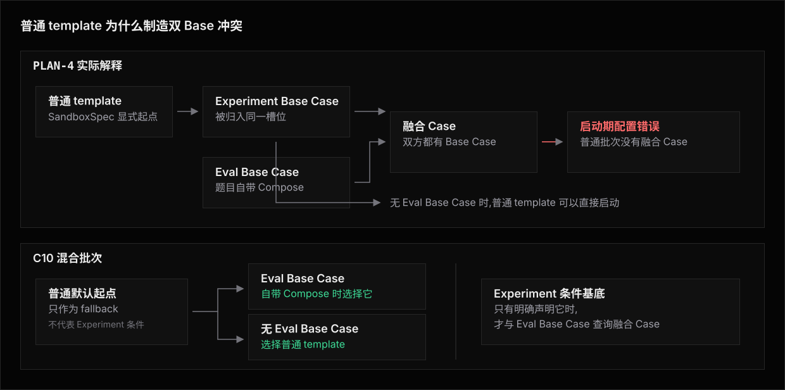

# PLAN-4 —— Lifecycle

**相关文档**:[方案](README.md) · [Library](library.md) · [Architecture](architecture.md) · [Use Cases](use-case/README.md) · [CASES](../CASES.md)

本篇把 PLAN-4 的运行语义摊成一条时间线,只回答四个问题:

1. Eval、Experiment、Agent 与 SandboxSpec 分别拥有哪一段。
2. template、Compose 与其它起点同时出现时,哪一份负责 build 和 start。
3. Requirement 安装、状态 Hook、Fixture 与 AgentProvisioner 按什么顺序执行。
4. `sandboxReuse` 打开后,哪些步骤每复用周期一次,哪些步骤仍然每 Attempt 执行。

类型与错误语义仍以 [Library](library.md) 和 [Architecture](architecture.md) 为准。
本篇保留单数 Requirement 槽位,也保留 PLAN-4 对 SandboxSpec 显式起点的原始解释。

## 四种 Base Case

PLAN-4 最终只启动一个完整 `Sandbox Case`:

| 名称 | 来自哪里 | 什么时候选中 |
|---|---|---|
| Provider 中性 Case | Sandbox Provider | Eval 与 Experiment 都没有 Base Case |
| Eval Base Case | Eval contribution 的 Dockerfile、Compose 或其它完整起点 | 只有 Eval 提供 Base Case |
| Experiment Base Case | `environment.base`,或者被 PLAN-4 归入同一槽位的 SandboxSpec 显式 image、template、snapshot | 只有 Experiment 一侧提供 Base Case |
| 融合 Case | `environment.cases[environmentProfile]` | Eval Base Case 与 Experiment Base Case 同时存在 |

融合 Case 是作者预先准备好的完整起点。
Runner 不在运行时拼接 Eval Base Case 与 Experiment Base Case。

这里最容易误解的是 SandboxSpec 的普通默认 template。
PLAN-4 没有“普通默认 Case”这一档,所以任何显式 template 都会被解释成 Experiment Base Case。
这个解释可以表达真正的 Experiment 条件基底,却会错误处理 C10 的普通 fallback。

## Owner 模型

| Owner | 可以贡献的 Base Case | 安装、状态与运行职责 |
|---|---|---|
| Eval | 一个 Eval Base Case | 一个 Eval `EnvironmentRequirement` 描述题目事实;Eval Fixture 准备任务;最后一次 turn 后执行隐藏 verifier 或 criteria |
| Experiment | 一个 Experiment Base Case 与按 profile 索引的融合 Case 表 | 一个 Experiment `EnvironmentRequirement` 描述实验条件;设计上需要晚期 state load/save,但 Library 没有公开入口 |
| Agent | 不可以贡献 Base Case | `AgentProvisioner` 检查、准备并安装 Agent CLI、配置与启动条件 |
| SandboxSpec | 显式 image、template、snapshot 会被算作 Experiment Base Case | 选择 Provider;提供早期 `sandbox.setup` 与 `sandbox.teardown`;没有显式起点时才由 Provider 提供中性 Case |

Eval 与 Experiment 各只有一个 Requirement 槽位。
多个证书、registry、运行时与工具必须包进一个复合 Requirement。

Agent CLI 可以预装在任意 Base Case 中。
预装只让 AgentProvisioner 的检查命中,不会让 Agent 参与 Base Case 竞争。

## Base Case 与 template 选择

规划器逐 Eval 执行以下选择:

1. Eval Base Case 与 Experiment Base Case 同时存在时,选择当前 `environmentProfile` 对应的融合 Case。
2. 只有 Eval Base Case 时,选择 Eval Base Case。
3. 只有 Experiment Base Case 时,选择 Experiment Base Case。
4. 两边都没有 Base Case 时,选择 Provider 中性 Case。

Experiment contribution 的 `environment.base` 与 SandboxSpec 显式起点占同一个槽位。
两者同时声明会在启动期得到重复 Base 配置错误,不是融合关系。

Eval Requirement、Experiment Requirement、AgentProvisioner、SandboxSpec Hook、Eval Fixture、隐藏 verifier 与目标中的 state load/save 都不参与 Base Case 选择。
它们在完整 Case 启动后按各自相位执行。

规划器先展开完整 Eval 矩阵。
任何一条同时具有 Eval Base Case 和 Experiment Base Case 的 Eval 如果缺少精确融合 Case,Runner 会在创建 Sandbox 前一次列出全部缺项。

### C10 为什么失败



图的上半部分是 PLAN-4 的实际解释。
普通 SandboxSpec template 先被归入 Experiment Base 槽位;遇到自带 Compose 的 Eval 后,规划器便认定双方都有 Base Case,转而强制查询融合 Case。

图的下半部分是 C10 要求的语义。
普通 template 应当只是 fallback:自带 Compose 的 Eval 选择自己的 Eval Base Case,没有 Base Case 的 Eval 才选择普通 template。
只有 Experiment 明确声明了条件基底时,它才应与 Eval Base Case 形成真正的双 Base 组合。

给普通 template 更低的优先级也不能修复 PLAN-4。
如果同一 SandboxSpec 还声明真正的 Experiment 条件基底,两者会先竞争同一个槽位;Runner 无法辨认哪一个是 fallback,哪一个代表必须保留的实验条件。

## Build、start、install 与 Fixture

| 阶段 | Owner | fresh Attempt | reuse window |
|---|---|---|---|
| 读取双方 Base Case 与融合表 | Eval + Experiment | 每个 Eval 规划一次 | 每个 Eval 规划一次 |
| build 或定位起点输出 | 选中的完整 `Sandbox Case` | Run 级按 BuildKey 协调 | Run 级共享;复用周期只消费 locator |
| start、services ready | 选中的完整 `Sandbox Case` | 每 Attempt 一次 | 每复用周期一次 |
| `sandbox.setup` | SandboxSpec | 每 Attempt 一次 | 每复用周期一次 |
| Eval 与 Experiment Requirement 检查和 Ensure | Eval + Experiment | 每 Attempt 一次 | 每 Attempt 一次 |
| 建立或恢复 workdir baseline | Runner / workspace | 每 Attempt 建立一次 | 每复用周期建立一次,后续 Attempt reset |
| Eval setup 与 Fixture | Eval | 每 Attempt 一次 | 每 Attempt 重建 |
| Agent CLI 检查与 Ensure | AgentProvisioner | 每 Attempt 一次 | 每 Attempt 一次 |
| Experiment state load/save | Experiment 状态 | Library 没有公开可执行相位 | Library 没有公开可执行相位 |
| Agent turn、隐藏 verifier 与断言求值 | Eval | 每 Attempt 一次 | 每 Attempt 一次 |
| Eval 与 Agent teardown | Eval + Agent | 每 Attempt 一次 | 每 Attempt 一次 |
| `sandbox.teardown` | SandboxSpec | 每 Attempt 一次 | 每复用周期一次 |
| Case finalizer | 选中的完整 `Sandbox Case` | 每 Attempt 一次 | 每复用周期一次 |

build 与 start 是两件事。
相同 BuildKey 可以复用不可变输出,每个 fresh Attempt 仍创建独立运行实例。

Requirement install 不是 Base build。
它发生在完整 Case ready 之后,并且只有初始检查未命中的 Requirement 才检查 prepare、上传与安装能力。

Fixture 也不是 Requirement。
Eval Fixture 服从既有 Eval 生命周期,不参与 Base Case 选择、Requirement identity 或融合表。

## 一条 fresh Attempt

```text
声明与规划
  -> 读取 Eval Base Case、Experiment Base Case 与 SandboxSpec 显式起点
  -> 按四种组合选择一个完整 Sandbox Case
  -> build 或定位所选 Case 引用的全部输出
  -> 启动完整 Sandbox Case
  -> 等待 services 与 resources ready
  -> 执行 sandbox.setup
  -> 检查 Eval Requirement 与 Experiment Requirement
  -> 为未命中项 prepare、安装并复检
  -> 再次检查完整的 Eval 与 Experiment Requirement
  -> 建立 workdir baseline
  -> 执行 Eval setup 与 Fixture
  -> AgentProvisioner 检查、准备、安装并复检 Agent CLI
  -> 最终检查 Eval、Experiment 与 Agent 三方条件
  -> 执行全部 Agent turns
  -> 挂载隐藏 verifier、判分,再由 Eval 作者清理
  -> 执行 Eval 与 Agent teardown
  -> 执行 sandbox.teardown
  -> 执行 Case finalizer 并停止 Sandbox
```

真实可执行的 `sandbox.setup` 位于 Requirement 与 AgentProvisioner 之前。
它可以承载早期 Sandbox 预置,却不能保证使用 Agent CLI 恢复外部状态。

本方案描述过一条理想路径:`AgentProvisioner Ensure -> state load -> 最终检查`。
但 Library 没有 state identity、load、save 或 activity 的公开形状,所以这条路径不能由公开 API 调用,C6 与 C7 只能部分涵盖。

单数 Requirement 不会在这条时间线上自动拆开。
一个复合 Experiment Requirement 内部的成员身份、依赖、资源等待和错误仍然合并在同一个活动中。

## `sandboxReuse` 生命周期

```text
复用周期打开
  -> 使用 Run 级 locator 启动一个选中的完整 Sandbox Case
  -> 执行一次 sandbox.setup
  -> 第一条 Attempt:
       检查并补齐 Eval Requirement 与 Experiment Requirement
       -> 建立 workdir baseline,执行 Eval setup 与 Fixture
       -> AgentProvisioner 检查并补齐 Agent CLI
       -> 最终检查三方条件
       -> 执行全部 Agent turns
       -> 挂载隐藏 verifier、判分,再由 Eval 作者清理
       -> 执行 Eval 与 Agent teardown

后续 Attempt
  -> 检查复用周期寿命
  -> 把 workdir 重置到复用周期 baseline
  -> 再次检查并补齐 Eval Requirement 与 Experiment Requirement
  -> 重建 Eval setup 与 Fixture
  -> AgentProvisioner 再次检查并补齐 Agent CLI
  -> 再次最终检查三方条件
  -> 执行全部 Agent turns
  -> 挂载隐藏 verifier、判分,再由 Eval 作者清理
  -> 执行 Eval 与 Agent teardown

复用周期关闭
  -> 执行一次 sandbox.teardown
  -> 执行 Case finalizer 并停止 Sandbox
```

一个复用周期只承接相同 Experiment、相同 environment profile 与相同所选 CaseKey。
不同 Eval Base Case、Experiment Base Case 或融合 Case 不共享运行实例。

复用的是 Case 实例与 workdir 外的活状态,不是上一条 Attempt 的验证判断。
Eval、Experiment 与 Agent 三方条件在每条 Attempt 中都重新检查;前一次安装通常只让下一次检查命中。

如果作者把状态读写放进 SandboxSpec Hook,它只能在复用周期早期载入、关闭时回存,并且要位于 workdir 外才能跨 reset 存活。
这仍然没有独立 state identity、activity、失败或轮换语义。

隐藏 verifier 仍位于 Eval `test(t)` 内,cleanup 由作者自行用 `try/finally` 实现。
本候选没有受管 cleanup 注册或独立活动。
Runner 不能保证 workdir 外路径、mount 与进程已经清除,也不能因 cleanup 失败自动退休复用周期。

## C1-C10 的 Base Case 与 template 选择

| Case | 涵盖结果 | PLAN-4 实际选中的 Sandbox 或 template | 启动后发生什么 |
|---|---|---|---|
| C1 评估 Sandbox 较重 | 涵盖 | 选择当前 Eval contribution 自带的 Dockerfile 或 Compose Base Case | 检查 Eval Requirement,再补齐 Experiment Requirement 与 Agent CLI |
| C2 实验 Sandbox 较重 | 涵盖 | SandboxSpec 写了普通 image、template 或 snapshot 时选择该显式起点;没有显式起点时选择 Provider 中性 Case | 每条 fresh Attempt 检查并补齐 Experiment Requirement |
| C3 评估与实验 Sandbox 都较重 | 涵盖 | SandboxSpec 没有显式起点时选择当前 Eval 自带的 Compose Base Case | 在该 Compose Case 中准备、上传、安装并复检 Experiment Requirement |
| C4 组合多个条件 | 部分涵盖 | 有 Eval Base Case 时选择它;否则选择 SandboxSpec 显式起点;两者都没有时选择 Provider 中性 Case | 多个实验条件被压进一个复合 Experiment Requirement |
| C5 预装稳定条件 | 涵盖 | Eval 无 Base Case 时选择预装该条件的 Experiment image、template 或 snapshot;Eval 也有 Base Case 时选择 `environment.cases[environmentProfile]` 中的融合 Case | 预装仍要通过三方实际检查 |
| C6 新 Sandbox 外部状态 | 部分涵盖 | 逐 Eval 选择其 Eval Base Case;没有 Eval Base Case 时选择 Experiment Base Case 或 Provider 中性 Case;双方都有时选择精确融合 Case | 实际只有早期 `sandbox.setup`;Agent 安装后的 state load 没有公开 API |
| C7 复用 Sandbox 活状态 | 部分涵盖 | 每个复用周期按同一规则选择一个 Eval Base Case、Experiment Base Case、融合 Case 或 Provider 中性 Case | 有复用周期 cadence,但没有公开的 state identity、activity 与失败语义 |
| C8 Experiment 提供条件基底 | 涵盖 | 选择 `environment.base` 声明的 Experiment 条件 template;PLAN-4 也会把 SandboxSpec 显式起点当成同类 Base Case | 检查 Experiment Requirement,再补齐 Eval Requirement 与 Agent CLI |
| C9 双方都有不可叠加基底 | 涵盖 | 选择 `environment.cases[environmentProfile]` 中已经融合双方条件的完整 Case | 分别检查 Eval Requirement、Experiment Requirement 与 Agent CLI |
| C10 混合批次 | 不涵盖 | 无 Eval Base Case 的 Eval 选择普通 SandboxSpec template;自带 Compose Base Case 的 Eval 被迫查询融合 Case,缺项即在启动前报错 | 普通默认 template 被误当作 Experiment 条件基底,制造并不存在的双 Base 冲突 |

C3 只有在 Experiment 没有贡献 Base Case,并且 SandboxSpec 没有显式普通起点时保持单 Base。
一旦 SandboxSpec 配置普通 template,PLAN-4 就把它解释成 Experiment Base Case,转入双 Base 分支。

C10 没有可用的优先级补丁。
让 Eval Base Case 静默覆写 SandboxSpec template 会同时覆写真正的 Experiment 条件基底,从而破坏 C8 与 C9。
