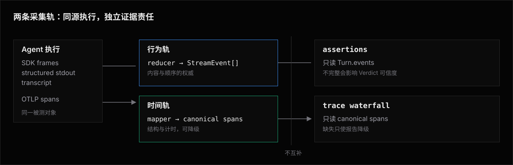

# Adapters —— 架构

Adapter 层隔离供应商协议。
core 只依赖 `Agent.send`、`Turn`、标准事件流和可选 tracing 声明，不识别 Claude、Codex、LangGraph 等名字。

## 数据流

```text
TurnInput
   │
   ▼
transport ──► raw frames / transcript
                  │
                  ▼
               reducer ──► StreamEvent[]
                  │
                  ▼
        session / HITL orchestration
                  │
                  ▼
                Turn
```

- **transport** 处理 URL、鉴权、CLI 和请求体，不抽象成通用 Agent 协议。
- **reducer** 把 SDK 事件、结构化 stdout 或 transcript 转成标准事件流。
- **orchestration** 使用 `ctx.session` 管理历史、ID 和暂停现场。

同一个 SDK 的 reducer 是稳定、可复用的协议知识，应放在独立转换器中；应用自己的 endpoint 与审批接口仍留在 Adapter 的 transport 粘合代码里。

## 行为轨与时间轨



OTel 内容字段可能被关闭或脱敏，因此 span 不补写 `Turn.events`。
行为轨不完整是契约缺失；时间轨缺失只是报告降级。

## 采集通道

按保真度优先选择：

1. 官方 SDK 事件或结构化结果，由官方转换器直接归一。
2. CLI 的结构化 stdout。
3. CLI 为 resume 保存的 transcript / tape。
4. 无结构化出处时返回空事件并明确负断言不可信，不从自然语言输出猜工具行为。

具体通道模型和新增 CLI 的检查清单见 [行为与 Trace 采集](architecture/collection.md)。

## Human live detail

Runner 在每次 `send` 开始时统一投影 `user: <message>`，Adapter 不重复从自己的 user event 提取正文。
这条短命 detail 只更新 Human `ACTIVE`，不进入 Record、JSON durable event 或 timeout error。

Adapter 只有在上游提供可证明的增量边界时才投影 `tool:` detail：

| Adapter | 可信的运行中边界 |
|---|---|
| Codex CLI | app-server item lifecycle，且 frame 同时匹配本次 native thread ID 与 turn ID |
| Claude Code | 双向 stream-json 中带完整 `id`、`name`、`input` 的 `tool_use`；每条 `result` 是本次 user frame 的 terminal barrier |
| UI Message Stream | 官方 reducer 已形成 `input-available` 或更后状态，并带完整 call ID、tool name 与 input |

Codex reasoning 与 assistant message 只显示泛化生命周期标签，不复制原始推理或回答正文。
Claude 与 UI Message Stream 按原生 call ID 去重，approval resume 不重报同一工具。

`aiSdkAgent(generateText)` 只取得终局结果，没有实时 transport seam。
OpenCode 与 OMP 的 Sandbox stdout callback 也不保证消费期间交付；Bub、Hermes、OpenClaw 与 DeepSeek Harness 只取得终局 transcript 或结果。
这些 Adapter 只获得 Runner 的 `user:` detail，不把退出后从 transcript 提取的工具事实伪装成实时进度。

Runner 在唯一 ACTIVE 出口先对完整文本做已知 secret redaction，再去除 VT、ANSI、C0 与 C1 控制字符并折叠空白。
控制字符移除与空白折叠后再次 redaction，最后在 grapheme 边界截到 256 UTF-8 bytes；Adapter 不预先截断可能含 secret 的字段。

## 标准事件不变量

1. 事件保持原始发生顺序，不按类型重排。
2. 工具调用与结果用稳定 `operationId` 配对；合成 ID 只作为不支持并发的最后回退。
3. `name` 保存原始名字，`tool` 保存跨 Agent 规范名。
4. 工具拒绝使用 `rejected`，执行故障使用 `failed`。
5. Skill 加载归一为 `skill.loaded`，不重复记成工具调用。
6. usage 缺失时不编造零以外的数字。

精确数据结构与状态不变量按主题拆分：

- [Agent 数据契约](architecture/agent-contract.md)
- [标准事件模型](architecture/events.md)
- [会话与 HITL 状态模型](architecture/session-state.md)
- [断言证据与完整性](architecture/evidence.md)
- [行为与 Trace 采集](architecture/collection.md)
- [Coding Agent 扩展边界](architecture/coding-agent-extensions.md)

## 小文件边界

每个 SDK 或 coding agent 在 [`sdk/`](sdk/README.md) 下独立成页。
新增页面只描述该方言特有的事实：公开入口、原始事件形状、会话、HITL、usage、trace 与已知完整性边界。
通用数据结构与不变量只在 `architecture/` 定义；Library 页面只展示如何调用和组合。

外部源码阅读和行业调研放在 [Adapter Research](../../research/adapters/README.md)，不会成为用户必须阅读的契约入口。

## 实现边界

| 责任 | 位置 |
|---|---|
| Agent / session / tracing 类型 | `src/agents/types.ts` |
| SDK 结果与事件转换器 | `src/agents/<protocol>.ts` |
| CLI transcript parser | `src/o11y/parsers/<agent>.ts` |
| OTLP 方言 mapper | `src/o11y/otlp/mappers/<agent>.ts` |
| Sandbox Agent 安装与驱动 | `src/agents/<agent>.ts` |
| 运行器调用、会话和 trace 归属 | `src/context/`、`src/runner/` |

新接一个对象时先判断协议知识能否独立于 transport。
如果能，先实现纯转换器和 fixture 测试，再编写薄 Adapter；不能，则保留为项目自己的手写映射，不把应用私有协议提升成 niceeval API。
