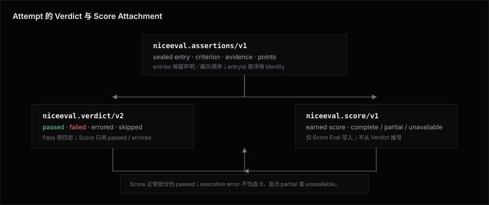

# 计分粒度：对比里一个 Eval 记几分

一条 eval 的**计分方式**由定义函数声明，两种题型：**`defineEval` = 通过制**——整题折叠成一分，gate 硬、 soft 软；**`defineScoreEval` = 计分制**——题内用给分 API 叠加挣分，五步走完三步挣 3 分，rubric 大题按分值给分。

题型是定义期事实：发现期就可知、进 `EvalDescriptor`，不靠执行 `test()` 推断——实验列表的主列形态、errored 时分数显示 `null` 还是不参与，都在题目一行代码没跑时就有答案。
同一个 Experiment 可以选择两种题型：通过制 eval 进入通过率，计分制 eval 进入总分。
两个读数分别聚合、并排展示，不把百分比与分值相加。
Experiment 不得改变计分语义；「怎么算分」是题目的契约，不是跑法的参数。

## 通过制（`defineEval`，默认）：一个 eval 一分

- 一条 eval 的一次 attempt 折叠成四态 [Verdict](../../verdict/architecture.md)，`passed` 记 1、其余记 0； `attempts > 1` 时按通过率。
  这个数就是内置读数 [`endToEndPassRate`](../../reports/library/measures.md#内置读数)，通过制的对比主读数读的是它。
- 断言只是 verdict 的**内部构成**：一条 eval 写 3 条还是 20 条 gate，对比里都是一分。
  这与 eve 的模型一致：一个 eval 就是一分，soft 分数 tracked-only。

通过制是**对的默认**，三个理由：

1. **不被断言数量加权。**
    写了 20 条断言的 eval 不该比写 3 条的权重大——断言多少反映作者的检查习惯，不反映题目的重要性。
   题目分量的差异要靠**显式给分**（计分制）表达，不靠断言数量隐式发生。
2. **单位对齐。**
    发现、缓存指纹、重试、首过即停的单位都是 eval；计分单位一致，「跑了 40 道题、过了 31 道」的心智直接成立。
3. **判定可信。**
    四态互斥、优先级固定（errored > failed > skipped > passed），不需要回答「部分可信的分数怎么折叠」这类没有好答案的问题。

## 计分制：叠加给分，没有上限声明

`defineScoreEval` 与 `defineEval` 字段完全同形。
唯一区别是 `test(t)` 的 `t` 额外提供给分词汇。
给分词汇**只**存在于计分制的 `t` 上，在通过制 eval 里写给分是类型错误，不需要运行时守护（形状声明见 [Eval · defineScoreEval](../../eval/README.md#definescoreeval计分制题型)）。

计分是**叠加制不是扣分制**：分从 0 往上挣、分值非负、给一次加一次，**不声明满分**。
对比是相对的——同一条 eval 的代码对每个 experiment 是同一把尺子，模型 A 挣 3 分、模型 B 挣 1 分，结论不需要分母；不存在「满分声明」，也就不需要守护声明与实际给分是否一致。
「做了坏事」不用负分表达。
要表达「到这一步不成立就别往下跑了」，写 `.gate().stopOnFailure()` 或值断言的 `t.require()`；要给「没做坏事」计分，就写成正向检查点。

```
eval 得分 = Σ 各给分项的挣分        （纯累加,无分母）
```

给分词汇两个，其余全是既有词汇：

- **`.points(n)`（链式句柄，`n > 0`）**——挂在断言上的条件给分：0/1 断言通过挣 `n` 分、不过挣 0；judge 等打分断言按连续分比例挣 `n × score`。
  `t.calledTool(...).points(1)` 读作「这个检查点值 1 分」。
- **`t.score(label, n)`（直接给分，`n ≥ 0`）**——作者自己算好条件和分数后直接累加，`label` 进报告：行数分档 `t.score("代码精简", tierPoints)`、覆盖率换算 `t.score("覆盖率", coverage * 20)`。
  判定条件复杂到断言词汇装不下时的出口。

一条断言在计分制里的**角色由断言句柄上链的词决定**，四种角色的读数落点两两不相交——同一条证据不会被两个读数读到：

| 链的词 | 角色 | 落到哪个读数 | 失败的后果 |
|---|---|---|---|
| `.points(n)` | 得分点 | 分数面：挣 `n × score` | 丢这 n 分，继续往下跑 |
| `.points(n).gate(x?)` | 得分点兼硬要求 | 分数面 + 判定面 | 丢这 n 分，Attempt failed，继续执行 |
| `.gate(x?)` | 硬要求 | 判定面 | Attempt failed，继续执行 |
| `.gate(x?).stopOnFailure()` | 硬前置 | 判定面 | Attempt failed，并就地结束 `test()` |
| 不链 | 观测 | 质量分（soft 均值） | 照记 failed（用 matcher 自带的线），不影响判定 |
| `.atLeast(x)` | 观测（带通过线） | 质量分（soft 均值） | 低于 `x` 记 failed，不影响判定 |
| `.soft()` | 观测（纯记录） | 质量分（soft 均值） | 无（不设线，永不 failed） |

表里「失败的后果」这一列怎样落到代码的每一行，逐行标注在 [Severity 与 Verdict · 控制流与严重度正交](../../verdict/architecture.md#控制流与严重度正交)。
分数面这边配套的语义：

- **分数与严重度正交**：`.points(n)` 决定挣分，`.gate()` / `.atLeast()` / `.soft()` 决定判定面。
  带 points 的断言不进入质量分，避免同一证据重复计入两个连续读数。
- **观测的通过线只改那一行的显示**：judge 这类默认没有线的打分断言靠 `.atLeast(x)` 把「装好了但质量差」显示成失败行；0/1 断言不需要它——matcher 自带的线在计分制照常生效，没做到的检查点如实记 `failed` 挣 0 分。
- **`--strict` 两种题型同义**：带线 soft 升级为 gate；它不添加 `.stopOnFailure()`。
- **`t.require` 两种题型都有**：它是 `t.check(...).gate().stopOnFailure()` 的值断言简写。
- **中止挣 0，基础设施得 null，严格分开**：前置失败强制结束，后面的给分代码不执行、那些分自然没挣到——agent 没走到是它的责任，低分成立；沙箱炸了、judge 没 key 是 `errored`，整题分数为 `null`、不折成 0——评不了不是 agent 差。
  带 `.points` 的断言 `unavailable`（仅 `.optional()` 情形，否则整题已 errored）不挣分、在报告里如实标注。
- **丢分不是失败**：五步走完三步的 attempt 是 `passed` 且挣 3 分，「做到几成」由分数面回答，不借判定面表达； verdict 回答的是「这次的分数完不完整」（[四态与优先级](../../verdict/architecture.md#verdict)）。
   `errored` / `skipped` 与通过制同义，缓存、重试、发现单位照旧。
- **`attempts > 1`**：eval 得分取各 attempt 的均值（`null` 跳过，全 `null` 为 `null`），与通过制按通过率聚合同构。

两种题内写法（完整用例见[计分制用例](../../eval/use-case/rubric-scoring.md)）：

```typescript
// 检查点制:每步 1 分,走完三步挣 3 分,挂一步不连坐后面
export default defineScoreEval({
  description: "安装并启动 DB-GPT",
  async test(t) {
    await t.send("把 DB-GPT 装起来并通过健康检查。");
    // 纯前置:失败就地结束,后面自然 0 分——存在性检查用 pathExists(布尔) + isTrue
    await t.require(await t.sandbox.pathExists("db-gpt/README.md"), isTrue("db-gpt cloned"));
    t.sandbox.fileChanged("db-gpt/.env").points(1);
    // 值 1 分,且没装依赖后面全白跑——得分点兼前置
    await t.calledTool("shell", { input: { command: /pip install/ } })
      .points(1).gate().stopOnFailure();
    // ……每个检查点 1 分,互相独立
  },
});

// rubric 制:正确性 60 / 精简 20 / 说明 20,分值作者自定
export default defineScoreEval({
  description: "回调改写 async/await,按 rubric 给分",
  async test(t) {
    await t.send("把 src/legacy.js 的回调改写成 async/await,并写重构说明。");
    const test = await t.sandbox.runCommand("npm", ["test"]);
    t.check(test, commandSucceeded()).points(60);                    // 纯得分点,丢分不中止
    t.score("代码精简", tierPoints(lines, [50, 80, 120], 20));       // 自算分档,直接给分
    t.judge.autoevals.closedQA("说明是否讲清动机与风险?").points(20); // judge 按连续分比例挣
  },
});
```

## 折叠树：判定面、分数面、质量分

评分证据是一棵四层折叠树（assertion → group → eval → experiment），每层最多折叠出三个读数：



- **判定面（verdict，两种题型都有）**：通过制里由 severity 决定，severity 是折叠树的**边属性**：gate 边一票否决；`atLeast` 边失败记 failed、默认不传播、`--strict` 下翻成 gate 边；`soft()` 边永不传播。
   `--strict` 是作用于所有层和两种题型的同一个旋钮，组层、eval 层不另设规则。
  计分制里的 points 只进入分数面；只有 gate 进入判定面。
- **分数面（挣分，计分制才有）**：由给分项构成，逐层求和；组的分数读数 = 组内给分项挣分之和（「正确性挣 45 分」）。
- **质量分（tracked，两种题型都有）**：soft 叶子断言（`.atLeast(x)` / `.soft()`）分数的无权均值。
  组质量分取该组后代叶子；eval 质量分取该 eval 全部 soft 叶子，不对组均值再次求均值。
  改变分组结构因此不会改变 eval 质量分。
  Experiment 再对各 eval 的质量分取均值，每道 eval 一票。

gate 不进质量分：10 条全过的 gate 加一个 0.6 的 judge 会把均值抬到 0.96，掩盖质量差。
带 `.points()` 的断言属于分数面，同样不进质量分；普通观测断言照常进入。
对 0/1 型 soft 断言，无权均值就是过线比例；对打分断言则保留连续信息。
默认权重没有原则化取值，因此权重只在作者显式给分时存在。

通用规则：**`unavailable` 在每一层都是 `null` 传播**、不折成 0，无 soft 内容或子项全 `null` 的节点质量分为 `null`（[Measure 的缺数据语义](../../reports/library/measures.md)）；**无组断言与无组给分归属隐式根组**。

## 横截面聚合：两种题型各读各的

- **通过制实验**：主读数是**通过率**（Σ passed / Σ 题数，每题一票），回答「它做对了几道题」。
- **计分制实验**：主读数是**总分**（Σ 各 eval 挣分），回答「它一共挣了多少分」。
  分值多的题分量就大——这是作者用分值声明的题目分量；同一实验内全部题都在同一套分值语境里，总分才可比。
- **混型 Experiment 同时给出两个读数**。
  「过了 31/40 道」和「挣了 142 分」不能相加，因此报告按 `EvalDescriptor.evaluationKind` 拆开分母与聚合，缺少某一题型时不摆空列。

## 得分点 = 组：对比读取的下钻粒度

一分/一个总分在模型对比里太粗的三个场景，各有一个树上的读法：

- **同 fail，不同深度**（都失败，一个死在路由层、一个死在命令调用链）→ **组级判定读数**：哪个组的 gate 失败就是死在哪层。
  它是失败定位，不是分。
- **部分完成没有部分分**（五步走完三步）→ **计分制**：步骤各 `.points(1)`，挣 3 分。
- **质量分差异被判定吞掉**（都通过，judge 一个 0.9 一个 0.6）→ **质量分列**：judge 默认 `.soft()`，读 eval 质量分。

得分点的粒度选组而不是别的：

| 得分点 = | 否决理由 |
|---|---|
| 单条断言 | 太细：断言数量差异直接污染权重，回到一分制要解决的问题 |
| 显式新 API（`t.scorePoint(...)`） | 给分词汇 + `t.group` 已完整表达「哪些检查是分、值多少、叫什么名字」，新词汇纯冗余 |
| **`t.group` 组** | 组是作者已经在用的语义分块（「路由层」「正确性」），零新概念 |

组名即维度值，报告按 **`groupPath` 字面相等**聚合，不做归一化、不做模糊匹配：「路由层」和「路由」是两个维度。
对齐靠 authoring 侧约定——同类检查抽成共享函数（如 `evals/*/share/`），组名在函数里写一次，跨 eval 天然一致；没对齐的组名不是错误，只是各自形成稀疏行。

## 报告读取面：show 与 view 怎么读

`show` 与 `view` 共用同一份 page 声明（[Reports](../../reports/README.md)），读取面在内建 `standard` 报告一处声明、两个宿主同时生效：

- **实验列表按题型选主列**：通过制实验出通过率列，计分制实验出总分列，两型并存时两列都出、不适用的格显示 `—`。
  判据是[主读数映射](../../reports/library/measures.md#题型构成与主读数)这一条单点规则，列集合的完整契约在 [`toExperimentRows(sample)`](../../reports/library.md)。
- **组级读数在 attempt 详情下钻**：非 passed 断言按声明顺序平铺、标题即分组路径，passed 断言按组折成计数行， `t.score` 给分记录单独成区块并按 `groupPath` 分组（[断言与 Turn 的展示](./display.md)）。
  「哪层死的」「哪个组挣了多少分」的逐条证据在那里读——组是折叠树的层级，不是跨 experiment 聚合的报告行维度。

## 怎么选题型

1. 这些检查点是**独立可跑的题目**还是**同一次运行内的检查**？
   独立可跑 → 拆成多个 eval（[测试集为各计分项生成记录](../../eval/use-case/dataset-fanout.md)），粒度来自更多的题、不是更细的分。
2. 同一道题内，「做对」是二值的 → `defineEval`：一票否决写 gate，观测指标写 soft。
3. 同一道题内，「做到几成」有意义（长链条、rubric 大题）→ `defineScoreEval`：检查点 `.points(n)`，自算分数 `t.score`，硬要求 `.gate()`，需要中止时再链 `.stopOnFailure()`。

各用例的题型对照见[用例目录](../../eval/use-case/README.md#通过制还是计分制)。

## 相关阅读

- [Eval · defineScoreEval](../../eval/README.md#definescoreeval计分制题型) —— 计分制题型的定义形状。
- [计分制用例](../../eval/use-case/rubric-scoring.md) —— 检查点制与 rubric 制的完整写法。
- [Severity 与 Verdict](../../verdict/architecture.md) —— 四态折叠与 gate / soft 语义，判定面的基础。
- [Assertions Architecture](../architecture.md) —— `AssertionResult` 的字段（`groupPath` / `score` / `severity`），折叠树的叶子素材。
- [Reports](../../reports/README.md) —— show / view 共用的 page 声明，读取面的落点。
- [Observability](../../../observability.md) —— 质量 × 成本对比的现有横截面。
