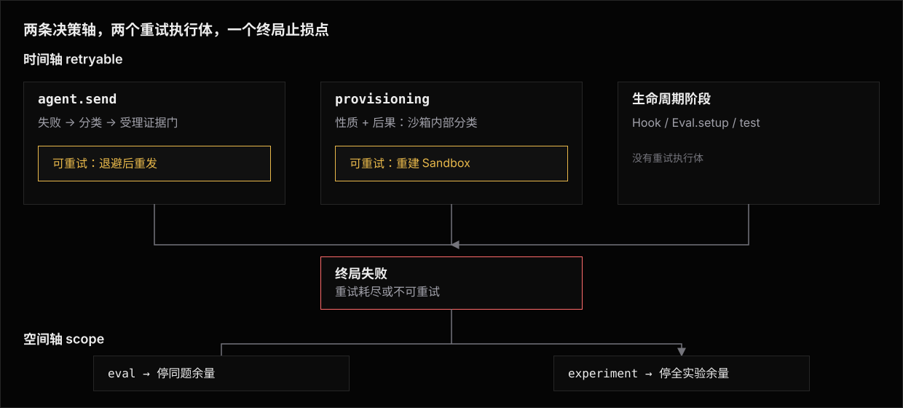

# 执行失败分类:时间轴与空间轴

一套统一的失败分类词表,回答两个正交的决策问题:**换个时机重做,能不能过**(时间轴 `retryable`,驱动 attempt 内的有界重试),以及**这个死因波及多远**(空间轴 `scope`,驱动 eval / experiment 粒度的止损闸)。
turn 失败、生命周期各阶段的失败、[sandbox 层的 provisioning 失败](../sandbox/architecture.md#provisioning-失败与重试)说同一种语言;声明通道随知识所在地分布,消费策略单点在框架。



## 动机

两类真实浪费,各暴露一条缺失的决策轴:

1. **瞬时故障被放大成 `errored`**(时间轴)。
   一次 turn 失败若只展平成不透明的 `AttemptError{code: "turn-failed"}`,限流、连接中断这类「换个时机大概率能过」的失败与同因必复现的确定性错误无法区分:没有 attempt 内重试,唯一自愈手段是重新调度整次实验(`attempts` + `earlyExit`),粒度太粗;高并发批跑里限流连续撞上时,run 级 fail-fast 的 streak 判定还会把最该重试的场景当确定性错误放弃派发。
   真实样本(批跑时多条 attempt 同报):

   ```
   This send returned failed (turn status = failed): agent run exited with code 1 ·
   last error: stream disconnected before completion: Concurrency limit exceeded for
   user, please retry later
   ```

2. **实验级死因被逐 attempt 反复撞**(空间轴)。
   实验共享的基建(隧道、mock server、共享凭据)死掉时,每条 attempt 各自创建沙箱、各自撞死、各自 `errored`——批跑常态是 `attempts: 1`,run 级 fail-fast 按「同一 eval 内同 code 连续复现」判定的 streak 永远凑不齐,几十条 eval 把同一个死隧道撞几十遍。
   作者在 setup probe 里第一时间就知道死因是实验级的,却只能看着余量烧完。
   同构的浪费在 eval 粒度同样存在:fixture 损坏时 `attempts: 5` 的五次同因必死,作者第一次就知道。

## 分类

分类结果是一份数据(`FailureClass`),两层纪律:**顶层是封闭的决策轴,只有决策轴进策略**;`reason` 是开放词表的细分诊断,只进观察面(activity、诊断文案),不参与任何分支。
决策轴有两条,正交:

```ts
/** 空间轴取值:失败死因的波及范围。 */
export type FailureScope = "attempt" | "eval" | "experiment";

export type FailureClass =
  | { readonly retryable: true; readonly reason: string; readonly scope?: FailureScope }
  | { readonly retryable: false; readonly reason?: string; readonly scope?: FailureScope };
```

框架预设不了所有错误的细分词表,声明方细分自家错误(队列满、模型预热中)时不该被迫放入内建的 `"rate_limit"` / `"network"` 两个桶;而「要不要重试」「波及多远」是封闭问题,枚举即穷尽——这是决策与诊断拆成两层的理由。

**时间轴 `retryable`,判据是重试安全性,不是错误文案的相似度**:只有能证明「这次输入未被 agent 受理」的错误才归可重试——

- `"rate_limit"`(内建 reason):服务端在受理前拒绝(429、限流关键字、明示 "retry later")。
  上面的样本属于这类:虽经 stream 断开的包装浮出,但本质是入场拒绝。
- `"network"`(内建 reason):连接建立失败(DNS 解析失败、连接被拒、TLS 握手失败、首字节前超时)——请求根本没到 agent。
- 其余一切不可重试,包括无法证明 agent 未开始处理的流中断、响应中途连接重置。

判据的理由:重试等于把同一段 user text 原样重发,若 agent 已执行部分工具调用、写了 workspace,重发会产出被污染的判定——比一次诚实的 `errored` 更糟。
歧义一律不可重试;这与 provisioning 分类「偏向宽认瞬时」方向相反,因为误判代价的不对称方向相反(provisioning 误重试只多花封顶的退避时间,turn 误重试赔的是判定正确性)。

**空间轴 `scope`,判据是死因共享的可证明性**:只有能证明「同 scope 的兄弟 attempt 同因必死」才可声明超出 `"attempt"` 的档——

- `"attempt"`(默认):死因只属于本次执行。
  任何未声明、未被分类器认领的失败都落在这档。
- `"eval"`:同一 eval 的其余 attempt 同因必死——fixture 损坏、任务前置资源确定性缺失。
  命中即停止派发同 eval 的剩余 attempt。
- `"experiment"`:全实验的兄弟 attempt 同因必死——实验共享服务死亡、共享凭据失效、实验级配置错误。
  命中即停止派发同 experiment 的全部剩余 attempt。

两轴的误判代价不对称方向不同,把关手段也不同:时间轴误重试赔判定正确性,由[受理证据门](architecture.md#分类链)机器检查;空间轴误扩 scope 赔整批覆盖数据,没有机器门可查,靠判据从严——**唯一有权扩 scope 的是携带作者知识的通道**(抛出点声明、adapter / 实验分类器),保守回退分类器永不扩 scope,「看起来像基建问题」不构成证明。

**组合规则:时间轴先走,空间轴只对终局失败生效。**
 可重试的失败先被重试执行体吸收,只有重试耗尽或不可重试的失败,才携带 scope 抵达止损闸。
限流这类「全实验共享但自愈」的死因因此永远到不了闸——不需要特判。

## 声明通道:知识在哪,声明就在哪

分类的附着点跟着知识走,所有通道产出同一份 `FailureClass`:

- **抛出点声明**(作者拥有的错误):包根导出空间轴糖衣类 `ExperimentFatalError` / `EvalFatalError`——作者写下 probe、fixture 校验时就知道失败的波及范围,直接 throw,任何 per-attempt 阶段可抛。
  糖衣类只开空间轴,不提供「可重试」糖衣:时间轴的消费点只有 send 与 provisioning 两处(见下节),作者代码不在任何重试执行体的包裹范围内,可重试糖衣是一张永远无法兑现的支票。
- **分类器**(第三方错误,事后识别):错误由 SDK / CLI / 网络栈抛出,制造者不可能使用我们的类,由最懂其形状的一方在自己的边界识别,按特异性降序决议——实验的 `classifyFailure` 识别自家共享基建的死因(隧道 host 拒连以 turn 层连接错误的形态浮出时,adapter 不认识那个 host,只有实验作者认得);adapter 的 `classifyTurnError` 识别自家协议错误(写法见 [Library](library.md#adapter-作者classifyturnerror));保守回退正则识别通用形状(限流关键字 → `"rate_limit"`,连接建立层错误 → `"network"`),只产时间轴。
- **provisioning**:sandbox 层的分类自治(性质 + 后果两维不外泄),向外浮出的确定性配置死因附带按**配置解析域**定档的 scope——凭据缺失 → `"experiment"`;模板不存在按 spec 是否带 `environments` 表(模板逐 eval 解析)落 `"experiment"` 或 `"eval"`。
  映射单源在 [Sandbox · Provisioning 失败与重试](../sandbox/architecture.md#provisioning-失败与重试)。

路由纪律沿用 Effect 生态的 tagged error 习语:**糖衣类的契约是它携带的 `_tag` 与 `class` 数据字段,一切识别走结构守卫(`failureClassOf`),不用 `instanceof`**——依赖树里出现第二份 niceeval 实例时类身份静默失效,数据不会。
精确类型、分类链的决议顺序与否决权见 [Architecture](architecture.md#数据建模)。

## 消费点是位置性的

两条轴各有固定的消费点,声明不改变消费点的位置:

- **`retryable`** 只在两处被消费:context 层包住 `agent.send(...)` 的重试执行体(全仓库唯一的 send choke point),与 sandbox provisioning 重试(内部自治)。
  其余位置(sandbox Hook、`EvalDef.setup`、`test(t)` 体内)的失败无论分类如何都不重试——那里没有重试执行体,分类链在这些位置也不产时间轴。
- **`scope`** 在 attempt 封口时被读取:终局失败携带的 scope 决定要不要落闸(eval 闸 / experiment 闸)。
  所有 per-attempt 阶段可达。

重试只包 send 一次调用,不重放会话记账;变更归因的 send 窗口横跨全部尝试;重试预算两层(单 send 封顶 4 次尝试、attempt 加总封顶 8 次重试)。
执行体的精确契约见 [Architecture · 重试执行体](architecture.md#重试执行体);重试封顶后的失败照旧走 `expectOk()` → `TurnFailed` → `AttemptError{code: "turn-failed"}` 路径,下游契约不变。

## 自愈阶梯与止损阶梯

**自愈**(时间轴,由内向外,每层只兜上一层兜不住的):

1. **agent 内层自愈**(能力因 agent 而异):被测 CLI / SDK 自己的重连与续传——codex 断连会带着会话现场自动重试,bub 没有这层。
   这是唯一能「从断点续传」的层,因为会话状态在它手里。
   adapter 不代偿这层能力,不在 `send` 里自己整段重发;`send` 浮出的失败视为 agent 侧自愈的最终结果。
2. **turn 级重试**:对受理前的失败整段重发同一段 `TurnInput`。
   只兜「输入还没进 agent」的窗口——断点续传只有内层做得到,对「已进 agent」的失败重发只会让 agent 重做已做过的操作。
3. **重跑 eval**(最外层恢复路径):重试耗尽或不可重试的失败落成 `errored`;`errored` 不进指纹缓存,重跑同一条命令即是续跑,只补跑失败的 attempt(见 [Experiments · 缓存与携带](../experiments/cache.md))。

**止损**(空间轴,由小到大,声明精确、推断回退):

1. **eval 闸**(`scope: "eval"`):一次命中即停止派发同 eval 剩余 attempt。
2. **experiment 闸**(`scope: "experiment"`):一次命中即停止派发同实验全部剩余 attempt。
3. **run 级 fail-fast**(推断回退,见 [Runner · 首过即停](../../runner.md#首过即停earlyexit)):没有任何声明时,同一 eval 内同 code 连续复现的 streak 推断确定性错误、停止派发。
   声明通道是作者背书下的一次命中,fail-fast 是无声明时的保守推断,二者并存、互不替代;turn 层瞬时故障在进入 streak 判定前已被重试吸收,streak 看到的 `turn-failed` 一定是重试耗尽后的最终结果。

## 止损语义

- **观察到失败的 attempt 照常 `errored`,error code 保持所属阶段的原有值**——scope 是路由标记,不是错误种类,不改写 `AttemptError` 的任何公开形状。
- **闸只停派发,不抢占在飞**:等待集中同闸的 attempt 中止、计入 `unstarted`,完成状态 `incomplete`;已在跑的 attempt 跑完如实落账。
  不为没跑过的 attempt 制造 `errored` 记录。
  实验级 `setup` 失败的「全部 attempt 记 `errored(experiment-setup-failed)`、不派发」是另一种情形——它发生在任何派发之前、整个计划确定性全灭(契约见 [Experiments · 实验级共享服务](../experiments/library.md#实验级共享服务setup-与-teardown)),与运行中止损各自成立。
- **闸幂等、invocation 内不可逆、不跨 invocation 持久**:并发 attempt 同时声明同一死因是常态,重复触发只折叠诊断计数;落闸后在飞 attempt 侥幸成功也不重开——作者背书的判定不被单次成功推翻,抖动的服务不该让调度来回摆。
  死因与修复都活在框架外(隧道、`.env`),框架无法验证「修好了没有」,不留跨次运行的止损状态、不需要解除命令;唯一持久痕迹是诊断记录,它是历史陈述,不是未来指令。
- **message 是作者的修复提示,走完全程**:运行期反馈流即时通知 + `run.json` 实验域诊断(`dispatch-halted`),双通路同源、互不派生。
- **恢复即重跑**:`errored` 与 `unstarted` 都不进指纹缓存,已 `passed` 的照常 carry 携入——修复后重跑同一条命令,自动只补跑死掉与未跑的部分,零新机制。
  止损做得激进(一次命中即停),正因为恢复路径免费。

## 非目标

- 不改变 `AttemptError.code` 的公开形状或 `errored` 判定语义——重试是 `send()` 内部的自愈,止损只影响「还没跑的」,对外仍然只暴露「这次 attempt 到底 errored 没有」。
- 空间轴不设 `"invocation"` 档——跨实验共享死因(全局 API key 失效)有真实用例再扩,词表形状留有余地。
- 不在 `EvalDef` 上挂分类器——「以第三方错误形态浮出、且死因只属于单条 eval」的场景没有真实样本;作者代码能触到的 eval 级死因由抛出点的 `EvalFatalError` 覆盖,有样本再扩。
- 不跨 invocation 记忆止损状态,不提供解除/隔离命令。
- 不抢占在飞的 attempt——已花的沙箱与 token 成本不可回收。
- 不复用或修改 sandbox provisioning 重试的实现——那层要处理「远端资源是否已创建」的对账;两层只共享词表、退避形状与槽位接口。
- 不在 CLI 或 `defineEval` / `defineExperiment` 加重试次数、退避参数一类配置——封顶次数与退避参数是固定值,有真实需要再考虑开放。
- 不改 `attempts` / `earlyExit` / run 级 fail-fast 的既有语义——止损闸在其旁并存,streak 推断继续兜没有声明的场景。

## 相关阅读

- [Architecture](architecture.md) —— 类型形状、分类链、重试执行体、止损执行体与不变量。
- [Library](library.md) —— 糖衣类与实验分类器的写法、adapter 作者的 `classifyTurnError`、观察面。
- [用例](use-case/README.md) —— 三种姿态的全流程叙事:读懂 errored、抛出点声明死因、写分类器。
- [Runner](../../runner.md) —— earlyExit、run 级 fail-fast、完成状态与外层超时。
- [Experiments · 实验级共享服务](../experiments/library.md#实验级共享服务setup-与-teardown) —— 实验级 setup 失败的既有语义。
- [Sandbox · Provisioning 失败与重试](../sandbox/architecture.md#provisioning-失败与重试) —— 词表对齐的另一处分类与退避。
- [Adapter · agent 契约](../adapters/architecture/agent-contract.md) —— `classifyTurnError` 的挂载面。
