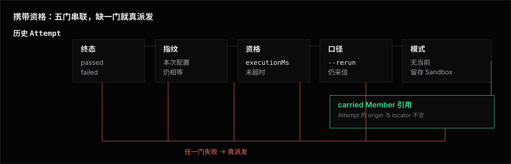

# 缓存与携带 —— 上一轮的结果哪些还算数

跑过一轮之后再跑同一条命令,已经跑完的结果默认不重花 agent / sandbox 成本: 它们直接**携带合入**本次 Run,本次只派发真正缺的那些 attempt。
这篇定义「哪些结果还算数」的完整判据,是指纹输入、携带粒度与终态定义的单源。

「我改的这个东西会不会让它重跑」按场景查[用例手册 · 改什么会作废缓存](use-case/缓存与沿用/), 本篇只写判据本身。

## 携带要过的门

一条已落盘的 attempt 要携带进本次 Run,必须同时过下面每一道门,缺一不可。
只有指纹那道走哈希——它是其中一个判据,不是携带的全部。
前三道问的是「这个条目自己够不够格」,后两道问的是「本次调用还认不认它」。



| 门 | 看哪一侧 | 判据 | 不过会怎样 |
|---|---|---|---|
| 终态 | 条目 | 判定是 `passed` 或 `failed` | `errored` / `skipped` 永不携带,总会重试 |
| 指纹 | 条目 | 该 eval 的指纹等于本次配置算出的指纹 | 这条 eval 的全部 attempt 重跑 |
| 资格 | 条目 | `executionMs` ≤ 当前解析后的 `timeoutMs` | 这一条重跑 |
| 口径 | 本次调用 | [`--rerun`](use-case/重新运行/) 档位仍采信这个判定 | 该判定的 attempt 重跑 |
| 模式 | 本次调用 | 该条不落在 `--keep-sandbox` 当前留存档内 | 这一条真派发 |

`passed` 与 `failed` 都是「跑完了、判定确定」的终态, 没理由重花一次钱去复现同一个已知结果。
`errored` 与 `skipped` 的判定本身不可信,不是可复用的终态,因此从不缓存—— 前者是框架或环境层面的不确定失败,例如超时、沙箱失败。

Runner 内部把每条判定表达为 `Eligible | Blocked`；`Blocked` 才携带 gate 与 reason。
成功不靠 `undefined` 表示，因此调用方必须穷尽处理两种结果，不能把遗漏分支误认成可携带。

后两道门的完整语义在[执行模式划走的两块](#执行模式划走的两块)。

五道门只管读得进来的条目。
写它的 niceeval 版本与本次的 `schemaVersion` 不同时,那份落盘整份不解析([版本不匹配时的读取行为](../record/architecture.md#版本不匹配时的读取行为)),条目根本走不到任何一道门前——`--dry` 把这样的行标 `incompatible` 而不是 `new`,它跟从没跑过是两回事。

## 指纹:两个哈希嵌套

指纹按**每条 eval** 各算一份(`runner/fingerprint.ts`),由两层嵌套构成:

```text
configHash  = hash(agent 与其安装身份, model, reasoningEffort, flags, sandboxReuse, sharedState.key,
                   Experiment sandbox layer 身份, strict, judge)
fingerprint = hash(configHash, eval 源码闭包, evalId / tags / metadata,
                   pair-owned ProviderPlan(含 template owner、目标 platform/libc 与物理身份),
                   loader 登记的数据文件内容与判据树哈希)
```

layer 身份 = template-bearing factory 的纯数据 options,加 `command()` / `shell()` / `defineSandboxCommand()` 的 command identity。
直接传入的 callback 不提供额外 identity，也不阻断跨 Run 携带；其它指纹输入相同时，结果默认携带。
这条默认避免一次声明遗漏让整批昂贵评测永久重跑，但不表示 Runner 能识别 callback 的语义变化。
需要让实现或动态输入变化自动作废结果时，作者必须改用 `defineSandboxCommand()` 并维护 `revision` / `inputs`。

Docker image 的浮动 tag、Dockerfile 未 pin 的 `FROM`、Compose 未 pin 的 image / `FROM`、checkout 的浮动 `ref` 与 opaque custom provider callback 都进入 fingerprint。
它们使用现有声明值、BuildKey 或 opaque marker。
同名外部内容后来发生变化时，Runner 无法自动感知，历史 `passed` / `failed` 仍按默认规则携带。
作者应提升 revision、改变声明，或用 `--rerun all` 明确重验。

Agent 安装身份只含按声明顺序冻结的 ensure identity 与精确配对 installer 的 identity/revision/installMode；
它进入 configHash。计划目标平台属于 pair-owned ProviderPlan，进入逐 Eval fingerprint。
实际 staged payload digest 与创建后核验出的实际平台是 runtime provenance/facts，不进入任一哈希。
因此改 Agent 版本不重建任务环境，换 template 不改 installer 静态身份；installer 分发内容变化必须提升 revision。

`configHash` 是 Run 级的**配置身份**,同时是跨 Run 可比性的唯一判据, 读取面怎么用它见 [Record · configHash](../record/library.md#confighash配置身份只算一次)。
两个哈希嵌套而不是并列,于是新增一个公开配置字段只需要裁决一次「进不进 configHash」, 不必分别裁决「进不进指纹」和「算不算可比性配置」。
**一个字段两处裁决迟早会分叉**, 而分叉的症状是静默的:报表把一行标成单一 agent / model / flags,底下却混着两套配置的数据。

三条配套规则:

- **进 configHash 的字段必须落进 `run.json`**,顶层或 `ExperimentRunInfo` 二选一、不重复。
  没落盘就没法对历史侧重算配置身份,配置面的差异解释与 [`accept`](#niceeval-accept-locator接受一条或多条结果) 的重锚校验也就无从落地。
- **`configHash` 不逐 eval、不逐题型分叉。**
  代价是配置改动会波及证明上不受它影响的 eval: 一条 eval 自己完整声明了 `judge` 时,config 层换裁判模型照样让它重跑。
   `--strict` 也一样——它对两种题型的 soft 断言统一提级为 gate；计分制的 points 仍只影响分数面，不因 strict 翻判定（见[判定与分数正交](../assertions/library/score-points.md#折叠树判定面分数面质量分)）。
  换来的是一个字段只裁决一次,不必维护一张「哪个字段对哪类 eval 有效」的表。
- **凭据不进。**
  `judge` 进的是解析后 `model`、`baseUrl` 与 `timeoutMs`；`judge.apiKeyEnv` 只选择凭据从哪来，不进哈希也不落盘。
- **`sandboxReuse` 进。**
  复用改变 Case 创建次数和题间状态边界，因此属于可比性配置；它不改变已完成结果能否按相同指纹携带。省略等价于 `false`。
- **`sharedState.key` 进。**
  key 决定这批结果属于哪一条持久状态轨迹；换 key 等于换 cohort，旧结果不能与新轨迹混合。省略表示未声明跨 Invocation 共享状态。

### manifest:哈希做索引,清单做解释

指纹是扁平哈希,只能回答「等不等」,回答不了「哪里变了」。
回答后一个问题的是 **manifest**:每次 Run 按 eval 落一份指纹输入的可读清单, 与指纹同刻算出、同处落盘(Run 记录根下 `manifests.json`,逐 eval 一份):

- **配置面**:configHash 各字段的解析后值。
  凭据本来就不进指纹,也不进 manifest。
- **源码面**:闭包逐文件的「项目根相对路径 × 内容哈希」,与指纹同一份输入。
- **数据面**:loader 登记文件的同口径清单。

指纹不等时,新旧两份 manifest 相减得到**带名字的精确差异**: `config:judge.model` 的旧值到新值、`source:evals/share/prompts.ts` 的内容哈希变化、 `data:evals/data/cases.yaml` 的增删改。
差异只服务于解释: [`--dry` 的逐条作废原因](cli.md#--dry计划矩阵与作废原因)展示它, `niceeval accept` 在接受前把它完整写入审计记录。
历史条目缺 manifest 时,算不出的只有源码面与数据面,两者合并成一条 `opaque:no-manifest`,不猜。
配置面另有出处:它落盘在 `run.json`,从条目重建后照常给具名差异。

fingerprint 与 manifest 各带独立版本。`algorithmVersion` 标识哈希 payload / 编码口径，`coverageVersion` 标识 manifest 覆盖的输入集合；旧记录未声明时按 legacy 版本 `0` 读取。
任何进入 fingerprint 的输入都必须有同源 manifest 投影。当前版本内出现 fingerprint 不同、manifest 相同，属于 `fingerprint-invariant-violation`，不能退化成没有原因的 stale。

跨版本先查显式迁移注册表。迁移只返回三种决策：已证明等价、具名差异、无法证明。
已证明等价时结果自动携带，并在新条目记 `migratedFrom`；具名差异照常进入指纹门；无法证明时阻断携带，交给人检查证据后接受或重跑。
迁移不能只凭 manifest 相同猜等价；它必须点名 from/to 版本与被移除、改名或重编码的输入。

携带决策与诊断解释分开建模。指纹门只维护 `match`、`changed`、`unexplained` 三种稳定决策；`unexplained` 携带比较 owner 给出的 `FingerprintDiagnostic`，不由 Runner 或 renderer 枚举可能原因。诊断 `code` 是可扩展的命名空间字符串，并携带自解释摘要、有序事实、已观察到的 manifest 差异、比较限制与递归 cause。新增一种不可证明情形时，owner 只增加一条诊断构造，不修改携带状态机或通用 renderer。

`observedDeltas` 的存在性本身有语义：省略表示相应输入面不可比较，空数组表示完成了可比较字段的相减但没有观察到差异，非空数组表示观察到具体差异。三者都不等于跨版本等价证明。诊断不得把空数组渲染成 `no input delta`；人读面只能说「可比较的 manifest 字段未观察到差异」，同时保留「等价性未证明」这一阻断原因。

诊断事实只保存规划期已经掌握的有界、安全摘要。凭据、源码正文、数据文件正文和未经脱敏的异常对象不进入诊断；需要查看执行证据时只给 locator 与下钻动作。

`compareFingerprints` 是诊断的唯一 owner。它按下面的顺序形成结果：

1. 指纹相等时返回 `match`，不制造诊断。
2. 同版本且 manifest 有差异时返回 `changed`，`deltas` 是携带门与接受审计共同消费的权威差异。
3. 不能证明时返回 `unexplained`。owner 同刻相减仍可比较的 manifest 字段，把结果放进 `diagnostic.observedDeltas`；不能比较的面写进 `limitations` 或递归 cause。
4. `planCarry` 只消费比较结果，不再次计算另一份解释。已知迁移仍可把 `unexplained` 提升为已证明等价；没有迁移时，诊断再详细也不能放宽携带。

`FingerprintDiagnostic` 不复用落盘的 `DiagnosticRecord`。后者是 Attempt / Run 已发生事件的 observation，带 level、origin、dedupe 与持久化约束；前者是一次规划里的比较证明，生命周期只到本次 `--dry` 或调度计划结束。它不进入 `run.json` / `result.json`，因此不改变 Record `schemaVersion`。

`niceeval accept` 使用同一比较结果里的完整 `observedDeltas` 写审计；诊断摘要、限制和 cause 只解释为什么自动携带被阻断，不成为授权 selector，也不改变反事实重算规则。`observedDeltas` 省略时，接受动作只能按原有 opaque / locator 资格处理，不能把「无法比较」当成空差异。

下面三块把每一行改动的后果标在原地。
设定:这个实验选中 36 条 eval,上一轮全绿。

### 实验文件:一行下去,要么 36 条全重跑,要么一条不动

```typescript
// experiments/compare/codex-nowledge.ts
//   ↑ 改文件名 → experimentId 跟着变 → 36 条全部重跑(相当于开了一个新实验)

export default defineExperiment({
  description: "codex + nowledge 对照",
  //  改文案 → 一条不动

  //  改注释、调字段顺序、把某个值抽成变量 → 一条不动。实验文件认解析出来的值,不认字节

  agent: codexAgent({ webSearch: true }),
  //  true → false → 一条不动!指纹只认 agent 的名字 "codex",看不见工厂参数
  //  想让这个开关作废历史,把它搬去下面的 flags,再让工厂从 ctx.flags 读

  model: "opus",                    // → "sonnet" → 36 条全部重跑
  reasoningEffort: "high",          // → "medium" → 36 条全部重跑

  flags: { webResearch: true },
  //  true → false → 36 条全部重跑。加一个键、删一个键同样全跑:flags 整袋进指纹,无逐键豁免
  //  这正是想要的——两个值下跑出来的是两批不同条件的结果,混在一起读通过率没有意义

  labels: { line: "codex" },        // → { line: "codex-cli" } → 一条不动,labels 是纯报告坐标

  attempts: 5,
  //  3 → 5 → 已有的 3 条携带,只补跑缺的 2 条
  //  5 → 3 → 不删已有结果

  timeoutMs: 40 * 60_000,
  //  20min → 40min → 一条不动,上限不改变「结果是什么」
  //  40min → 10min → 上一轮执行了 15 分钟的那几条重跑(在新上限下复现不出来)

  earlyExit: false,                 // 改 → 一条不动
  maxConcurrency: 2,                // 改 → 一条不动
  budget: 50,                       // 改 → 一条不动。这三个是调度参数,不改变结果

  sharedState: { key: "mempal/codex/cohort-a" },
  //  换 key → 36 条全部重跑；状态轨迹变了，不能沿用另一 cohort 的结果

  sandbox: sandboxLayer().prepare(shell("npm i -g some-cli")),
  //  这个实验的 layer 是 command-only,起点由各条 eval 自带(见下一块)
  //  改 shell(...) 的脚本、cwd 或 env → 36 条全部重跑:command()/shell() 的 identity 进配置哈希
  //  追加或删除一条 prepare 命令 → 36 条全部重跑
  //  直接传 callback 不增加可追踪输入；要让变化自动作废结果，改用 defineSandboxCommand()
  //  反向配对(实验自带 template-bearing factory、eval 全部 command-only)时,
  //  换 factory 的任何一个参数 → 36 条全部重跑:起点身份进配置哈希

  evals: (e) => e.tags.includes("memory"),
  //  改谓词 → 只改变选中谁。上一轮跑过、这一轮仍被选中的照常携带

  classifyFailure: ({ text }) => text.includes(tunnelHost)
    ? { retryable: false, scope: "experiment" }
    : undefined,
  //  改分类器 → 一条不动。它只改变终局失败怎样止损,不改变已完成 Attempt 的结果身份

  setup: async (ctx) => { tunnel = await startTunnel(); },
  //  改函数体 → 一条不动
  //  tunnel.url 这种跑起来才有的值也进不了指纹:携带决策发生在任何 setup 执行之前,那时它还不存在
});
```

命令行上还有一个:`--strict` 改变 soft 断言怎样影响判定,进指纹 → 36 条全部重跑。
`--max-concurrency` 只是调度,一条不动。

### eval 文件:一行下去只作废这一条

```typescript
// evals/memory/recall-3.eval.ts
//   ↑ 改文件名 → id 跟着变 → 这一条重跑,同实验其余 35 条照常携带

export default defineEval({
  //  在这里加一行注释 → 这一条重跑
  //  格式化一次、调个缩进、加个空行 → 这一条重跑
  //  ↑ 不是笔误:eval 文件进指纹的是**整份字节**,不是解析出来的字段

  tags: ["memory"],                 // 加一个 tag → 这一条重跑
  sandbox: dockerImageSandbox({ image: "ghcr.io/acme/py39-astropy:r1" }),
  //  换 image、换 factory → 这一条重跑,同实验其余 35 条照常携带:起点身份进它自己的指纹
  //  同名 image 被原地重建 → 一条不动,指纹看不见镜像内容
  metadata: { source: "swe" },      // 改 → 这一条重跑

  timeoutMs: 15 * 60_000,
  //  改这个值 → 这一条重跑,因为字节变了
  //  四层来源里只有写在 eval 文件里的这一层会这样;--timeout / experiment / config 三层改了不作废

  async test(t) {
    await t.send("把 recall 结果写进 out.md");   // 改 prompt → 这一条重跑
    t.check(await t.sandbox.pathExists("out.md"), isTrue());  // 改断言 → 这一条重跑

    t.fact("endpoint", tunnel.url);
    //  改这行代码 → 这一条重跑,因为字节变了
    //  但 tunnel.url 的值不进指纹:换一个地址重跑,已完成结果照常携带
  },
});
```

### eval 源码闭包:算到哪为止

判定逻辑常常不住在 `.eval.ts` 里——断言抽进 `share/assert-memory.ts`、数据行从 `evals/data/` 读进来,是被鼓励的写法。
指纹因此认的不是单个文件,是这条 eval 的**源码闭包**:

- **静态面**:eval 文件字节,加上它的导入图里解析后落在项目根内的每个模块,递归展开。
  判据是模块解析后的真实路径,不是 import 写法——相对路径、`tsconfig` 的 `paths` 别名都算数。
  按项目根相对路径排序后逐个哈希,顺序固定;循环导入按解析后的绝对路径去重。
- **数据面**:经 loader 读入的数据与 EvalDefinition 声明的受管文件,内容哈希进引用它的那条 eval——增删文件与改一字节同等作废。
  哈希口径是排序后的「相对路径 × 内容哈希」对,权限位与修改时间不进哈希。
  输入分两类:
  - `loadYaml` / `loadJson` / `loadText` 读入即登记。发现期把内容交给 Eval 定义并哈希进数据指纹。
  - 普通 `uploadFile(URL)` / `uploadDirectory(pathOrUrl)` 在真实执行时记录 transfer manifest。后续携带重算历史 manifest；Eval 源码闭包变化时不信任旧依赖集合，直接重跑。
  完整规则见[本地测试文件](../eval/use-case/criteria-files.md)。

两块之外还有两处进不来,是明确的缺口:落在 `node_modules` 里的包(含 workspace 内经 symlink 解析过去的那些)、以及动态 `import()`。
改了这些要重验用 [`--rerun all`](use-case/重新运行/)。
用户自己写 `fs.readFileSync` 读进来的文件同样进不来——niceeval 不知道那次读发生过；数据走 loader，静态判据走 EvalDefinition 文件声明。

**闭包是 1 对 N 的,依赖越集中作废面越大。**
eval 文件的字节只作废它自己, 而一个被 30 条 eval 引用的 helper 改一行就作废那 30 条,效果接近改一个 `flags` 值。
`share/` 里通常还混着 prompt 模板、类型与日志这类不参与判定的代码,改它们同样全批重烧。
想缩小作废面就按变更频率拆文件:稳定的断言 helper 和天天调的 prompt 模板不放同一个文件。

### 两个文件之外的世界:改了也不作废

指纹只认你写下的配置与它能读到的源码。
下面这些一条都不作废,上一轮的绿照常携带:

- agent CLI 从 v1.2 升到 v1.3
- 被测服务改了行为、重启了、换了一个实例
- 同名的外部预建镜像被原地重建
- 受管的按需构建例外：`Dockerfile`、过滤后的 context、build args 或 target 改动会改变 BuildKey 与指纹
- agent 的 system prompt 改了(它不在实验文件里)

这时旧的绿掩盖的可能是真实回归。
要复验用 [`--rerun`](use-case/重新运行/)—— 改了被测对象只复验失败项走 `--rerun`,外部世界整个变了走 `--rerun all`。
能配置化的差异(服务端版本号)就显式写进 `flags` 让指纹自然失效,比每次手动重跑可靠。

### 为什么 eval 认字节,实验文件认解析值

上面两块的不对称是有意的,来自两者语义的可声明性差异。
实验文件的语义完全等于 `defineExperiment` 那几个字段的值,列得出来,指纹就认这些值。
eval 的判定逻辑写在 `test(t)` 的函数体里,列不出一组能代表它的字段,只能把整份文件当作它的定义; 闭包只是把同一条理由推广到判定逻辑实际所在的那些文件。

代价是格式化一次 `evals/` 或 `share/` 等于一次整批重烧,这是有意接受的。
要让格式化不作废结果,前提是能声明「eval 的语义等于哪几个字段」,而函数体让这个前提不成立。
退而求其次去做源码规范化(剥注释、AST 归一),等于把「哪些字节不算语义」变成一条长期维护的猜测。
猜错的方向是**该重跑的没重跑**——静默采信一条已经不成立的旧判定,比多烧一次钱贵得多。

同理,连接坐标(隧道 URL、实例地址)的家是 [`ctx.fact()`](../record/architecture.md#facts运行事实), 换多少次都不作废已完成结果;三个家的判据见 [Library · 运行时坐标不进配置](library.md#运行时坐标不进配置三个家)。
把开关声明进 `flags` 而不是写死在 agent 工厂里,也是 [配置归属不变量](../adapters/architecture/agent-contract.md#配置归属不变量)本来就要求的写法。

## 携带资格:`timeoutMs` 不进哈希

超时上限不改变「结果是什么」,只决定「等不等得到」。
一条 15 分钟跑完的 `passed`,在 20 分钟和 40 分钟的上限下是同一个事实; 把 `timeoutMs` 掺进哈希会让提高上限作废全部已完成结果,为一个不影响它们的参数付全量重跑。

因此指纹不含 `timeoutMs`,它在指纹匹配之外另立一条判据: **终态 attempt 可携带,当且仅当其 `executionMs` ≤ 当前解析后的 `timeoutMs`**(未设上限视为无穷)。
四层来源的解析顺序单源在[配置解析链](architecture.md#配置解析链一次求值处处同源)。

判据用 `executionMs` 而不是 `durationMs`,是为了让两侧量的是同一段时间。
attempt deadline 从 `sandbox.create` 起算、不含等并发位的排队, `executionMs` 按同一口径落盘(定义见 [Results · result.json](../record/architecture.md#resultjson))。
拿含排队的 `durationMs` 去比就是两把尺子:一条排队 20 分钟、执行 5 分钟的 `passed`, 在 10 分钟上限下会被判成复现不出来,而它执行只要 5 分钟,根本不会撞线。

提高上限时全部已完成结果照常携带,只有当初撞线的 `errored`(本就不携带)重跑。
调低上限时,执行耗时超过新线的旧结果在新配置下复现不出来,如实重跑。

## 携带粒度:以 attempt 为单位

指纹未变时,上一轮已落盘的终态 attempt **逐条**携带,本轮只派发计划内缺失的 attempt 序号—— `attempts: 5` 已有 3 条终态就只补跑 2 条,通过率的分母由携带与新跑共同凑满。
`attempts` 因此不进指纹:调大只补跑缺的,调小不删已有结果。

携带的 `passed` 与[首过即停](use-case/首过即停.md)组合遵守既有语义: 已携入通过且 `earlyExit` 开时,缺失序号不再派发,计入 `earlyExitUnstarted`。

## 一份 Run 里的条目共享一个指纹口径

携带的含义是「这条已落盘的结果对本次规划的输入依然成立」,判据又正是指纹相等。
两者合起来落成一条不变量:**Run 里每个条目的 fingerprint 都等于本 Run 配置算出的指纹**, 携带条目不背着产出它那一轮的旧指纹漂下去。

读取面因此不必翻更早的 Run 就能把条目与 Run 记下的配置对上号,`flags` 与条目指纹恒同源。
合入只重打指纹一个字段:`locator`、`artifactBase`、判定、`facts` 与证据指向照旧原样携带, 落盘语义见 [Results · 两类条目](../record/architecture.md#resultjson)。

## `niceeval accept @<locator>...`:接受一条或多条结果

指纹变化后,人判断某条历史结果仍然成立时,直接接受这条结果:

```sh
niceeval accept @a1b2c3d4
niceeval accept @a1b2c3d4 @e5f6g7h8
```

显式 locator 列表是唯一输入,也是唯一作用域。命令从当前项目发现每条来源对应的 experiment 与 eval,按当前源码和运行配置重算指纹,然后新建一份结果快照。新条目保留原结果的 verdict、证据和 artifact 引用,使用当前指纹与配置身份,因此下一次 `niceeval exp` 自然携带它。

接受不是一次 `exp` 的参数,也不按 `config:`、`source:` 或 `data:` 选择一批条目。`--all-stale` 不存在：范围会随当前发现结果漂移，不能代表逐条授权。
多个 locator 可以跨 experiment：命令按每条 locator 解析出的 experiment 分组，为每个 experiment 各自合成一个原子 snapshot。同一 experiment 内，两个 locator 解析到同一个当前 (eval, attempt) 目标视为重复选择，直接拒绝；跨 experiment 时，同名 eval 各自独立，不算重复。它不把某个 experiment 内部的共同差异扩散到其它 experiment 或未列出的结果。

写盘前先对全部 locator 验证下列条件:

- locator 恰好指向一条可读的历史结果;
- 结果是 `passed` 或 `failed`;
- 当前项目仍发现同一 experiment 与 eval,并能解析其运行配置;
- 当前 Sandbox pair 已成功完成 discovery、link 与 physical planning;
- 当前超时上限仍允许该结果的 `executionMs`。

缺失序号、`errored`、`skipped` 与留存 Sandbox 的结果都不能接受。`sandboxReuse` 只描述真实派发时的 Sandbox 生命周期，不收紧单条结果的接受资格。Provider identity 未 pin 或 callback opaque 属于 fingerprint 输入，不单独作为 carry blocker。

任一 locator 解析失败、重复、不可接受或不能重算当前指纹时，整批零写入。全部通过后按 experiment 分组，每组各自封口一个 snapshot。
输出逐条列出来源与新 locator，结果各自保存自己的 `acceptedFrom`。
该 snapshot 的 `experiment.selectedEvalIds`（与 `sandboxPlansByEval` / `knownEvalIds`）覆盖**本组全部接受的 eval**。
它不是 prepare 时为重算指纹而临时收窄到单题的那份。
Sample 的当前结果集按 `selectedEvalIds` 过滤贡献；声明缺一题就会让 view / 默认 show 把已落盘结果静默丢掉。

`accept` 不能把「每次 Invocation 都故意换身份」的条目重锚成可携带结果。否则命令虽然报告成功，下一次规划仍必然 stale。错误信息说明阻止条件和下一步,不会退化为运行实验或批量接受其它结果。

新条目记录 `acceptedFrom`:原 locator、原指纹、当前指纹和 manifest 差异摘要。这个留痕跟着新结果走,让读取面区分正常携带与人工接受;它不是对将来变化的永久豁免。下次输入再变,指纹门照常拦下,需要再次显式接受对应结果。

长期反复接受同一类变化说明声明放错了家——连接坐标该搬去 `ctx.fact()`,稳定的开关该从 `flags` 里拆出去。接受入口只记录一次明确的人为判断,不把不可比的结果伪装成正常缓存命中。

## 携带来源不要求 Run 收尾

attempt 的 `result.json` 在收尾链完成后一次写成,判定可信与否与 Run 有没有补上 `completedAt` 无关。
被中断或强杀的 run 留下的未收尾 Run,其中已落盘的终态 attempt 照常携带。

**重跑同一条命令就是续跑**:只花缺失 attempt 的成本。
这也是长 run 撞上外部看门狗(CI 时限、宿主超时强杀)后的恢复路径, 配合[实验面的启动自愈](architecture.md#强杀后的收尾回退收尾登记与启动自愈) 与[实例面的孤儿核对](../sandbox/architecture.md#孤儿核对强杀路径的实例面回退), 重跑前不需要任何手工清理。

这条保证只覆盖 NiceEval 自己能判定的结果与受管资源,不声称回滚 Agent 已经写进外部系统、`$HOME` checkpoint 或共享数据库的副作用。跨 Attempt 持久状态的作者必须把 Attempt 终态设计成原子提交边界:中断中的 Attempt 要么能够回滚到上一个已提交 checkpoint,要么把当前 cohort 标为污染并换一个干净 cohort 重建序列。否则「已完成结果照常携带、缺失 Attempt 续跑」会把半次写入带进后半段,这两部分不能视为同一条实验轨迹。

直接 callback 不提供可追踪 identity。只改变 callback 实现或它读取的外部状态时，旧结果可能继续携带；作者应永久补上 `defineSandboxCommand()` 的 `revision` / `inputs`，并用 `--rerun all` 修复已经产生的结果集。

## 并发 Invocation:取到锁之后重做一次规划

用例锁在派发时刻逐用例取:一条 Invocation 只锁自己正在跑的用例,不囤积选择集。
两条选择重叠的 Invocation 因此各自认领不同用例、按各自并发上限并行推进—— 多开一条终端就是给同一批选择加吞吐。
撞上别人持有的锁时该用例不双跑:挂起等待(不占并发位、计入独立的 `elsewhere` 计数状态, 并发位转派给下一条没被锁的用例),锁释放后重新参与派发。

**取到锁之后一律重做一次携带规划**:别的 Invocation 已跑完并落盘的终态, 每一道门都过就携入,仍缺的 attempt 序号才自己跑。
这次重判无条件发生在取锁之后,两条选择有交集的 Invocation 因此不论时序怎样交错, 各自结束时都拿到完整结果集,交集部分只花一份成本。
锁文件、心跳、接管与非目标的完整契约单源在 [Experiments · 并发 Invocation](architecture.md#并发-invocation用例锁与共享状态租约)。

## 执行模式划走的一块

[`sandboxReuse: true`](../sandbox/reuse.md#结果与结果沿用) 是真实派发时的 Sandbox 生命周期，不是结果携带门。复用与普通 Experiment 都按同一组终态、指纹、资格与 `--rerun` 判据携带；`sandbox.reused` 保留为读取和污染诊断的运行事实，不降低结果资格。携带的 Attempt 不创建 Sandbox，也不补建或模拟历史 Sandbox；之后实际派发的 Attempt 仍按当前 Experiment 的复用生命周期执行。

[`--keep-sandbox`](../sandbox/cli.md) 下,历史终态判定落在**当前留存档内**的 attempt 不携带、照常派发重跑: 留存要的是一次真实执行的现场,携带条目没有沙箱可留。
`failed` 档下 `failed` 重跑、`passed` 照常携带,`all` 档下全部重跑。

## `--rerun`:一个旋钮定「哪些还算数」

三档都只作用于本次调用,不改指纹定义;档位词表与 [`--keep-sandbox`](../sandbox/cli.md) 同构, 单独使用都是保守的 `failed` 档。

| 写法 | 哪些算数 | 本次跑什么 |
|---|---|---|
| 不带 | `passed` 与 `failed` | `errored` / `skipped` / 缺失序号 |
| `--rerun` = `--rerun failed` | 只有 `passed` | 上面那些,加所有 `failed` |
| `--rerun all` | 都不算数 | 选中矩阵的每一条 |

`failed` 档用于改了不在指纹里的东西(agent 的 prompt、被测服务)之后复验失败项, 不必去结果树里挖失败的 eval id。
`all` 档用于外部世界变了(agent CLI 升级、镜像重建)时的全量重验。
全流程见[用例手册 · `--rerun`](use-case/重新运行/)。

---

这几道门合起来只为一件事:让「改一个 case 重跑」只花那一个 case 的时间,而不是全量。

## 相关阅读

- [改什么会作废缓存](use-case/缓存与沿用/) —— 按场景查我改的这个会不会重跑。
- [`--rerun`](use-case/重新运行/) —— 指纹没得改但就是要重跑时的一次性口径。
- [Record · configHash](../record/library.md#confighash配置身份只算一次) —— 同一个哈希在读取面怎样担保跨 Run 可比。
- [Results · 两类条目](../record/architecture.md#resultjson) —— 携带条目怎样落盘、怎样回指原 artifact。
- [Architecture · carry](architecture.md#carry自动携带) —— 携带在实验解析与运行规划里的位置。
- [Runner](../../runner.md) —— 发现、并发调度、首过即停与退出码。
