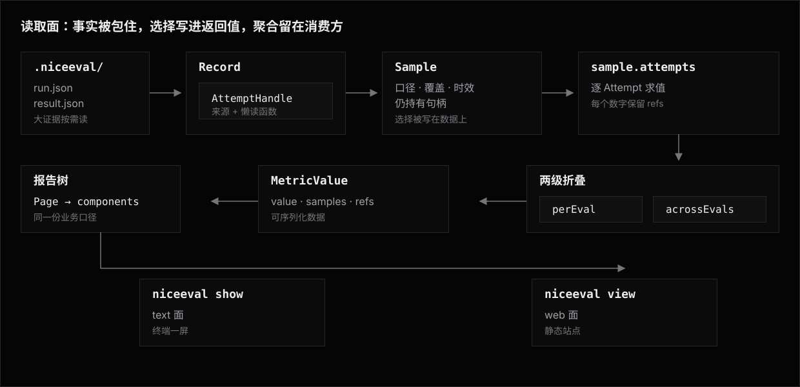

# Reading —— 从记录到报告

[Architecture](../../architecture.md) 讲一次运行怎么产生结果,终点是判定与 artifact 写进 Run 目录。
本篇接着往下讲:这些字节躺在磁盘上之后,怎么变成终端里的一屏、网页上的一张报告,或者你自己脚本里的一个数字。两篇的交接点就是那个 Run 目录 —— 执行链路的终点,读取面的起点。

读取面拆成三层,每层一个包,各自只做一件事。本目录是三层之上的总纲:分工、跨层不变量,以及 [用例手册](use-case/README.md) 里一个读取任务从头走到尾的路径。各层自己的契约仍单源在各层目录,这里不复制。

下面这张图按层给出三样东西:数据长什么样、这一层做了什么、下一层从哪个调用开始。图上只出现类型名与层间调用,字段级形状看各层文档。

## 三层与那条分界线

| 层 | 模块 | 输入 | 输出 | 有没有判断 |
|---|---|---|---|---|
| 事实 | [`niceeval/record`](../record/README.md) | 磁盘 | `Record` / `Run` / `AttemptHandle` | 无 |
| 选择 | [`niceeval/sample`](../sample/README.md) | `Record` | `Sample` | 有:口径、覆盖、时效 |
| 呈现 | [`niceeval/report`](../reports/README.md) | `Sample` | 组件数据 | 有:指标、折叠、排版 |

分界线是**判断**:哪一层允许有看法,允许到什么程度。

**Record 一点判断都不许有。** 它的承诺是每个返回值都能在磁盘上逐字节指出来源。所以通过数、成本合计这类聚合不落盘,「最新一次」这种选法也不在这里 —— 「最新」先要定义粒度,而定义粒度就是看法。

Record reader 遇到缺 `run.json` 的残缺目录时不伪造 Attempt 或 Verdict；它把目录列入 `record.unreadable`，Sample 将其呈现为 `unreadable-run` warning。未派发 Attempt 只存在于 Invocation 的 `unstarted` 计数中，不创建 `result.json`；两者都不能冒充 `skipped`。

**Sample 有判断,但判断必须写进返回值。** current 选择、覆盖与缺口原因都写在返回值上；Reports 不从 Run、历史或运行期计划重建另一份贡献集合。

**Reports 的判断是呈现判断。** 值怎么算归[读数](../reports/library/measures.md),两级折叠归 `perEval` / `acrossEvals`,长什么样归组件与主题。

把选择器长在 Record 上,那条「逐字节可指出来源」的承诺当场垮一半:读者每读一个字段都要先想「这算事实还是算解释」。三层切法本身学自 Vega-Lite 的 `data → transform → mark`,逐条出处见各层的 `reference/`。

## 跨三层的不变量

这六条不属于任何一层,是三层共同守的。改动任何一层前先对一遍。

**一、聚合永远发生在消费方。** 通过率、总成本、p90 耗时都不落盘,由逐条 `result.json` 现算。
同一个数字有两个地方能算,两边迟早给出不同的值。

**二、把判断写进数据,不藏在语义里。** 消费 `sample.attempts` 就自动正确,不需要知道口径怎么展开。反例是让消费方自己 `flatMap` 一遍 `runs`,那会把同一道题的历史 attempt 重复计入。

**三、每个数字都能回到证据。** 样本成员是 `AttemptHandle` 而不是行；呈现层的 `MetricValue.refs` 带着 `AttemptLocator`，让报告里的一格能寻址回一个 attempt。
这条排除了「把结果压成宽表」这类看着更通用的中间表示。

**四、给用户的自由度有清楚的语义边界。** Sample 用 `scope()` 重定义总体、用 `filter()` 删观测；报告树是声明式结构,不是能求值的表达式。失败模式不是积木不够,是近义算子长成了半门语言。

**五、派生物明确标为缓存。** 落盘的派生物只有 [`o11y.json`](../record/architecture.md#o11yjson) 一份,定位写死为缓存不是权威,删掉能从 `events.json` 重算,不一致时以事实为准。

**六、格式即契约。** `.niceeval/` 的[格式规范](../record/architecture.md)是唯一的接入面:第三方 harness 经 `createWriter` 写进来,渲染器不 link 任何采集代码。跨出可信边界一律经 [`publish()`](../record/library.md#发布publish) 解引用并复制成自包含结果,不带指向原 Run 的回退指针。

## 一件事该放哪层

| 要加的东西 | 落哪层 | 判据 |
|---|---|---|
| 一种新的证据文件 | Record | 它是磁盘上的字节;加一行[证据 registry](../record/architecture.md#证据-registry) |
| 「结果最多有效七天」 | 携带资格或 fingerprint | 时效要求决定结果是否仍能成为 current，不在报告里临时过滤 |
| 「排掉一个坏掉的实验」 | Sample 的 `pipe` 算子 | 只删减,不替换、不重挑 |
| 「按 agent 分组算 p90」 | Reports 的指标 | 值怎么算、两级怎么折叠归呈现层 |
| 一个通过率字段 | 哪层都不落 | 聚合永远在消费方 |
| 一种新的展示形态 | Reports 的 `defineComponent` | 两个渲染面必填,缺一面定义时就报错 |
| 一个新的运行配置字段 | Record 的 `run.json` 投影 | 它是运行事实,同步进 `ExperimentRunInfo` |

判不准时问一句:**这东西删掉能重算吗?** 能重算的是派生物,不进事实层;不能重算的是事实,不进选择层和呈现层。

## 宿主、收窄与出站

`show` 与 `view` 是两个宿主 —— 打开记录、挑 Sample、渲染报告的那一侧。它们装载同一份报告定义,走同一条 `装载 → resolve → validate → render` 管线,没有宿主特权。

**收窄是选择层的事,写在命令行上。** 两个宿主的位置参数与 flag 是同一套:位置参数是 eval id 前缀,`--exp` 按 experiment id 路径段匹配,`--record` / `--run` 换输入。它们合起来把记录根滤成一份有效根,再交给选择器。命令行表达不了的挑选走 [`publish()`](../record/library.md#发布publish) 构一个新的记录根,而不是给 CLI 加谓词语法。

一个报告实例只绑定宿主创建的一份 Sample。
报告组件可以折叠或排序同一批行，但不能调用 Sample 转换改变贡献集合、覆盖分母或导出值。
要看单次执行事实进入 Run，要看历次变化进入 History；两种旅途都不改变 current 报告。

**出站有两条,共用一条站点管线。** [`niceeval view`](../reports/view.md) 建一次站点再盯着输入 [持续重建](../reports/view.md#持续重建),`niceeval view --out <dir>` 建完就退出、产物写进目录。
同一份收窄下两者逐字节一致 —— 本地看到的就是发出去的。

## 常见用途

| 用途 | 入口 |
|---|---|
| 只看某几个实验、某几道题 | [收窄读取范围](use-case/narrow-what-you-read.md) |
| 一边跑一边看结果长出来 | [跟着运行看](use-case/watch-while-running.md) |
| 把结果发成一个静态站点 | [导出与发布](use-case/export-a-site.md) |
| 在自己的脚本里算一个数 | [脚本里读结果](use-case/read-from-script.md) |

## 相关阅读

- [用例手册](use-case/README.md) —— 四个读取任务的完整路径。
- [Architecture](../../architecture.md) —— 这些字节怎么被跑出来:发现、驱动、评分、报告。
- [Record](../record/README.md) —— 事实层:格式、读写、身份与发布。
- [Sample](../sample/README.md) —— 选择层:口径、覆盖、时效与转换算子。
- [Reports](../reports/README.md) —— 呈现层:show、view 与报告组件。
- [Concepts](../../concepts.md) —— 「结果数据与报告」一组词的总表。
