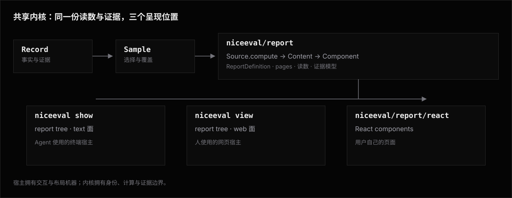

# Reports —— 架构

Reports 把同一份结果事实呈现到三个位置：Agent 使用的终端宿主 `show`、人使用的网页宿主 `view`、
用户自己的 React 页面。三个入口共用读数与数据计算；两个官方宿主共用 Sample 规则，自有 React 页面
显式选择 `currentSample(record)`。`--report` 的自定义报告树可在两个官方宿主间复用，
让人和 Agent 读取同一套业务口径；两面共享事实与证据，不要求共享几何布局。



## 核心模型

报告作者的完整模型是三个概念：

| 概念 | 形态 | 职责 |
|---|---|---|
| Source | `Source<Input extends SourceInput, Content>` | 从 Sample 或 AttemptEvidence 计算可复用的事实投影 |
| Composition | `defineComposition(...)` | 拿到运行期 page input，编排多个 Source、加工 Content、返回组件树 |
| Component | `Table`、`Chart` 或 `defineComponent(...)` | 把一份 Content 同步投影到 text 与 web |

```text
Source.compute(input) ─┐
                       ├─ Composition 编排 → Content → Component → text / web
外部准备好的数据 ──────┘
```

简单报告只碰 Source 与 Component：把 Source 交给 Component 的 `source` 形态就出一页。需要
拿运行期输入、协调多个 Source、跨来源 join 或动态生成组件树时进入 Composition。三者的边界在
[加一个能力时选哪个](components/README.md#加一个能力时选哪个)。

Component 只接受互斥的 `source` 与 `data` 两种形态。renderer 永远看不到 Source、Sample、Record，
也不能再次取数。page、报告外壳和页级呈现分配是宿主装配层，不属于作者模型。

`defineSource` 保留传入对象引用；`defineComponent` 产出可进入报告树的双面组件；`defineComposition`
产出在 resolve 阶段展开的编排节点。三者只提供类型推导与定义期反馈，不建立注册表；页仍是纯绑定记录，
不机械增加 `definePage`。

## 共享内核与两个宿主的代码边界

`Reports` 是功能总称，包含 `show`、`view` 和可编程的 `niceeval/report`；单数的 `report` 不是 `show` 或 `view` 的别名，而是两个宿主共用的报告内核。报告的内容单位只有 page，page 的内容单位只有组件树。view 没有一套 page 之外的“attempt 证据面”：attempt 的事实由 Record 提供，详情只是以 locator 为输入的一张参数化 page。

上图中的 `niceeval/report` 是两个官方宿主与用户 React 页面共享的内核；
`AttemptEvidence` 也由 `niceeval/record` 直接装配后注入这条内核边界。

| 所有者 | 责任 |
|---|---|
| `niceeval/report` | `ReportDefinition` / page / 报告树的唯一模型；静态页与参数化页的装载、规范化与 resolve；Sample / AttemptEvidence 注入；读数、维度和可序列化组件数据；text / web 两个渲染面；内建报告；官方样式与渐进增强资产。 |
| `show` | 终端宿主：范围 / 切片 / 形态的 CLI 输入组合、page / locator 寻址与 text 输出。切片不是宿主内容——每个切片都解析为报告组件的装配（见[「show 的切片是组件选择」](#show-的切片是组件选择)），show 保留的是 flag 解析、逐 attempt 分节映射与 text 渲染的机器。`show @<locator>` 是选择 attempt-input page 并传入 locator 的快捷语法。 |
| `view` | 网页宿主：站点产物清单、本地服务与静态导出、page 路由、导航、语言切换与 artifact 交付。所有 HTML 都是 `niceeval/report` 的 page 输出；view 可把参数化详情页渐进增强成 modal，但不拥有固定 modal 内容。 |
| `niceeval/record` | 持久化事实、locator 解析与中性 `AttemptEvidence` 装配。两宿主与 report 组件共用同一份证据模型，不各自重读 artifact 或重建时间树。 |
| `niceeval/sample` | 从 Record 选择 Sample，并物化口径、覆盖、时效与读取期 Issue；Record 不承担任何选择判断。 |

依赖方向只能从宿主指向 `niceeval/report`、`niceeval/sample` 和 `niceeval/record`。`show` 与 `view` 之间不互相 import；两者都需要的 Sample 选择属于 sample，报告装载、规范化、标题回退、静态 / 参数化 page 解析或渲染适配属于 report，共用的结果事实与证据投影属于 Record。“先放在某个宿主里、另一宿主反向 import”不是共用机制。

### 单一 report runtime 身份

`niceeval/report`、`niceeval/report/react` 与 `niceeval/report/built-in` 是同一个 package-owned 构建单元的三个入口。官方宿主通过一个中性的 host facade 调用这个构建单元；装载、`ReportDefinition` 品牌、resolve 状态和 text / web 渲染都来自同一个物理 runtime。

同一进程不混用 raw `src/report/**` 与预编译产物的两份模块实例，宿主也不通过多处相对路径直接探测构建目录。构建产物缺失或过期是构建失败，不由宿主保留旧 `ReportDefinition` 形状、重复类型或运行时 fallback 来遮蔽。

### 内部按功能纵切

公开入口保持 `niceeval/report`、`niceeval/report/react` 与 `niceeval/report/built-in` 的扁平使用面；源码内部按责任与组件族分层，不把所有组件的计算、类型、text 面和装配继续堆进各自的横切大文件：

```text
report/
├── definition/                 ReportDefinition、页、外壳与报告树协议
├── model/                      Measure、Dimension、聚合与格式化
├── sources/                    官方 Source；按 entity / measure / sample / run / attempt 分组
├── components/                 defineComponent 协议与内建原语的两面 renderer
├── compositions/               defineComposition；SampleOverview / AttemptDetail / FailureList
├── runtime/                    装载、compute、validate、text/web 渲染与 host facade
├── built-in/                   只用公开数据源、原语与组合组件装配的内建报告
└── assets/                     官方样式、渐进增强与共享设计令牌入口
```

依赖方向是 `sources → model`、`compositions → sources + components`、`runtime → definition +
sources + components + compositions`。渲染组件不反向读取数据源，数据源不读取主题、终端宽度或浏览器状态。

### Attempt 详情是一张参数化 page

`ReportDefinition` 只有一个非空 `pages` 列表，不再在旁边增加 `attempt`、`modal` 或其它内容槽。page 按输入分两种形态，但仍是同一个类型族、走同一条 `resolve → validate → render` 管线：

- `input` 省略或为 `"sample"`：静态 page，消费宿主选择的 Sample；默认进入导航。
- `input: "attempt"`：以 locator 为参数的 page，消费 Record 装配的一份 `AttemptEvidence`；必须 `navigation: false`，因为没有 locator 时不能打开，也不应出现在全局导航。

一份报告至多声明一张 attempt-input page，避免 `show @<locator>` 与 locator 链接出现多个目标。报告未声明它时 locator 只是普通文本，宿主不悄悄补一张官方详情页。view 的 locator URL 与 `show @<locator>` 只是定位这张 page 并传参的宿主语法，不构成第二种内容模型。

内建 `standard` 的 `pages` 因而有四项：报告、Attempts、追踪三张导航页，以及一张 `id: "attempt"`、`input: "attempt"`、`navigation: false` 的参数化页。它的 `content` 是普通 [`AttemptDetail`](components/attempt-detail/README.md) 组合组件；`AttemptDetail` 与 `SampleOverview` 同级，都只用公开叶子组件装配，没有私有 renderer。用户可以直接用成品组合，也可以在该 page 的 `content` 里用 `AttemptSummary`、`AttemptAssessment`、`sources.attempt.timeline` 等区块重新组装。

view 只保留 page 寻址、locator 历史记录与内容摆放机制。它可把已渲染的参数化 page 渐进增强成 dialog，但 dialog 内部的区块、顺序、样式和取舍全部来自 page content。本地模式与静态导出对同一 locator 物化相同字节的独立 page 文档；基线链接直接指向该文档，所以无 JavaScript 仍能打开，JavaScript 只拦截链接并把同一内容放进 dialog，不另造一份内容实现。`show @<locator>` 渲染同一 page 的 text 面；`--source` / `--execution` / `--timing` / `--diff` 选择 attempt-detail 组件族对应区块的 text 面（见下节）。

### show 的切片是组件选择

show 的每个切片都解析为报告组件的装配，`--json` 输出该视图组件 resolve 产物的信封包装——「text 面与 JSON 共有派生字段同值」因此由构造保证（同一次 resolve 的产物），不是两套手写投影之间的纪律：

| 切片 | 数据源或组合组件 |
|---|---|
| 默认报告 | 内建报告首页（`SampleOverview` / `sources.entity.experiments`） |
| 对照矩阵（多 `--exp`） | `sources.measure.delta`（多条件对照：翻转标记、各条件汇总、共同题 paired delta） |
| `--stats` | `sources.measure.stability`（历史全执行证据面的稳定性矩阵） |
| `--usage` | `sources.attempt.snapshot`（与 attempt 详情 `usage:` 行共享组装口径单源） |
| 缺省 attempt 首页与 `--source` / `--execution` / `--timing` / `--diff` | attempt-detail 组件族（`AttemptDetail` 及其区块） |

- sample 级切片消费宿主注入的 Sample；证据切片消费 locator 解析出的 `AttemptEvidence`。范围含多个 attempt 时，宿主机器把同一组件逐 attempt 映射并分节——分节是宿主机器，节内内容仍由组件拥有。
- 终端专属行为——卡片预览预算、`--expand` 句柄、`--grep`——是这些组件 **text 渲染面的选项**，不是事实过滤器；JSON 面恒为完整 resolve 产物。「`--json` 不受 text 预算约束」「`--expand` 与 `--json` 组合是用法错误」由此成为推论而非特判。
- `--json` 的信封见 [Show `--json`](show/json.md)；逐视图 Content 形状单源在各数据源分篇的类型声明，json 页只保留信封与指针，不手写第二套形状。
- CLI 缺省切片与报告库组件因此不是两套实现：终端矩阵与报告页矩阵是同一组件的两处装配，语义与数字必然一致。

## 事实与看法

Record 保存事实：判定、断言、runner 时间树、事件、trace、diff 和运行元数据。`loadAttemptEvidence` 把一个 attempt 的 locator、身份、主记录、标注源码、执行树、trace、diff、artifact 路径与能力位一次装成中性 `AttemptEvidence`；report 组件和宿主不各自重读 artifact。Reports 只派生看法：读数、聚合、排序、图表、列表和 attempt 详情布局。Attempt 的统一时间视图以 `phases` 作为生命周期/hook/command/turn 骨架，按 turn 的 `traceId` 临时挂接同一份 evidence 中的 spans；组合结果不写回任一 artifact。

派生数据不写回记录根，不带独立 schemaVersion——支持口径是同一 niceeval 版本写读，删除报告缓存后可从原始结果重新计算。渲染面消费 `data` 时校验结构，不符合当前版本的形状按完整用户反馈报错并提示可能的版本漂移；漂移因此以显式错误浮出，不静默错渲染。

## Sample 是计算入口

范围级数据源的 `Input` 统一是 `Sample`。需要完整历史的 `sources.measure.stability` 等读取
`Sample.historyAttempts`；attempt 详情数据源显式声明 `Input = AttemptEvidence`。输入差异进入类型，
不压进一个含混的 `ReportInput` 后靠运行时猜。

Record 与 Sample 都不提供 Source。Record 是持久化事实读取面，Sample 是从 Record 选出的可比较
视图；Source 属于 report 层，把其中一种明确输入计算成 Component 需要的 Content。依赖方向固定为：

```text
Record ── currentSample / latestRunSample ──▶ Sample ── Source.compute ──▶ Content
                                           └─ historyAttempts（历史读数）
```

这个方向保证 `niceeval/record` 与 `niceeval/sample` 不依赖报告的 `Cell`、`Row`、`ColumnSpec`
或任何 text / web 形状。官方 Source 从 `niceeval/report` 的 `sources` 目录导出；自定义 Source 实现同一接口。

Sample 同时携带真实 Run、覆盖事实和读取期 `SampleIssue`。Issue 由读取 / 选择过程检测，不落盘。
`sources.sample.snapshot` 把这些投影为中性事实；[`SampleNotices`](components/summaries/sample-notices.md)
再同步生成本地化 Notice 与 action。

Run 实体上持久化的 structured diagnostics 由 `sources.run.diagnostics` 返回。`RunNotices` 决定
可见性、分组、文案与 action；未知 code 回退显示 raw detail。覆盖缺口由
`sources.entity.experiments` 消费成占位行。Source 不产生本地化 Notice 文案。

读数与实体数据源的样本一律来自 `Sample.attempts`——按 `currentSample()` / `latestRunSample()` 口径挑好的 attempt 全集，数据源不各自 `flatMap` `runs` 重新展开，避免同一道题的历史 attempt 被不同数据源用不同口径重复计入或漏算。配置（agent / model / flags / sandbox 等）、diagnostics 与 Run 目录这类**Run 级**信息来自真实 `Sample.runs`。`currentSample()` 下同一个 experiment 可能有多个贡献 Run（不同 eval 取自不同历史 Run，见 [Sample · 两个选择器](../sample/library.md#两个选择器)）；此时该 experiment 展示用的“水位基准 Run”是这些贡献来源里 `startedAt` 最新的一个——表头、hero 与 `config()` 桥接读取的 agent / model / flags 都以这一个为准，不是任取某个来源或合并多个来源的字段。

`show` 与 `view` 对命令行范围使用同一套选择规则：

1. `--record` 确定记录根。
2. `--exp` 和 eval id 位置参数收窄范围。
3. 宿主调用 `currentSample(record)`——官方现刻水位口径（每个 experiment × eval 取「包含该 eval 的最新 Run」里的 attempt），单点定义在 [Sample · 两个选择器](../sample/library.md#两个选择器)，宿主不自带第二套选择规则。
4. 局部补跑、过旧或未完成 Run 形成结构化 Issue。
5. 同一份 Sample 交给各宿主默认首页或 `--report`。

宿主把选出的 Sample 注入每张 sample-input page，把 locator 解析出的 `AttemptEvidence` 注入
attempt-input page。原语 source 形态的默认 `input` 与 Composition 的 `ctx.input` 都是这份注入值，
由 page 的 `input` 声明判别，不靠猜测。报告若需要历史趋势，读取 `ctx.input.historyAttempts`；
宿主仍只做一次 Sample 选择，不开放第二条 Record 旁路。

## Sample 是默认报告的比较边界

`sources.entity.experiments`、`sources.sample.snapshot` 与 `sources.measure.rows` 不推导第二层实验组，
直接消费宿主已经收窄并完成现刻水位选择的 Sample。每个 experiment 当前有效的 eval 集从
`Sample.coverage` 读取：`knownEvalIds` 去掉 `missingEvalIds`，就是当前范围下真正有判定的分母。
`missingEvalIds` 进入覆盖占位行，不进分母也不补成失败。

这条读法不依赖任何单一 Run 的 `ExperimentRunInfo.selectedEvalIds`。`currentSample()` 下一个
experiment 的有效题集由多个贡献 Run 共同撑起，没有哪一个来源能单独代表它。直接调用这三个
Source，与经 `SampleOverview` 展开后的调用深相等。

`SampleSummary`、默认散点与 `sources.entity.experiments` 都消费同一份 Sample；前者在组合层选择 snapshot 与 Measure 中哪些字段作为默认 KPI。用户用 `--exp` 按 experiment id 路径收窄，或在自定义报告里显式 `filter`；Component 不从路径、文件名、agent、model、flags 或 labels 猜比较边界。

## Source、Composition 与 Component

Source 是可复用数据计算的唯一公开单位：

```ts
type SourceInput = Sample | AttemptEvidence;

interface Source<Input extends SourceInput, Content> {
  readonly name: string;
  compute(input: Input): Promise<Content>;
}

function defineSource<Input extends SourceInput, Content>(
  definition: Source<Input, Content>,
): Source<Input, Content>;
```

只有这一种 Source 协议，输入被限定为 NiceEval 的两种记录视图。Source 可以读 artifact、计算
Measure 与投影已记录 diagnostics。它不能请求外部 API、生成本地化 Notice、选择首页 KPI、
生成 label 或决定布局。

表格的默认字段身份与 rows 一起进入 `TableContent`，由同一次 `compute()` 返回。字段描述只带
key、unit、better 等事实与数值语义，本地化表头由 Component 负责。字段与行由同一次 `compute()`
返回，没有第二个定义入口。Source 不注册、不缓存；缓存只属于一次 page resolve。

原语只接受两种互斥形态：

```tsx
<Table source={sources.entity.experiments} />

<Table data={content} />
```

- **source 形态**：管线在 resolve 阶段调用 `source.compute(input)`；`input` 省略时注入 page 的默认输入。
- **data 形态**：作者传入已计算的可序列化 Content；原语不再取数或聚合。
- 同时给 `source` 与 `data` 按完整用户反馈失败，不静默取一边。

`data` 形态的 Content 有两个合法产地：Composition 的展开回调，或报告管线之外的独立库程序
（调用方自带 `sample`）。报告文件顶层没有 page input，不在那里取数。

### Composition：运行期编排

Composition 拿到当前 page 的输入，编排 Source、加工 Content，再返回组件树：

```ts
type MaybePromise<T> = T | Promise<T>;

interface CompositionContext<Input extends SourceInput> {
  readonly input: Input;
  /** 运行前冻结的外部数据快照；缺省是空对象。 */
  readonly data: Readonly<Record<string, JsonValue>>;
  readonly page: NormalizedPage;
  readonly signal: AbortSignal;
  resolve<Content>(source: Source<Input, Content>, input?: Input): Promise<Content>;
}

function defineComposition<Props, Input extends SourceInput = Sample>(
  expand: (props: Readonly<Props>, ctx: CompositionContext<Input>) => MaybePromise<ReportNode>,
): Composition<Props, Input>;
```

`ctx.input` 是当前 page 的输入：sample-input page 上是 `Sample`，attempt-input page 上是
`AttemptEvidence`。输入只有这一个入口，不按种类分裂成两个平行字段。

Composition 内取 Source 必须写 `await ctx.resolve(source)`；需要覆盖 page input 时写
`await ctx.resolve(source, input)`。不写 `source.compute(input)`——后者绕开下面的 page 级缓存，
同一份计算会做两遍。`source.compute()` 仍供报告管线之外的独立库代码使用，那里没有 page
也就没有缓存。

`ctx` 不携带主题、`dimensionPins` 或任何颜色。页级呈现分配必须是纯函数，主题必须能独立分发；
能读钉色的 Composition 可以按颜色改变返回的树，这两条就都保不住。

`ctx.resolve` 只收与本 page 同类型的 Source 和 input。省略第二个参数时使用 `ctx.input`。
显式 input 只覆盖本次 Source 计算，不改变 page 的输入。

**attempt 级 Source 只能出现在 attempt-input page**：sample-input page 上没有
`AttemptEvidence` 可传。
另一条路是给 Composition 开一个 `ctx.record` 让它自行装配 evidence，代价是 Composition 能绕过
Source 任意读盘，「Source 是 `.niceeval` 唯一查询接口」当场失效。
要在总览页展示某条 attempt 的证据，用 locator 链到 attempt-input page。

**输入类型不匹配在装载期拦。** `Composition<Props, Input>` 的 `Input` 记在节点品牌上，装载校验
页列表时就比对 page 的 `input` 声明，按完整用户反馈报错。不能等到 resolve——那时 `expand` 已经
拿着错类型的 `ctx.input` 跑起来了，错误会从作者代码内部冒出来而不是指向那次错误的装配。

Composition 不实现 renderer，也不产生另一套 Content——它展开成的树里，显示仍然全部由 Component
承担。

### 外部数据走冻结快照

NiceEval 读数 join 外部业务数据（工单、预算、人工标注）是 Composition 的正当用途，但**取数不在
报告里发生**。外部数据在跑报告之前落成一份可序列化快照，`ctx.data` 只读它：

```tsx
const BudgetReport = defineComposition(async (_props: {}, ctx) => {
  const performance = await ctx.resolve(sources.measure.rows({
    dimensions: ["experiment"],
    measures: [passRate, costUSD],
  }));
  const budgets = ctx.data.budgets as BudgetSnapshot;

  return <Table data={joinBudgets(performance, budgets)} />;
});
```

快照有两个入口，与报告装载链同形：`--data <file>` 本次运行显式指定，`config.reportData` 是项目
配置里的缺省。两者都收一份 JSON 可序列化值，装载失败与报告装载失败同级。

**这条边界不是给外部 IO 单独设的。** `expand` 是普通异步回调，它同样能读 `Date.now()`、
`Math.random()`、环境变量与文件系统。报告树的承诺是「同输入同字节」，对这几样一视同仁：

- **`SitePlan` 的字节恒等保住**——快照是输入的一部分，本地 server 与 `--out` 对同一份快照产出
  相同字节。
- **`writeSite` 的全或无保住**——失败源仍是确定性的，一次远端 502 不会让整份站点导不出来。
- **`show` 不打网络**——Agent 入口的耗时与结果可预期，不会被一个挂住的 HTTP 请求拖死。
- **时钟与随机数同样禁止**——要时间戳就放进快照。这条能被测试守护：同一份输入跑两次，
  产出必须逐字节相同。

代价照实说：多一个准备步骤，快照的新鲜度归报告作者。这与 `--record` 已经确立的形状一致——
报告读的始终是一份冻结的数据，不是一个活的服务。

### Component：同步双面显示

作者用 `defineComponent({ dimensions, enhance, text, web })` 定义新的显示形状。三个 renderer 面
都必填：`dimensions(data, options)` 声明这份 data 会消费哪些维度值，让管线在 renderer 执行前完成
页级名称与视觉编码分配；`text` 与 `web` 是同步纯 renderer，共同消费同一份 Content。

Component 没有 `resolve`：**可复用的 NiceEval 数据计算定义为 Source；依赖当前 page input 的
编排与跨来源 join 定义为 Composition**，否则"谁算数据、谁显示数据"的边界就不存在。

`niceeval/report` 导出数据源、内建原语、渲染组件协议与组合组件；`niceeval/report/react` 只导出
内建原语及其 Content 类型，而且只接受 data 形态。浏览器包因此不含 Record、Sample、artifact
或任何磁盘读取能力。作者定义的组件直接随报告文件装载，不需要在第二个入口注册。

### 一次 page resolve 的缓存

resolve 在一次 page 实例内按「同一个 Source 对象身份 + 同一个 input 对象身份」记忆化。
`ctx.resolve(source)` 与 `<Table source={source}>` 命中同一份缓存，所以组合组件先算一遍、
下面的原语再引用同一个值，只发生一次计算。

**缓存的是 Promise 而不是完成后的值。** 并发请求因此也只计算一次，成功与失败都由同一个 Promise
广播给本页全部消费者；缓存生命周期止于 page resolve 结束。

同一页的多个原语直接引用同一个 TypeScript source 值即可共享计算。多页也直接 import 或引用这个值，
但每个 page 实例独立 resolve；报告外壳没有 source 注册表，原语也不接受字符串绑定。两个配置相同
但分别创建的 Source 可以各算一次，管线不靠不透明的深相等猜测。

**Composition 自己不进这份缓存。** 一个 Composition 节点在一次 page resolve 里展开一次，
text 与 web 共用同一次展开结果；同一个 Composition 用在两处就是两个节点，各展开一次。它们内部的
`ctx.resolve(source)` 仍然共享上面那份 Source 缓存。

这个模型保证四条边界：

- 可达数百 MB 的 diff 只在 resolve 阶段被懒加载（经 `AttemptHandle`），不进入任何渲染调用。
- 计算产物永远是可序列化普通数据，可以在 RSC 中直接传递，也可以写成 JSON 给 SPA。
- text 与 web 面消费同一次 resolve 的产物，终值、覆盖率和 attempt 引用两面相同。
- 缺 artifact 时计算返回 `null`，渲染面不自行猜值。

## 报告树与两个宿主

报告树由内建原语、作者渲染组件与组合组件组成；数据源作为组件的 `source` 属性出现，不单独成为树节点。节点的穷尽
形状单点定义在 [Library · `ReportNode`](library/layout.md#树的节点reportnode)。宿主管线固定为：

```text
装载（规范化外壳与页列表，静态校验；不调用 Composition）
  → resolve（展开 Composition + 执行 source.compute；同层并行、保持声明顺序）
  → validate（逐节点校验双面资格、data 形状与结构节点父子关系）
  → collect dimensions（收集整页维度声明，算最短唯一标签；web 面另算视觉编码）
  → render（纯同步输出终端文本或静态 HTML）
```

- **装载：** 只规范化并校验外壳、页列表与节点品牌，不执行任何 Composition 的展开回调。
- **resolve：** 页内唯一的异步边界。调用 Composition 的 `expand(props, ctx)` 并 await 其结果，
  递归展开返回的子树，并行执行其中同层的 Source；同一个 Source 与 input 组合只计算一次。
  未经定义的普通函数和报告树里的 HTML intrinsic 立即拒绝。
- **validate：** 作用在展开后的完整树上，确保每个渲染组件都有 text / web 两面，data 可序列化
  且符合组件声明。
- **collect dimensions：** 调用每个组件的纯 `dimensions(data, options)`，汇总整页声明。
  这一格分两半，语义见[页级呈现分配](components/README.md#维度呈现分配单位是页)：label keyset
  两面共享，视觉编码规划是 web 面专有。
- **render：** 纯同步。两面消费同一次 resolve 的 data；映射不改写 data。

renderer 经 `ctx.dimension(handle)` 按 `dimensions()` 声明的句柄取回这份维度已经算好的呈现，
再用 `.at(index)` 按数据项位置读单个身份。自有 React 页面没有报告管线，改用
`presentDimension(declaration)` 一次传入同形状的声明。两处都不公开「传一个值查一个结果」的入口：
标签去重与视觉编码消解都要先知道全集，而复合键（`` `${agentId}/${model}` ``）只在 `dimensions()`
里派生一次，renderer 不重新拼。

### 只有一面能做的事：具名 `enhance` 位

有些能力只在 web 面成立——列头点击排序、过滤框、图表 tooltip、hover 展开。原语不用
`if (host === "web")` 表达这件事；每项能力是一个内部具名 `enhance` 位，text 面的降级形态由
原语统一规定，不由数据源或组合组件自行发明：

| 能力位 | web 面 | text 面的规定降级 |
|---|---|---|
| `sortable` | 列头可点击改变行序 | 按组件 data 里的既定行序输出,不提示「可排序」 |
| `filterable` | 过滤输入框收窄行集 | 输出全集;若宿主传入了过滤条件,按条件收窄后输出并在尾部注明条数 |
| `hoverDetail` | hover / focus 展开补充信息 | 补充信息作为同一行的括注直接输出,不隐藏 |
| `collapsible` | 折叠区默认收起、可展开 | 输出展开态全文,超出节点预算时按预算截断并给 `--expand` 句柄 |

三条纪律:

- **降级不是「少一块」。** 每个能力位的 text 形态都必须仍然表达同一份事实——`filterable` 降级成
  全集、`hoverDetail` 降级成括注、`collapsible` 降级成展开。web 面能看到的信息,text 面不许因为
  没有交互而消失。
- **能力位是闭集,新增要回这张表登记。** 一个 web 能力找不到诚实的 text 降级形态,就说明它不该做成
  报告组件能力,而应该是 view 的宿主机器(如 modal 摆放)。
- **`enhance` 不改 data。** 两面消费同一份 `data`,能力位只影响渲染面怎么用它。`--json` 输出不含
  能力位,它不是数据。

这条契约冲着一个具体的失败模式设计:Sphinx 的第三方 directive 常常只实现 html visitor,text
builder 上就报错或输出空白——「双面 × 用户可编程组件」这一格的固有病。双面必填挡住了「另一面完全
没写」,`enhance` 挡住的是「另一面写了但悄悄少了东西」。见
[参考方案](reference/README.md#sphinx--多-builder-与它的固有病)。

### 排版原语的语义层与面内布局

排版原语不把终端字符布局和浏览器像素布局强行做成同一份几何结果。两面共享的是节点顺序、分组、字段终值和降级不变量；各面再用自己的宽度单位排版：text 面使用终端显示列，web 面使用 CSS container 的可用 inline size。`show` / `view` 只提供可用宽度或承载 HTML，不参与 Grid、Stat、Section 的布局决策。

`Grid` 固定走下面的内部边界：

```text
resolved ReportNode children
  → normalizeGrid（校验 props；递归展开数组 / Fragment；去掉空分支）
  → NormalizedGrid（有序、不可拆的 cell 列表 + columns / variant / density）
       ├─ text：planTextGrid(available columns) → TextGridPlan → 逐 cell ctx.render(width)
       └─ web：稳定 root / cell 语义结构 → CSS Grid 按 container width 自动排轨
```

`NormalizedGrid` 不是公开 Content，也不进入 Record 或 artifact；它只是两个渲染面共享的同步排版
中间值。每个展开后的直接子节点是一格，格内节点对 Grid 是不透明块。Grid 不探测领域字段、
不读取 Sample，也不根据内容类型改写子节点 props。

text 面的 `TextGridPlan` 是确定的纯值，至少携带实际列数、各 cell 的外框 / 内容显示宽度、row-major 的 cell 索引和 gutter。规划器只依赖 `availableWidth`、cell 数和规范化 Grid props：先预留 `boxed` 的四边框、左右 padding 与格间 gutter，再从 `min(columns, cellCount)` 向一列尝试，选择每格达到契约最小可读内容宽度的最大列数；一列是无条件 fallback。余下的显示列从左向右分配，因整除产生的一列宽差不会累积到行尾。确定计划后才以各格的内容宽度调用 `ctx.render`，随后按显示宽度补齐并顶对齐多行块；renderer 不为试探列数重复 resolve 或执行组件计算。`boxed` 把每个 cell 各自包成完整 `┌─┐ / │ │ / └─┘`，同行 box 只用 gutter 相隔，换排重新起 box；`plain` 复用同一计划，只去掉边框与内边距。

web 面输出完整有序 cell 和声明的最大列数事实，由官方 stylesheet 用 CSS Grid 的 `auto-fit` / `minmax` 与 container inline size 减列；不读 viewport、不测 DOM、不靠增强脚本重排。最大列数通过一个受控 CSS custom property 传给 stylesheet，用每格最小 inline size 同时保证“最多 columns 列”和窄容器降到一列。无 JavaScript 时节点、顺序与全部文本已经完整。`boxed` 给每个 `.niceeval-grid-cell` 独立的完整四边框并用 gap 分开；`Col` 无框。这样响应式换行不需要判断首列 / 末列，也不用写死 `nth-child(6n)`，不会因实际列数变化产生缺边或双边。

`Stat` 在进入任一面前用同一 helper 解析为 `StatDisplay`：按 locale 得到 label / value / detail，number 用同一 `Intl.NumberFormat`，`null` 变成 `—`，tone 原样保留。两面只决定结构和折行，不再各自解释字段。label、value、detail 都按 inline-start 对齐；web 只给 value 使用 tabular numerals 和 tone，text 无 ANSI 时仍靠三行语义自足。text Grid 只把 Stat 当成普通多行块：label → value → detail，省略 detail 不占行；字段超过计划宽度时用统一显示宽度工具折行。

这条边界对应的物理实现固定为：`src/report/definition/grid-layout.ts` 放 `normalizeGrid` 与 text plan 纯函数，`src/report/definition/primitives.tsx` 只声明 Grid / Stat / Section 及两面适配，`src/report/model/text-layout.ts` 保持 CJK 计宽、折行和补齐的底层工具，`src/report/assets/styles.css` 负责 web 几何与视觉。不得把规划器放进 `src/show/**`、`src/view/**`，也不得让 CSS 反向决定 text 输出。

## 外壳与页：装载规范化

报告文件的默认导出恒为 `defineReport` 产物，产物只有一种：一层外壳（标题、外链、页脚、自带主题、钉色、脚本、样式）与**非空 page 列表**——单页、多页与参数化详情都不换机制，差别只在 page 数量和输入。入参的页内容有两级缩写，各有精确展开：

- 树入参是 `defineReport({ content: 树 })` 的缩写。
- `content: 树` 是 `pages: [{ id: "report", title: 内置页名「报告 / Report」, content: 树 }]` 的缩写。
- `content` 与 `pages` 恰好声明一个：同时声明或都省略，装载按完整用户反馈报错——省略不是一种有含义的取值，缩写的展开则完全由写下的值决定。
- 树 / `content` 缩写展开出的 page 是 `input: "sample"`、`navigation: true`；它不会偷带参数化详情。要有 locator 详情，就在 `pages` 中显式声明一张 attempt-input page，或 `extends: standard` 继承内建全部 pages。

`defineReport` 产物只有两个去处，都是交给宿主装载：报告文件的默认导出，或 `niceeval.config.ts` 的 `report` 字段。页内复用的单位是组件与树的具名导出；`ReportDefinition` 不在 `ReportNode` 类型里，外壳不嵌套由类型天然保证——给一个报告文件加外壳永远不会破坏别处对它内容的复用，因为复用从不消费默认导出。

**装载哪一份定义有一条取值链。** 宿主拿到 definition 的来源恰好三档，前档缺席才落下一档，之后的管线完全相同：

1. **`--report <名字|文件>`**——本次运行显式指定。
2. **`config.report`**——项目配置里的 `defineReport` 产物，类型是 `ReportDefinition`。两个宿主启动时读项目根 `niceeval.config.ts`；没有配置文件或没声明该字段等价于未声明。
3. **内建 `standard`**——`niceeval/report/built-in` 的默认导出：报告、Attempts、Traces 三张导航 page 加一张参数化详情 page 的普通 `defineReport`（全文见 [Library · 内建报告](library/built-in.md)）。

裸 `show` 与裸 `view` 因此不是第二条路径，与任何 `--report` 值走同一条 `装载 → resolve → validate → render` 管线。「builtin」不是装载逻辑里的类别，只是取值链最后一档拿哪个值的事实。

`--report` 的值按形态判别，判别只看字符串本身、不探测文件系统：含 `/`、以 `.` 开头，或带 `.ts` / `.tsx` / `.js` / `.mjs` 后缀的，按报告文件路径装载其默认导出；其余裸词查[内建视图名表](library/built-in.md)（视图的具名导出名，当前只有 `standard`）。裸词未命中名表时按完整用户反馈报错，列出可用名字并提示文件要写成带路径形（`./reports/site.tsx`），不回落到文件探测、也不静默落回默认报告。

`config.report` 与 `--report` 的合法值判定同源：拿到的不是 `defineReport` 产物（普通对象、React 组件、裸报告树）时按完整用户反馈报错，两者只有出处一句不同——一个指向文件的默认导出，一个指向 `niceeval.config.ts` 的 `report` 字段。`view` 本地 server 的 mtime cache-busting 对两档同规则：只击穿装载入口本体，入口 import 的模块仍走缓存。`--report <文件>` 的入口就是报告文件，改它下次请求即生效；`config.report` 的入口是 `niceeval.config.ts`，报告文件是它的依赖，改报告文件要重启 server 才生效。边写边看报告的工作流因此是 `--report ./reports/site.tsx` 直接指文件，定型后再填进配置。

报告定义只属于读面：`config.report` 不参与 `niceeval exp`，报告树不进 Run，换报告不改写任何落盘结果。

页层的边界规则：

- **页是宿主寻址单位。** 每页有唯一 id：`show --page <id>`、view 的 `#/page/<id>` 路由和导航项都用它。`Tabs` 是页内浏览状态，没有 id、路由或 CLI 选择器。这条分工决定内容放哪层：要能被单独打开、深链、在终端独立渲染的内容成为页；同页内的并列视图用 tab。
- **所有 sample-input pages 共享同一 Sample。** 宿主完成范围收窄与现刻水位选择后，把同一份 Sample 注入这些 pages；attempt-input page 则额外接收 locator 对应的一份 `AttemptEvidence`。page 不承担数据过滤职责。
- **管线以 page 实例为单位执行，产物清单与内容求值分离。** `SitePlan` 是一份路径到内容产出器的清单；本地 server 与 `--out` 共享同一份清单和同一套产出器——给定同一输入，同一路径最终字节恒相同，区别只在求值时机与失败的影响范围：
  - **求值时机。** 本地 server 按收到的请求求值对应路径的产出器，并缓存进当前 plan，同一 server 生命周期内同一路径不重复计算；`writeSite` 在写任何文件前对清单中的每个产出器求值一次。
  - **失败隔离的单位是 page 实例，不是文件。** `index.html` 由全部 sample-input page 各自独立的实例拼装而成——某个 sample-input page 实例 resolve 失败时，该实例的槽位显示完整错误反馈，其它 sample-input page 实例仍正常出现，不因共享同一份文件而互相污染；`attempt/<locator>.html` 每份文件对应恰好一个 attempt-input page 实例，resolve 失败即该文件整体给出错误反馈。
  - **`writeSite` 的整体失败语义。** 静态导出对清单中的每个产出器求值——即全部 sample-input page 实例与全部可达 locator 的 attempt-input page 实例；任一次求值失败，整体导出失败、不留半套目录。本地 server 按请求求值，某个路径求值失败不影响已经服务过的其它路径。

  外壳、page id、输入声明与导航资格在装载期先校验；content 在 resolve 展开时逐节点校验。
- **外壳是 web 面元数据，`title` 例外。** 双面同源约束只作用于页内报告树；外壳不携带数据。`show` 只把 `title` 用作页索引标题，`links`、`footer`、`theme`、`dimensionPins`、`scripts`、`styles` 不进 text 面。
- **主题与自定义资产属于视觉 / 增强层。** 主题只规范化为宿主 chrome 与报告组件共用的 CSS 语义令牌加一组样式资产，不进 `ctx.report`、不改变组件树或计算口径；令牌全集、Library DX 与样式级联见[主题](library/theme.md)。自定义脚本与官方增强脚本遵守同一不变量：初始静态 HTML 无 JS 完整可读，脚本只添加浏览行为，不改变计算口径或初始数据。这条不变量是对报告作者的义务约定，宿主不校验也无法校验脚本内容——脚本在读者浏览器里能做任何事，违反义务的站点其数字可信度由作者自己负责。

外壳字段（`title`、`links`、`footer`、`theme`、`dimensionPins`、`head`、`scripts`、`styles`）住在报告文件而不是 `niceeval.config.ts` 或 Run 里，因为它们是「怎么看」的看法而非运行事实：改一个 GitHub 链接不应该要求重跑，也不应该改写任何落盘结果。配置里的 `report` 不违背这条分工——它只声明默认装载哪一份 definition，不承载任何外壳字段，改它同样不重跑、不改写结果。Run 里的 `name`（来自 `config.name`）仍是零配置时的身份兜底，定义的 `title` 覆盖它。

### 主题装载：与报告并列的第二条链

主题是宿主装载的第二份制品，与报告平行而不是报告的一个字段值。`view` 每次运行解析两条链各自的取值，再把结果合到同一份站点管线里：

1. **`--theme <名字|文件>`**——本次运行显式指定。值的形态判别与 `--report` 同源，只看字符串本身、不探测文件系统：含 `/`、以 `.` 开头，或带 `.ts` / `.tsx` / `.js` / `.mjs` 后缀的按主题文件装载其默认导出；其余裸词查[内建主题名表](themes/README.md)（当前只有 `basalt`），未命中按完整用户反馈报错并列出可用名字，不回落到文件探测、也不静默落回官方主题。
2. **报告外壳的 `theme`**——这份报告自带的外观，随报告文件分发。
3. **`config.theme`**——项目配置里的 `defineTheme` 产物。
4. **内建 [`basalt`](themes/basalt.md)**——`niceeval/report/built-in` 的具名导出。

四档取的都是 `ThemeDefinition`。**档只选一份，不跨档合并**：生效主题里未声明的令牌取官方默认值，不从下一档借。装载失败（文件不存在、默认导出不是 `defineTheme` 产物、裸词未命中）与报告装载失败同级——`view` 启动或 `--out` 导出整体失败，不带着半份主题继续。

装载后的规范化产物是两样东西：一张完整令牌表（单色展开成相同的 light / dark 值，pair 保留两支）与一份有序资产清单。令牌表生成一个纯 CSS 令牌块挂到文档根，`.niceeval-report` 报告边界继承它；资产清单与外壳 `styles` 走同一套内容哈希物化规则，只是路径基准是主题文件而不是报告文件。因此本地 server 与 `--out` 对同一份主题产出逐字节相同的样式资产。

主题不参与 resolve：它不进 `ctx`，不改变组件树、数据源声明、Content 或任何数值。这条约束是主题能独立分发的根据，也划清了两处容易混淆的分工：

- **页级视觉编码只产出槽位，不产出颜色。**
  分配算法读报告外壳的 `dimensionPins` 与页内 visual keyset，输出每个键的 `seriesSlot`
  （1..24，见[视觉编码容量](components/README.md#视觉编码容量24-个身份)）。
  颜色由 `--niceeval-color-series-N` 令牌在 CSS 层给出，线型与 pattern 由官方 stylesheet
  按同一槽位给出。换主题因此不触发任何重算，也不改变哪个实验对应哪个槽。
- **`appearance` 只决定文档根的 `color-scheme` 与页头是否渲染浅 / 深切换控件。** 选色发生在样式层（`light-dark()`），初始 HTML 无 JavaScript 即为声明的外观；切换控件属增强层，与自定义脚本受同一条不变量约束。

`show` 不装载主题：text 面没有颜色令牌这一层，`--theme` 因此不是它的 flag（[反馈契约](show/reports.md)）。

### 宿主保留的只有机器

报告定义拥有全部 page 内容——包括裸宿主导航里的 Attempts、Traces 与 locator 打开的参数化详情页：它们都是[内建报告](library/built-in.md)显式声明的普通 page + 组件树，换 `--report` 后要不要它们由报告文件决定。宿主没有保留内容，保留的是机器加一个恒定品牌位，清单穷尽如下：

- **管线与路由**：装载 → resolve → validate → render、`#/page/<id>` / `--page` 页寻址、导航条的渲染（渲染什么完全由页列表与外壳声明决定）、语言切换。
- **参数化 page 寻址与摆放**：`view` 解析 locator URL、`show` 解析 `@<locator>`，选择报告中唯一的 attempt-input page，并把 locator 解析为 `AttemptEvidence` 注入该 page；宿主不在 page content 外追加断言、时间、对话、trace 或 diff 区块。show 的切片 flag 解析与多 attempt 范围的逐 attempt 分节映射同属机器（内容归组件，见[「show 的切片是组件选择」](#show-的切片是组件选择)）。本地 view 与 `show` 按它们各自的记录根语义寻址；导出站只携带有效根内的证据，范围外 locator 如实显示缺失。
- **文档单例**：浏览器 `<title>`（消费外壳 `title` 的回退链）、`meta charset` / `viewport`。
- **品牌位**：`view` 页头左端恒定的 NiceEval 字标（45° 方块 mark + 文字），外链官网、带 `utm_medium=brand`。它是产品品牌位，报告定义不能覆盖或移除；与页内 `PoweredBy` 品牌行同族（`utm_medium=powered-by` 区分点击来自哪个位）。报告 `title` 的落点是页内 hero 与浏览器 `<title>`，不进这个品牌位。

sample-input page 与 attempt-input page 是 page 协议的两个明确输入分支，不靠宿主内容特例调和。Traces 的 text 面同样不是特例——`sources.sample.traces` 的 text 面是带 `--timing` 下钻命令的 attempt 索引（[契约](components/sources/sample-traces.md)），符合「索引终结于可执行命令」的省略规则。

### text 面的省略规则

两面同源不等于两面同长。原语在两个面消费同一份 Content；web 的浏览增强（tab 切换、排序、过滤）
在 text 面没有交互，但其覆盖的内容全量可读。text 面只把页与 `sources.sample.traces` 的 attempt 行折成带命令
的索引；tab 没有选择器，所以不索引也不省略。

## `show` 与 `view` 的职责

两个宿主共享 Sample 与自定义报告协议，但默认首页和证据体验不同：

| 层 | `show` | `view` |
|---|---|---|
| 报告槽 | text 面 | static HTML web 面 |
| 默认填充 | `config.report`，未声明时是[内建报告](library/built-in.md)首页：`SampleOverview` 输出当前 Sample 的摘要、成本 × 主读数散点（通过制通过率 / 计分制总分，[映射单点](library/measures.md#题型构成与主读数)）与 `sources.entity.experiments`；尾部附 Attempts / Traces 页索引 | 同一内建报告：`SampleOverview` 输出同一份摘要、散点与可排序、可过滤的 `sources.entity.experiments` |
| attempt 下钻 | `niceeval show @<locator>` | `#/attempt/@<locator>` |
| attempt 内容 | 同一 report definition 中 attempt-input page 的 text 面；显式 flag 选择 attempt-detail 组件区块的 text 面 | 同一 page 的 web 面；可渐进增强为 dialog |
| 自定义 | `--report <file>` 替换整份 page 声明 | `--report <file>` 替换整份 page 声明 |
| 页选择 | `--page <id>`；渲染初始页，多页时尾部附其余页索引 | `#/page/<id>` 路由；`--page <id>` 定初始页 |

裸 `show` 与裸 `view` 只是在同一默认 definition 上选择不同渲染面；显式 `--report` 替换同一个 page 列表。`view` 的导航条、locator 寻址和 dialog 摆放是机器不是内容（[边界清单](#宿主保留的只有机器)）；组件中的证据引用只在当前定义声明了 attempt-input page 或显式 `attemptHref` 时成为 web 链接。

## 读数聚合不变量

- `null` 表示测不了，不参与聚合；`0` 表示测得为零，正常参与。
- 一般读数先把同一 experiment × eval 的多个 attempt 折成题级值，再跨 experiment × eval 聚合，避免重试次数改变题目权重，也避免不同 experiment 的同名 eval 被误当成重试。
- 无限定词的“Pass rate / 通过率”和所有默认总览统一指 `passRate`：`passed = 1`，`failed / errored = 0`，`skipped = null`，同一 experiment × eval 多轮先求均值，再跨 experiment × eval 求均值。完整口径名是“End-to-end pass rate / 端到端通过率”，默认组件使用前述短标签。多轮 attempt 的最终 Eval verdict 另按 `passed > failed > errored > skipped` 折叠（任一轮 passed 即 Eval passed），只用于判定构成和运行器结论，不从它反推通过率。`taskPassRate` 是条件于已形成可信判定的诊断读数，必须带限定名称展示，不能作为默认排名或被简称为通过率。
- `sources.measure.scoreboard` 的 `questions` 是必填固定题集；未跑题按 0 分并计入 `notRun`，跑了但读数为 `null` 的题同样按 0 分并计入 `unscorable`，两个计数不合并。组件不从已观测 attempt 的并集猜分母。
- 报告消费落盘 verdict，不重新判卷。
- 跨 Run 计算先按 Record 的 attempt 身份键去重。
- 每个 `MeasureCell` 保留 `samples`、`total` 和完整 `refs`，覆盖率与证据链不可被渲染层丢弃。

## 静态网页

web 面先输出完整可读的静态 HTML。官方 CSS 使用稳定 `niceeval-*` 类名；`className` 和 `Style` 提供样式入口。增强脚本只增加临时排序、过滤和 tooltip，不改变计算口径或初始数据；站点的 `scripts` / `styles` 加入同一增强层并遵守同一不变量。`{src}` 资产在导出时按内容哈希写入 `assets/<sha256><ext>`，HTML 引用同步改写；同内容去重，同名文件不冲突。

CSS 的作者工具是内部实现选择：可以手写 CSS，也可以用 Tailwind 或其它构建时工具；对外契约始终是一份随包发布、可独立加载的已生成 CSS，消费方不需要安装或运行同一构建工具。`niceeval-*` 是组件结构与 cascade 覆盖的稳定语义入口，utility class 可作为内部生成细节，不取代这些公开覆盖点。

report 组件与 view 宿主使用同一份设计令牌源，不在两份样式表里手工复制颜色、线条、字体或状态值。生成的 report stylesheet 在每个 `var(--niceeval-*, <default>)` 使用点携带同源默认值，因此仍能独立嵌入任意宿主；view 把规范化 `theme` token 挂到站点根，由 `.niceeval-report` 报告边界继承，只为导航、路由与 dialog 摆放增加宿主样式，不复制 report 组件规则。官方 stylesheet 与增强 runtime 作为 report 构建单元的资产产出，宿主不从 raw 源码路径读取它们。公开 `--niceeval-*` token 与覆盖层次见[主题与 CSS](library/theme.md)。

组件的实体边界不限制其视觉形态。`sources.entity.experiments` 保持“一项一个 experiment、展开到 eval”的实体语义，web 面渲染为带列头的固定比较表，text 面采用紧凑列表。两面共享数据、读数、排序基准和证据引用。

`view --out` 把报告页、报告定义为每个可达 attempt 渲染的独立详情文档和前端会读取的 artifact 一起导出。报告 HTML 不是结果格式，`__NICEEVAL_VIEW_DATA__` 也不是编程读取契约；程序消费结果应使用 `niceeval/record`。

## 相关阅读

- [README](README.md) —— 三种查看入口怎么选。
- [Library](library.md) —— 组件与组合示例。
- [Show](show.md) / [View](view.md) —— 两个官方宿主。
- [Record](../record/README.md) —— 持久化事实与 attempt 身份。
