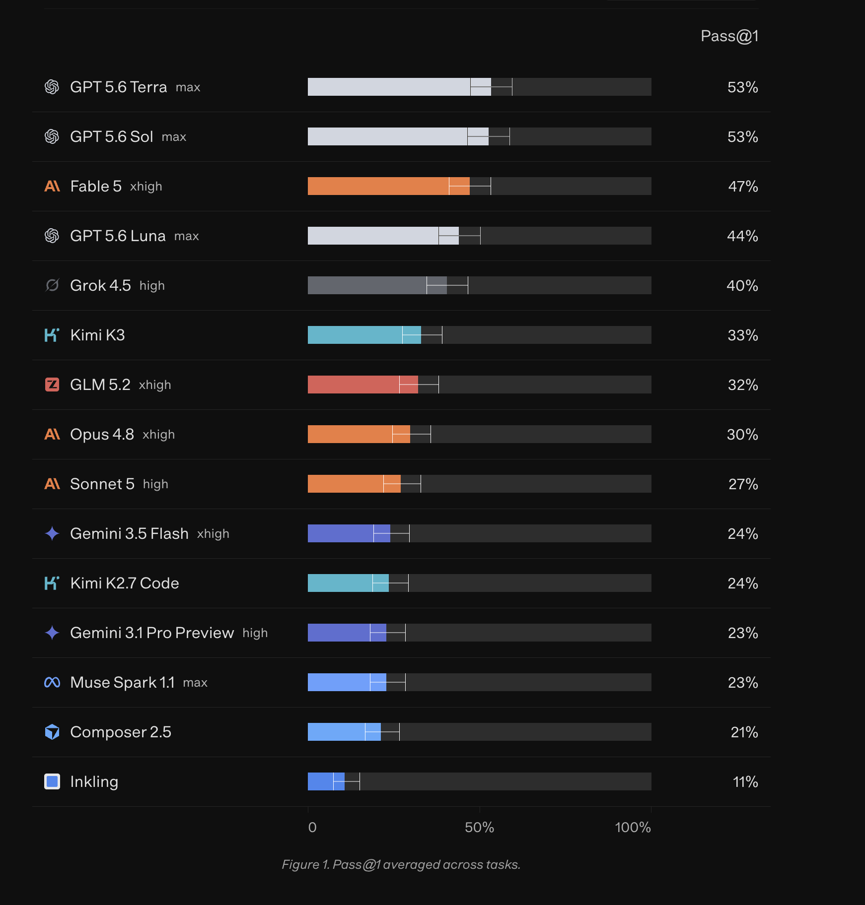
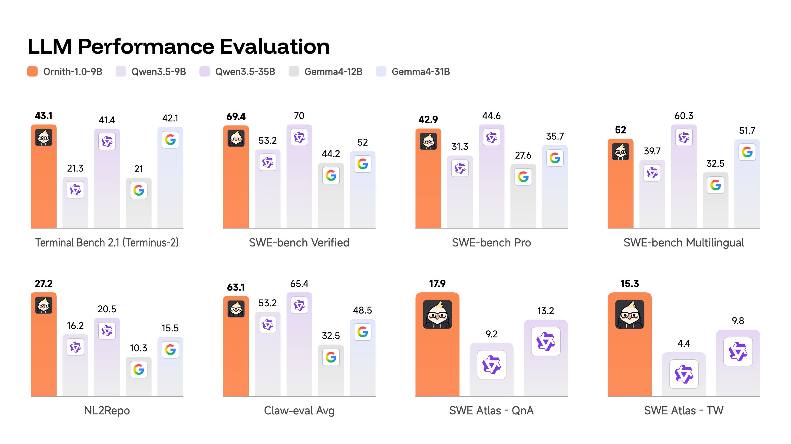
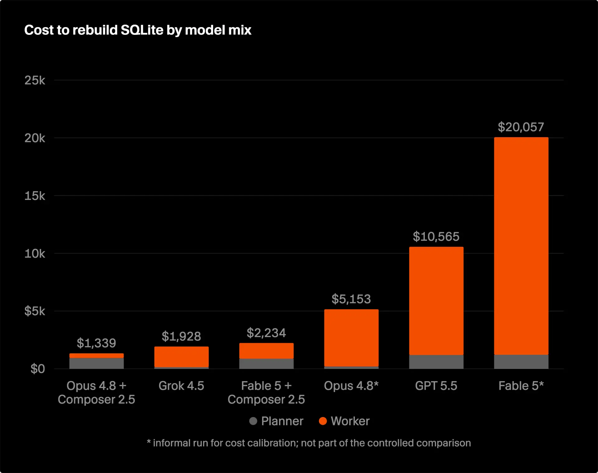
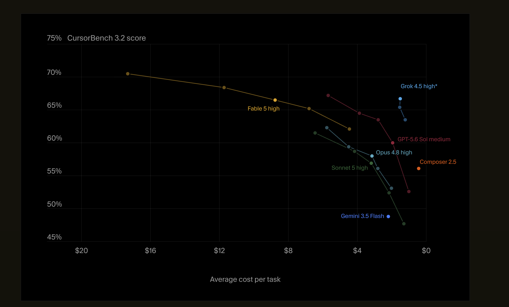

# Gallery：真实报告图对照

四张真实 eval 报告图在[图表契约](charts/README.md)下的写法。对照关注轴、series、误差、堆叠和多面板等结构；颜色、字体与圆角归[主题层](../library/theme.md)。

## 图 1：单指标排行与置信区间



一个模型维度按通过率排序，每个模型一根条；误差线只属于该通过率 series，数值标签也是该 series 的子节点：

```tsx
<BarChart layout="vertical">
  <XAxis metric={endToEndPassRate} orientation="top" />
  <YAxis dimension="agent" sort={endToEndPassRate} />
  <Tooltip />
  <Bar metric={endToEndPassRate}>
    <ErrorBar kind="ci95" />
    <LabelList position="right" />
  </Bar>
</BarChart>
```

维度轴的 `sort` 方向跟随 Metric 的 `better`，同值按 agent key 稳定收口。排行产生 `ChartData` 的 dimension axis + metric series，不伪造列维度。

## 图 2：多题集小面板



面板展开属于 TSX 和排版层。每个面板用相同的 `BarChart` 结构，`Cell` 在父 `Bar` 已知的 agent 横轴中选择一个值进行强调：

```tsx
<Grid columns={4}>
  {["terminal-bench/", "swe-verified/", "swe-pro/", "swe-multilingual/"].map((prefix) => (
    <BarChart key={prefix} evals={prefix}>
      <XAxis dimension="agent" />
      <YAxis metric={examScore} />
      <Bar metric={examScore}>
        <Cell value="ornith-9b" emphasis />
        <LabelList position="top" />
      </Bar>
    </BarChart>
  ))}
</Grid>
```

不增加 facet 容器：JSX `map` 已经完整表达展开。跨面板同键同色由[页级色分配](README.md#系列色分配单位是页)保证；不提供跨图集中图例。

## 图 3：成本构成堆叠条形



每段是一个独立 `Bar`，共同绑定成本轴并共享 `stackId`；堆顶总值由 `LabelList` 显式声明：

```tsx
<BarChart>
  <XAxis dimension="experiment" />
  <YAxis yAxisId="cost" metric={costUSD} />
  <Legend />

  <Bar metric={plannerCostUSD} name="Planner" yAxisId="cost" stackId="cost" />
  <Bar metric={workerCostUSD} name="Worker" yAxisId="cost" stackId="cost">
    <LabelList value="stackTotal" position="top" />
  </Bar>
</BarChart>
```

`plannerCostUSD`、`workerCostUSD` 与轴 Metric 必须通过单位、尺度和可加性校验。图题与脚注属于外层 `Col` 的文本节点，不进 chart。

## 图 4：成本-质量前沿散点



散点使用同一套容器、轴与 series 所有权。`points` 决定点身份，`by` 说明 agent 是 series 维度，`line` 在每个 agent 内按成本原值连线：

```tsx
<ScatterChart>
  <XAxis metric={costUSD} />
  <YAxis metric={endToEndPassRate} />
  <Tooltip />
  <Legend />
  <Scatter
    points="experiment"
    by="agent"
    x={costUSD}
    y={endToEndPassRate}
    line
  />
</ScatterChart>
```

成本 Metric 的 `better: "lower"` 让横轴反向，所以「更好」仍朝右上。text 面不画折线，而是按同一排序输出相邻点位移摘要。点标签使用最短唯一 experiment 后缀，完整 id、两轴值与证据进入 tooltip / text 明细。

## 双轴混合

四张来源图没有双轴柱线混合，这项能力由容器层级直接表达：

```tsx
<ComposedChart>
  <XAxis dimension="experiment" />
  <YAxis yAxisId="cost" metric={costUSD} />
  <YAxis yAxisId="quality" metric={endToEndPassRate} orientation="right" />
  <Bar metric={costUSD} yAxisId="cost">
    <ErrorBar kind="ci95" />
  </Bar>
  <Line metric={endToEndPassRate} yAxisId="quality" dot={false} />
  <ReferenceLine y={0.8} yAxisId="quality" label="目标" />
</ComposedChart>
```

误差线只影响成本柱；通过率线有自己的轴；参考线用 `yAxisId` 指明坐标系。没有 chart 级「对全部 series 生效」的模糊设置。

## 对照结论

- 排行、离散比较、堆叠、参数趋势、散点与混合图都落在同一套 Chart → Axis/Series → nested presentation 层级。
- 动态 series 必须以 `by` 指明维度；`value` 只做该维度内的精确选择。点级覆盖由父 series 下的 `Cell` 承担，不混入 series 选择语义。
- `ErrorBar`、`LabelList`、`Cell` 的作用域由 JSX 父子关系决定，不需要 chart 级侧表。
- 四类图共用 `ChartData`，但维度 x、数值 x 与散点 Metric x 是判别形状。
- 不提供 facet 容器、跨图集中图例与线端重复 series 标签；这些边界不妨碍图中核心结构。

## 相关阅读

- [图表](charts/README.md) —— 示例中每个组件的精确契约。
- [组件树](README.md) —— 结构节点、页级色分配与双面投影边界。
</content>
