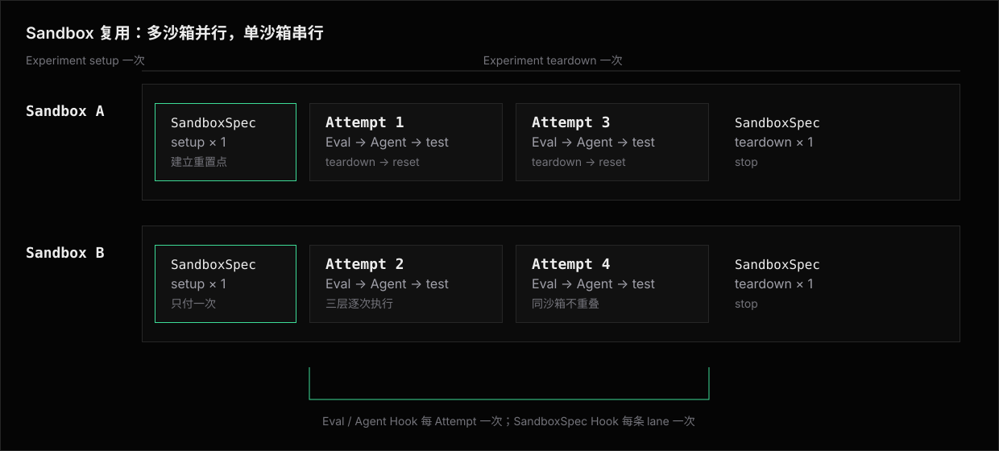

# Sandbox 复用

Experiment 用 `sandboxReuse: true` 声明多条 Attempt 可以共用 Sandbox：

```ts
export default defineExperiment({
  agent: codexAgent(),
  sandbox: e2bSandbox({
    template: "niceeval-agents",
    lifetimeMs: 4 * 60 * 60_000,
  }),
  sandboxReuse: true,
  maxConcurrency: 2,
  timeoutMs: 30 * 60_000,
});
```

这是可签入的实验语义，不是 CLI 运行模式。
省略 `sandboxReuse` 时，每个 Attempt 使用全新 Sandbox。

## 作者声明了什么

`sandboxReuse: true` 表示作者接受以下生命周期：

- workdir 在 Attempt 之间回到复用 Sandbox 的题间重置点；
- `$HOME`、`/tmp`、全局安装、后台进程和外部服务状态可能继续存在；
- 两层作者 layer 的 `prepare()` 每条 Attempt 重放,昂贵动作靠真实检查快速命中(官方写法见[内置 prepare 命令](prepare-commands.md))；
- agent.ensure 循环与 Agent runtime 每 Attempt 执行；
- `maxConcurrency > 1` 时，不保证哪些 Attempt 共用同一个 Sandbox。

如果结果依赖严格的跨 Attempt 顺序或累积状态，必须同时声明 `maxConcurrency: 1`。
如果 Attempt 不能接受 workdir 之外的状态残留，就不能声明 `sandboxReuse`。
这里允许的是**已经成功 settle 的命令有意留下的任务服务**，不是超时或取消后失控的命令树。异常命令树必须先确认终止；Provider 做不到时整台 Sandbox 退休，绝不进入复用池。

复用改变可观察行为，因此 `sandboxReuse` 和 `sandbox` Provider 配置进入配置哈希。
同一个 Experiment 不能由 CLI 临时打开或关闭复用。
需要全新 Sandbox 的对照时，定义另一个不带 `sandboxReuse` 的 Experiment。

## 完整生命周期

一次 Invocation 中，一个声明复用的 Experiment 按以下顺序运行：



每个 Sandbox 同时只承接一条 Attempt。
不同 Sandbox 可以并行；同时执行数仍受全局并发位和 Experiment `maxConcurrency` 限制。
Runner 按需创建 Sandbox，不因为并发上限较大就提前创建不会使用的数量。

### 各阶段次数

| 生命周期阶段 | `sandboxReuse: true` |
|---|---|
| Experiment `setup` / `teardown` | 每 Invocation 成对一次 |
| `createSandbox` / `stop` | 每个 Sandbox 成对一次 |
| 两层作者 layer 的 `prepare()` 与已登记 cleanup | 每 Attempt 成对 |
| agent.ensure 循环(probe、缺失才 install、复检) | 每 Attempt 一次,命中快速返回 |
| Agent runtime `setup` / `teardown` | 每 Attempt 成对一次 |
| `test(t)`、断言求值与证据收集 | 每 Attempt 一次 |

成对语义:

- cleanup 只在 command 成功取得资源后经 `context.onCleanup()` 登记,按全局准备顺序逆序执行;
- Attempt 的 Agent 与 cleanup 收尾完成后,Sandbox 才能 reset、轮换或停止。

Runner 不把任何作者准备提升成每个 Sandbox 一次。
稳定 Agent CLI 应进入预制环境;随 Experiment 变化的准备写在 Experiment layer 的 `prepare()`,由真实检查控制重放成本。

Agent CLI 先由 ensure 重新 probe；缺失或 identity 不符时由配对 Installer 安装并复检。
随后 runtime setup 的扩展步骤按声明收敛，不假设 Sandbox 空白：同名 marketplace 注册与 Plugin 安装被替换成按声明来源与 ref 的全新安装，规则见 [Coding Agent 扩展边界](../adapters/architecture/coding-agent-extensions.md#安装收敛不假设沙箱空白)。
「可重复执行」的作者义务只覆盖作者自己写的代码:两层 layer 的 `prepare()` 与 Agent factory 的 `postSetup`。

## 复用池按完整身份分组

一个 Experiment 的混合批次里,不同 Eval 的 template 可以各不相同。
Runner 按 `(CaseKey, templateOwner, layer identities, Agent ensure identity)` 分组:

- 同一个 Sandbox 只承接同键 Attempt；
- 每组建立自己的题间重置点；
- Experiment `maxConcurrency` 约束所有组的同时执行总数；
- 不同组之间不共享 Sandbox,也不共享任何检查命中历史。

含 opaque command 的 layer 没有稳定 layer identity,对应窗口不跨配对、不跨 Invocation 共享;完整规则见[三方准备时序](lifecycle.md#身份与复用池)。

## 题间重置

Sandbox Case 就绪后,Runner 在分类账上建立 **复用 Sandbox 的题间重置点**。
每条 Attempt 开始前,workdir 必须处于这个点。

上一条 Attempt 的证据折叠完成后,Runner:

1. `git reset --hard` 回到题间重置点；
2. 按分类账排除清单执行 `git clean`；
3. 按 owner 顺序重放两层作者 layer 的 `prepare()` 命令；
4. 重新执行 agent.ensure 循环与 Agent runtime,再建立本 Attempt 的归因窗口;`test(t)` 重新准备本 Attempt 的 Fixture。

reset 删除了某个已安装内容时,当前 Attempt 的检查会未命中并重新安装;这是正确性结果,不是缓存失败。
reset 失败后,该 Sandbox 不再承接 Attempt。
后续 Attempt 等待其它 Sandbox,或由 Runner 创建替代 Sandbox。

## 两种时间不能混用

`timeoutMs` 与 `lifetimeMs` 控制不同对象：

| 字段 | 对象 | 到期结果 |
|---|---|---|
| Experiment `timeoutMs` | 一条 Attempt | Attempt 记为 `errored`，随后执行有界收尾 |
| Sandbox Provider `lifetimeMs` | 一个 Sandbox | Provider 到期后停止 Sandbox |

不能为了让 Sandbox 活得更久而提高 Experiment `timeoutMs`。
这样做会放宽卡死 Agent 和测试脚本的保护，却不能保证 Provider 接受更长的 Sandbox 存活时间。

内置 Provider 的 `lifetimeMs` 使用同一个名字：

```ts
dockerImageSandbox({ image: "acme/evals:latest", lifetimeMs: 4 * 60 * 60_000 })
e2bSandbox({ template: "acme-evals", lifetimeMs: 60 * 60_000 })
vercelSandbox({ snapshotId: "snap_123", lifetimeMs: 4 * 60 * 60_000 })
```

**上限是账号档位的属性，不是这个字段的属性。**
上面 e2b 那行写 1 小时不是笔误：实测 e2b 账号档位的硬上限就是 1 小时，超了在创建实例时直接 400（`Timeout cannot be greater than 1 hours`）。
同一个值在别的档位可能是合法的，所以这里给不出一张能长期成立的上限表——按自己账号的档位定，撞上了报错会把 Provider 的原话带出来。

Provider 可以限制最大值，但不能静默压短。
不支持指定值时，Experiment 在第一条 Attempt 派发前报错并展示 Provider 理由。
超出上限时报错点名 `lifetimeMs` 与 Provider 的拒绝理由，不替作者把值改小——悄悄压短会让复用池按声明的寿命记账，而实例在远处按更短的寿命被回收，症状要到 Attempt 跑到一半才现形。

## 派发前确认

每个支持 Sandbox 复用的 Provider 提供：

```ts
interface SandboxReuseCapability {
  ensureLifetime(minRemainingMs: number): Promise<
    | { ready: true; expiresAt?: string }
    | { ready: false; reason: string }
  >;
}
```

该能力只能由 Provider 自己实现：`ready: true` 的唯一合法依据，是寿命已经真实设置或续期到了 Provider 后端。
Runner 不提供任何基于本地时钟的通用记账实现——记账没有把寿命写进后端时，它把「没实现」伪装成「实现了」，Sandbox 会在远处的运行期被 Provider 按自己的默认寿命回收，而 Runner 一路答 `ready: true`。

Runner 在每次派发前请求足以覆盖 Attempt deadline 与收尾预留时间的 Sandbox 复用寿命。
Provider 可以在 `ensureLifetime` 内续期，也可以只确认现有时间。

- `ready: true`：Sandbox 可以承接 Attempt。
- `ready: false`：停止旧 Sandbox，创建并准备替代 Sandbox。
- Provider 没有该能力：Experiment 在第一条 Attempt 派发前报错。

替代 Sandbox 就绪后再次检查。
如果替代创建已消耗过多时间，本次 Run 报错，不反复创建同样的替代 Sandbox。

Sandbox 在 Attempt 中途消失时，该 Attempt 记为 `errored`。
Runner 不静默重跑，因为 Agent 可能已经产生成本或外部副作用。

## 结果与结果沿用

声明复用的 Experiment 每次都真实执行计划内的 Attempt：

- 不消费历史结果沿用；
- 产出的 Attempt 不供后续 Run 结果沿用；
- 结果可以进入 CI，因为 Sandbox 生命周期已写入 Experiment 并进入配置哈希；
- Attempt 记录 `sandbox.reused`、本次 Run 内的 Sandbox 编号和承接序号。
  这些是调度事实，在 Sandbox 租借给该 Attempt 的那一刻确定；Attempt 无论在哪个阶段终结（含 Eval `setup` 失败与超时），记录里都必须带完整归属，不得因为没走到收尾而缺失。

## 复用污染的可观察性

「prepare 可重复执行、不依赖 workdir 外残留」是作者义务，但违约的症状（下游 Eval 莫名失败）不指向复用，作者靠肉眼比对无从发现。
框架必须自己把线索说出来。
Run 收尾时，声明 `sandboxReuse` 的 Experiment 按 Sandbox 实例与承接序号聚合判定。
当首承接（序号 1）正常、而某实例序号 ≥ 2 的 Attempt 集中失败或集中 `errored` 在同一生命周期阶段时，结束反馈追加一条运行级 diagnostic，点名实例、序号区间与阶段，提示复用残留的可能性。
诊断只指路，不改判定。

禁用结果沿用不是在否定结果，而是避免跳过部分 Attempt 后改变 Sandbox 的完整生命周期。

## 与其它能力组合

- **`--rerun`**：合法，但没有结果沿用可关闭。
- **`attempts > 1`**：每次运行仍是一条 Attempt，开始前重置 workdir。
- **首过即停**：语义不变，取消的 Attempt 不触发新 Sandbox 创建。
- **`--keep-sandbox`**：与 `sandboxReuse: true` 互斥；最终现场不只属于某一条 Attempt。
- **`localSandbox()`**：与 `sandboxReuse: true` 互斥；Runner 不重置用户工作树。
- **预制环境**：优先使用，先把稳定安装移出 Attempt。
- **Sandbox 预热**：不叠加；复用 Experiment 自己按需创建 Sandbox。

## 失败与收尾

- prepare 命令失败：当前 Attempt `errored`，执行已登记 cleanup；reset 成功后 Sandbox 可以继续承接。
- 领域判定 failed：照常执行 Agent 与 cleanup 收尾；命令树静止且 reset 成功后 Sandbox 可以继续。
- Attempt 超时、取消、interruption 或 `agent-send-failed`：先确认 Agent driver 与受管命令树终止；任一项无法证明就停止该 Sandbox，不进入 reset / 复用。
- reset 或寿命确认失败：停止该 Sandbox，后续 Attempt 等待替代 Sandbox。
- Invocation 中断：停止派发，收尾所有已创建 Sandbox，最后执行 Experiment `teardown`。
- cleanup 或 `stop` 失败：记录诊断，不让同一 Sandbox 再承接 Attempt。

## 非目标

- 不跨 Invocation 保留 Sandbox。
- 不把 workdir reset 描述成完整隔离。
- 不在 Sandbox 中途消失后自动重跑 Agent。
- 不用 CLI 临时改变 Experiment 的 Sandbox 生命周期。

## 相关阅读

- [实验加速 Design](../../design/experiment-speed/README.md) —— 真实耗时、候选方案与选择。
- [Experiments](../experiments/README.md) —— `sandboxReuse` 在 Experiment 中的归属。
- [预制环境](library/prebuilt-environments.md) —— 把稳定安装移到构建期。
- [Architecture](architecture.md) —— 分类账与 Provider 实现。
- [Runner](../../runner.md) —— 派发、并发与完整收尾顺序。
