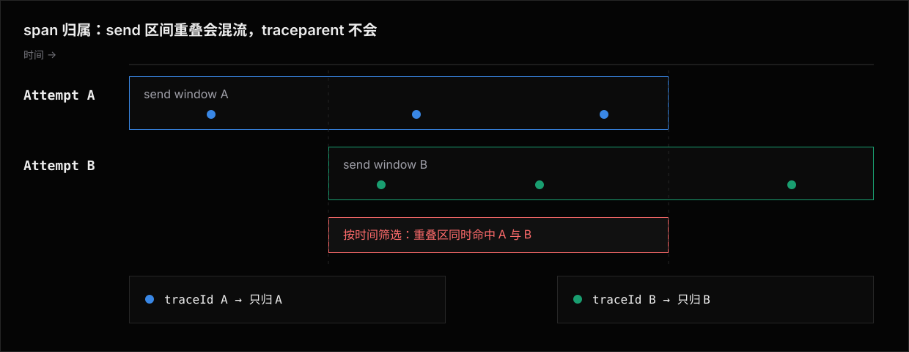

# Observability —— transcript、 Record 与报告

评测的价值不止"过/挂",更在"为什么"。
这一篇讲三件事:agent 的 **transcript** 如何被归一化成统一 trace、跑完提交的**Record**长什么样、**报告器**如何把结果回传。

## Transcript → 标准事件流

每个 agent 都吐自己格式的 transcript(Claude Code 一种 JSONL、Codex 另一种、bub 又一种)。
直接消费这些就得到处写 `if (agent === ...)`。
adapter 的核心职责,就是把它**归一化**成那条[标准事件流 `StreamEvent[]`](feature/adapters/architecture/events.md) ——它既是 trace,也是整套断言的唯一数据源,断言和报告只面对它。

每个 agent 一个归一器,住在 `o11y/parsers/<agent>.ts`,把原始 JSONL 映射成标准 `StreamEvent[]`。
**这是接新 agent 的第二件事**(第一件是 adapter 的 `send`):没有归一器,trace 就退化成不透明字符串。
归一化失败不崩:保留原始 JSONL,并把归一化失败作为该 eval 的 Observation 事实写入 Record。

事件里工具调用的名字(`operation.started.operation.name`)被归一化到一组**规范名**,便于跨 agent 断言:

```typescript
type ToolName =
  | "file_read" | "file_write" | "file_edit"
  | "shell" | "web_fetch" | "web_search"
  | "glob" | "grep" | "list_dir" | "agent_task" | "unknown";
```

core 再从这条流派生两样:`deriveRunFacts(events)`(toolCalls / subagents / parked,供断言,见 [标准事件模型 · 派生事实](feature/adapters/architecture/events.md#派生事实)),以及下面给人与宿主侧行为断言用的 o11y 摘要。

原始 transcript 具体怎么从 agent CLI 弄到手(磁盘旁读 / stdout 捕获 / OTLP 推送)、采集层与转换层的边界怎么分,属于"怎么写 adapter"的范畴,见 [Sandbox Agent · Transcript 采集](feature/adapters/library/sandbox-agent.md#transcript-采集)。

## o11y 派生摘要

从归一化事件派生出一份给人和给断言看的摘要:

```typescript
interface O11ySummary {
  totalTurns: number;
  toolCalls: Record<ToolName, number>;   // { file_read: 15, shell: 8, … }
  totalToolCalls: number;
  filesRead: string[];
  filesModified: string[];
  shellCommands: { command: string; exitCode?: number; success?: boolean }[];
  webFetches: { url: string; status?: number; success?: boolean }[];
  errors: string[];
  thinkingBlocks: number;
  contextInjections: number;             // 被测系统内部机制(如 Claude Code 的 SessionStart/UserPromptSubmit hook)注入进上下文的次数
}
```

`O11ySummary` 只承载**从标准事件流可重算的行为计数**,是读取期的 Projector 读模型(见 [Record · Architecture](feature/record/architecture.md))。
token 用量、估算成本与耗时不在其中:用量是 Observation,估算成本是引用价格表的 Claim,耗时由 Projector 从事件重建,同一事实不落第二份。

### 宿主侧行为断言:t.o11y

`t.o11y` 是 `TestContext` 上的只读 getter,每次读取都从当前 attempt 已累积的标准事件流经 `buildO11ySummary()` 现算,返回一份 `O11ySummary`;多轮之间读取,拿到的是截至最近一次已返回 `t.send()` 的行为。
direct 与 sandbox Agent 同一行为:只要 adapter 吐标准事件流,摘要就有数据。

行为数据不进沙箱:摘要在宿主侧现算,沙箱里没有它的任何拷贝。
workdir 里没有框架文件, agent 进程与用户命令的进程变量里没有框架变量;runner 确需落在沙箱里的运行时数据 (变更分类账、OTLP 采集缓存)一律在 workdir 外的私有路径,处在 agent 视野之外。
这与分类账把 git 目录放在 workdir 外是同一条素净原则 ([Sandbox · 变更归因](feature/sandbox/architecture.md#变更归因send-区间与分类账)),它买到三件事:

- agent 观察不到自己被评测的痕迹，评测意识不污染行为。
- 行为证据全程在 agent 够不着的宿主侧，篡改摘要骗过验证在物理上不成立。
- workdir 里只有用户与 agent 写入的内容，`git clone <url> .` 这类要求空目录的 fixture 写法不会撞上框架文件。

`O11ySummary` 不含 usage、估算成本、耗时或其它字段；这些事实分别以 Record 的 usage Observation、成本 Claim 与 Projector 重建的时间树为准。
读取期的 o11y Projection 与 `t.o11y` 共用同一派生算法，同一事实不落第二份权威。

分工因此一刀切：沙箱内的脚本只断言**落盘结果**——文件存在、测试通过、构建成功，这些事实本来就在沙箱里，不需要框架送数据进去；**行为**断言写在宿主侧 `test(t)`，与作用域断言、judge 同一个家。
安装 manifest 同理不落沙箱盘：adapter 在宿主侧把它交给运行器，作为该 attempt 的 Provenance 事实存入 Record。

于是 `test(t)` 能断言 agent **干了什么**,而不只是**产出了什么**:

```typescript
await t.send("用脚手架初始化项目,然后实现 Button 组件。");

// 用了正确的脚手架,而不是手搓
t.check(t.o11y.shellCommands.map((c) => c.command).join("\n"), includes("create-next-app"));
// 没有读不该读的文件
t.check(t.o11y.filesRead.join("\n"), excludes(".env"));
// 工具调用没失控
t.check(t.o11y.totalToolCalls, satisfies((n) => (n as number) < 50, "工具调用少于 50 次"));
```

这把"过程正确性"也纳入了评分,而不只是"结果正确性"。

## OTLP traces → 统一瀑布图

`StreamEvent` 回答「做了什么」;**trace 回答「各花了多久、谁套谁」**。
配了 OTel 接入的 agent 经 OpenTelemetry 把 OTLP traces 导出到运行器：

- Sandbox Agent 声明 `tracing`，默认在同一个 Sandbox 内起 attempt-scope receiver，避免依赖未承诺的容器到宿主路由。
- direct agent 配 `defineConfig({ telemetry })`，共享宿主固定端口 receiver。

两条路径都把端点经 `ctx.telemetry.endpoint` 交给 agent。跑完后，runner 把 span 归一成 `TraceSpan[]` 作为 telemetry Observation 写入 Record，`niceeval view` 经 trace Projector 画成瀑布图。作者显式配置 `telemetry.host` 时，Sandbox Agent 也可改走已经由作者保证可达的宿主或 tunnel receiver。

**断言永远只读事件流,从不读 span。
** `send` 返回的 `Turn.events` 是断言唯一的数据源——有 trace 也不给断言开后门。
理由是 span 关联是脆弱的:一旦断言读 span,span 归属判错就会直接污染判分。
所以 **span 从不产出、也从不改写任何 `StreamEvent`**。

展示层则同时消费两条数据。
span 除了喂瀑布图,还作为**可选 enrichment** 合并进事件骨架,构成 `ExecutionTree`,供 `niceeval show --execution` 这类需要「一份读完」的视图消费。
把事件和 trace 分成两个存储、两套 renderer 去读,对着一次失败要来回翻两个视图拼时间线。
`ExecutionTree` 用纯函数 `buildExecutionTree(events, spans)` 把两者合并成一份视图,事件当骨架,只服务展示,不反哺判分。

`ExecutionTree` 的骨架就是标准事件流本身。
骨架节点包括 `message`、`thinking`、`skill.loaded`、`operation.started` / `operation.finished`、`input.requested`、`context.injected`、`compaction` 与 `error`。

`skill.loaded` 是一等事件:agent 加载 Skill 时归一化直接产出,不靠「识别到叫 `load_skill` 的工具调用」这类按名字猜的办法。
`operation.started` / `operation.finished` 按 `operationId` 合并成工具或子 agent 调用节点。
`context.injected` 是被测系统内部机制注入进上下文的文本,不属于任何一方"说的话",单独成一类节点,不并进 `message`(详见[标准事件模型 · 不变量 9](feature/adapters/architecture/events.md))。

**骨架的节点、顺序、内容永远不因 OTel 有没有接入而变**。
OTel span 只是叠加在同一个节点上的可选信息:起止时间、耗时、父子关系、错误状态。
合并靠**显式 correlation ID 或 GenAI 语义约定属性**(如 `gen_ai.tool.call.id`),**永远不靠拿 span 名字 / 文本去猜哪个事件对应哪个 span**。
没有 OTel 接入时,节点照样全部显示,只是耗时标「timing unavailable」;span 存在但唯一关联不上任何事件时,保留成一个单独标注的 telemetry-only 节点,不悄悄猜着合并到某个事件上。

因为 span 不参与断言，`telemetry.configure` / `telemetry.collect` 都是 supplemental 采集。
接收器启动、exporter 配置、settle 或 collect 失败时，Runner 追加带原始 phase 的 diagnostic Observation。
随后继续执行或保留已经形成的 Verdict Claim；不得把 trace 缺席伪造成终局执行错误。
更不得把 Attempt lifecycle 标成 verdict token。
若某种 Adapter 只能从 telemetry 取得行为事件，它违反“事件是行为轨、span 是时间轨”的边界，应修 Adapter 的事件转换器，不能把 OTel 暗中提升成判定依赖。

这份事件骨架用于 `show --execution`:它回答「agent 做了什么」,唯一关联上的 span 只作为该事件旁的时间注释。
完整的时间分析入口是 `show --timing`:它以 runner 的 lifecycle/turn/command 时间树为骨架,再按 turn 保存的 `traceId` 把 OTel agent/model/tool 子树挂进去。
两个视图可以显示同一条 tool span,但只是对同一事实的两种投影,不会把 span 复制进事件或 runner timing。

这条线分两层,两层都得归一,但**含义层(语义约定)才是接新 agent 的关键工作**:

| 层 | 干什么 | 谁做 |
|---|---|---|
| **线格式层** | OTLP/JSON(codex)、OTLP/protobuf(bub)→ 统一的 `TraceSpan[]` | core `o11y/otlp/parse.ts`,通用,接新 agent 不用碰 |
| **语义层** | span 名 / 属性的**含义**(「这是模型调用」「这是工具执行」) | **每个 agent 一个薄 mapper**(见下) |

### canonical 目标 = OpenTelemetry GenAI 语义约定(不发明私有 schema)

不同 agent 的 span 命名 / 属性约定天差地别(codex 的 `codex.exec`、bub 插件的 `agent.step` / `execute_tool`)。
直接把原生 span 喂给 view 就是**苹果对橘子**:名字、属性键都不一样,跨 agent 没法叠加对比 ——而横向对比是本套件的全部意义(同一任务、不同 memory 条件 / 不同 agent 比通过率 × 时间 × 成本)。

**定下来的规矩:canonical 目标就是 OpenTelemetry 官方的 [GenAI 语义约定](https://opentelemetry.io/docs/specs/semconv/gen-ai/),不另造 niceeval 私有 schema。
** 理由:

1. **它是行业标准**,codex 的 OTLP 已部分遵循、bub 的 otel 插件可配置直接发 `gen_ai.*`。
2. **我们不控制 agent 的 instrumentation** —— codex(Rust)、claude 发什么是什么。
   造私有 schema 也强迫不了它们原生发,最终只能在我们这侧归一;那不如归一到一个公认标准,而不是又一套只有 niceeval 认得的键。

canonical 的核心是用 `gen_ai.operation.name` 把 span 分成几类语义角色(view 据此着色 / 分组 / 对比):

| `gen_ai.operation.name` | niceeval `kind` | 含义 |
|---|---|---|
| `chat` / `text_completion` | `model` | 一次模型调用 |
| `execute_tool` | `tool` | 一次工具执行 |
| `invoke_agent` / `create_agent` | `agent` / `turn` | 一次 agent / 回合调用 |
| (其余 / 未识别) | `other` | plumbing,view 默认折叠 |

配套属性一律走 GenAI 键:`gen_ai.request.model`、`gen_ai.usage.input_tokens` / `output_tokens`、`gen_ai.tool.name`、`gen_ai.tool.call.id`、`gen_ai.agent.name`。
`derive.ts` 的 `extractUsageFromSpans` 已经在认 `gen_ai.usage.*` 这套。

### 每个 agent 一个薄 mapper

和 transcript 归一器(`o11y/parsers/<agent>.ts`)**完全对称**:每个 agent 再加一个 span mapper,把它的原生 span 归一到 canonical GenAI semconv。
mapper 只做一件事 ——认出「这条 span 是模型调用 / 工具执行 / 回合」,补上 `gen_ai.operation.name` 与相关 `gen_ai.*` 属性,**保留 raw `name` / `attributes` 供下钻**。

> **mapper 越薄越好:能在源头对齐就别在 mapper 里补。
** codex 的 `config.toml`、bub 插件的配置尽量让它们直接发 `gen_ai.*`;源头发对了的 agent,mapper 近乎透传。
mapper 是「上游不肯按标准发」时的回退,不是主力。

这把 `o11y/otlp/select.ts` 里那串「猜各 agent 命名约定」的正则全删掉 —— agent 特定知识回到 agent 自己手里(和 parser 同一个归属原则),`select` 退化成纯通用逻辑:按 `kind != "other"` 留、按 firehose 频率丢。

### view 只认 canonical

**view 不读任何原生 span 名 / 原生属性。
** 它只消费归一后的字段:`gen_ai.operation.name` → `kind` 着色分组,`gen_ai.*` 取模型 / 工具 / 用量。
后果:

- 接新 agent **不用动 view** ——只要 mapper 把它归一到 canonical。
- 两个 agent 的瀑布图**天然对齐、可叠加对比**(同一种颜色 = 同一种语义)。
- 没写 mapper(或 mapper 没认出)的 span 落进 `other`,view 折叠不渲染细节 —— **降级但不崩**,也不污染对比。

### agent 定义里 otel 怎么放(两块责任分开)

otel 在 agent 定义里其实是**两个互不相干的责任,分开放**,别都放入 `setup` / `send`:

1. **导出配置(adapter 侧的 `tracing` 块)** ——「怎么让这个 CLI 把 OTLP 发到 endpoint」。
   从 `setup`/`send` 抽出来,做成 agent 定义里一个声明式 `tracing` 块(见 `AgentTracing`)——这个块存在,运行器就为该 agent 开 OTLP 接收,不需要另外声明什么开关。
   两种投递方式(按 CLI 而定,互不排斥):

   ```typescript
   defineSandboxAgent({
     name: "my-agent",
     evidenceCoverage: completeEvidenceCoverage,
     ensure: {
       identity: { agent: "my-agent", version: "1.4.2" },
       probe: shell('test "$(my-agent --version)" = "1.4.2"'),
     },
     tracing: {
       protocol: "http/protobuf",
       // env-based(标准 OTEL_* env,如 bub/Python OTel SDK):给 endpoint → 返回 env。
       // 运行器把它算进 ctx.telemetry.env,send 直接 `{ ...ctx.telemetry?.env }` 注入。
       env: (endpoint) => ({ OTEL_EXPORTER_OTLP_TRACES_ENDPOINT: endpoint, /* … */ }),
       // file-based(CLI 自有配置文件,如 codex 的 config.toml [otel] 块):给 sandbox + ctx,
       // 自己写/追加配置。运行器在 setup 之后、首次 send 之前调一次(子表天然落在主配置之后)。
       configure: async (sandbox, ctx) => { /* 把 [otel] 块追加进 config.toml */ },
     },
     async setup(sb) { /* 只写鉴权、主配置与扩展,不安装 CLI,不碰 otel */ },
     async send(input, ctx) { /* env: { ...auth(), ...ctx.telemetry?.env } */ },
   });
   ```

为什么要 env / configure 两条路:bub(Python OTel SDK)读标准 `OTEL_*` env,codex(Rust)**不读** env、只认自己 `config.toml` 的 `[otel]` 块 ——这是上游差异,抹不平,所以两种投递都得支持。

2. **span mapper(core o11y 侧)** ——「原生 span → canonical」。
   **纯数据变换,不碰沙箱**,和 transcript parser 一样住 core 的 o11y(`o11y/otlp/mappers/<agent>.ts`),可独立单测。
   分派靠接口不靠名字:adapter 在 `defineSandboxAgent` / `defineAgent` 里用 `spanMapper` 声明自己的 mapper,运行器只调 `agent.spanMapper`,未声明的走通用 heuristic 回退 —— core 不出现 agent 名字的行为分支。

**为什么要分:** 导出配置是「沙箱里怎么发」,mapper 是「发回来怎么读」——一个需要沙箱、一个是纯函数,生命周期和测试方式都不同。
混在 `setup`/`send` 里,既难单测 mapper、又让 adapter 把 otel 拼装逻辑揉进主流程。
`ctx.telemetry` 则统一带上 `{ endpoint, env? }`:env-based agent 拿 `env` 直接 spread,file-based agent 在 `configure` 里用 `endpoint`。

> **claude-code:** 走原生 OTLP(beta 遥测):adapter 的 `tracing.env` 注入 `CLAUDE_CODE_ENABLE_TELEMETRY=1` + `CLAUDE_CODE_ENHANCED_TELEMETRY_BETA=1` + `OTEL_TRACES_*`(见 `src/agents/claude-code.ts`)。
span 层级 `claude_code.interaction → llm_request / tool`,只有结构与计时、内容默认脱敏——内容与断言仍来自 transcript 旁读,trace 只补瀑布图。
span 量级小(每回合个位数),`selectTraceSpans` 的 small-trace 路径整段保留,不需要专属 mapper,也不做「transcript 时间戳合成 span」。

### span 怎么归属到轮

spans 是异步推来的,必须知道「这批 span 属于哪一轮 `send`」。
接收器的**粒度**跟**被测进程**走,不是跟 attempt 走:



- **沙箱型 agent**:每沙箱一个接收器。
  每个沙箱是独立进程,env 注入各自端点,attempt 之间端口天然隔离。
- **direct agent**:整个 run **共享一个接收器**(`defineConfig({ telemetry })` 固定的固定端口)。
  被测应用只有一条全局 OTel 管线、一个导出目标,做不到"给每条并行 eval 发不同端点"——并行 attempts 的 span 混在同一条流里,这是共享被测对象的物理事实,不是实现选择。

共享流之下的归属阶梯:

- **traceparent(并发正确性的必要条件)**:`ctx.telemetry.headers` 是每轮一个新值的 W3C trace context,`send` 把它 spread 进请求头。
  支持 context 传播的埋点(标准 OTel HTTP 服务端埋点、Claude Code 的 `TRACEPARENT`、LangSmith 检测 global provider)把本轮 span 挂到这个 trace 下,按 traceId 精确归属,并发随便开。
- **时间窗回退(仅串行可靠)**:runner 在 `send` 前记时间戳,`send` 返回后取该段时间内的 span。
  并发 attempts 的时间窗互相重叠,时间窗归属必然混流。
- **并发守卫**:共享接收器 + 未确认 traceparent 生效(收到的 span 不带我们发的 traceId)+ 该 agent 并发 > 1 → runner 把该 agent 的 attempts 降为串行并提示。
  宁可慢,不可静默混流;确认 traceparent 生效后解除。

## Record 提交

提交单位是**结果 Run**(一个 Experiment 的持久化执行批次)。
一个 `.niceeval` 是跨 Invocation / Experiment / Run 的长期 Record 事实根。
Runner 每次提交把新的 Run / Attempt / Stream / Claim payload 写进 frozen typed-object Graph。
它产出新的 committed Graph root,再与 mutable 元数据(head 与 append-only committedRoots)原子更新。
每次提交的 Graph root 都是不可变 durable revision,没有 Graph open / sealed 状态。
完整性由 stream、Attempt、Run 与 receipt 表达。

`AttemptPayloadV1` 只保存 identity、origin Run、Provenance ref、lifecycle state 与 stream bindings；Attempt 永属其 origin Run。

结构化执行错误、diagnostic、事件、源码、trace 和原始用量是 Observation。

Assertion、Judge、Verdict 与估算成本是带依据的 Claim。瞬时 progress 不落盘。

通过数、失败数、总用量、总成本这类聚合不落盘,由读取面([Record Lib](feature/record/library.md)的
`openRecordStore(root)` → `openRecord(store)` / `openRecordGraph(store, ref)` 逐条推导。

事件、源码、trace、o11y 与 diff 以 Observation 事实保存,读取面经 Projector 重建;未知 payload 保留原始字节。

完整容器、payload media type 与读取规则见 [Record Format](feature/record/architecture.md)。

attempt 收尾后收到 `AttemptReceiptSnapshot`：Invocation、origin Run、Experiment、Attempt、locator、Eval、ordinal、执行终态与穷尽 `RecordCommit`。
它不是 Verdict 的替代数据——判定、断言与诊断仍从 Record 读取。
整次 Invocation 结束时返回 `InvocationReceipt`，其中是 Run / Attempt receipt、整体 `RecordCommit` 与 terminal live snapshot，不复制宽结果对象。

Verdict Claim 只有 `passed` / `failed` / `errored` / `skipped` 四态,没有 `scored` 中间态(soft 断言的分数就在断言 Claim 里如实保存,不影响这四态)。Attempt lifecycle 仍只用 `active` / `completed` / `abandoned`。
`failed` 与 `errored` 是互斥判定:前者表示断言/评分不通过,后者表示宿主运行条件、超时、adapter 或 agent runtime 这类执行错误。
JUnit reporter 也按这个口径输出 `<failure>` 与 `<error>`。

OTel trace 不是执行错误的权威存储。
Sandbox provisioning 可能早于 telemetry,teardown 可能晚于 trace collect,没有 tracing 的 provider 也必须产生同样可回顾的结构化 error/diagnostic。
trace 只在存在时补充调用关系与耗时；配置或收集失败产生 diagnostic，不改变 Verdict。

Record 是机器可读的,可回放、可二次分析、可喂给下游 dashboard。

## 用量与成本(token / 计费)

评测很贵 ——每个 case 可能是几十次模型调用。
**「花了多少 token / 多少钱」是一等公民**,因为评 coding agent 时最值钱的对比维度是**质量 × 成本**:同一批 eval 跑 claude-code / codex / bub,谁的通过率高、谁更省钱,一目了然。

参考项目这块都是空的:eve 在模型层有 token 数但 eval 不聚合成本;agent-eval 连抠都没抠(opencode 归一器里只留了句 "could extract token usage if needed" 的 `TODO` 注释)。
niceeval 把它补齐。

### 用量从哪来

`Usage`(`{ inputTokens?, outputTokens?, cacheReadTokens?, cacheCreationTokens?, reasoningTokens?, requests?, costUSD? }`,字段契约见 [Record · Architecture](feature/record/architecture.md))按 transport 取得,作者通常**什么都不用做**:

- **远程 agent** ——你在 `send` 里把模型返回的 usage(或你服务响应里带的 usage,若它回了)一并返回。
- **沙箱 coding agent** —— **不必手填**:agent 的 JSONL transcript 里本就逐条带 token 用量,transcript 归一器(`o11y/parsers/<agent>.ts`)抠出来。
  这正是 agent-eval 留下的 `TODO`。

每轮的用量出处二选一:direct agent 由 `Turn.usage` 直接给,sandbox agent 由归一器从该轮 transcript 抠出。
运行器把每轮原始用量作为 Usage Observation 写入 [Record](feature/record/architecture.md)；usage Projector 才按固定 `RecordGraphRef` 汇总到单 Attempt，reporter 再跨 eval 投影整次 Run 的用量。

### 换算成本:价格表从哪来

token 数能可靠拿到;难点是 token→$ 的价格表 ——价格会随时间、provider、网关、企业折扣、自托管而变,写死必然过期。
所以成本估算是**分层的,且"实测优先于估算"**:

1. **网关实测成本(最高优先)。
   ** 不少网关(Vercel AI Gateway、OpenRouter…)每次请求直接回真实 cost。
   只要 agent 把它带进 `Turn.usage.costUSD`,就直接用它 —— **根本不需要价格表**。
   这绕开了一大半场景。
2. **内置默认价格表 ⊕ 用户自定价目。
   ** 没有实测时,用观测到的模型查价。
   niceeval 内置一份**带版本的 Run**适配常见模型(零配置即有 $),用户在 config 里**替换或补充**(网关/企业折扣/自托管/自定义费率,用户赢):

   ```typescript
   // niceeval.config.ts —— 合并在内置默认之上,用户优先
   defineConfig({
     pricing: {
       "anthropic/claude-opus-4-8": { inputPerMTok: 5, outputPerMTok: 25, cacheReadPerMTok: 0.5 },
       "openai/gpt-5.2-codex":      { inputPerMTok: 1.25, outputPerMTok: 10 },
       "my-selfhosted/*":           { inputPerMTok: 0, outputPerMTok: 0 }, // 自托管=免费
     },
   });
   ```
3. **未知模型 → 只报 token、不报 $,并打一行 warning** 列出没映射的模型(绝不静默瞎猜)。

`estimatedCostUSD = inputTokens×in价 + outputTokens×out价 + cacheReadTokens×cacheRead价 + cacheCreationTokens×cacheWrite价`。
该值作为成本 Claim 写入每个 attempt 的 Record，并引用 usage 事件、价格表与计价算法。

逐桶乘单价直接相加成立的前提是 token 桶**恒互斥**。
`inputTokens` 是未缓存输入,cache 桶不在其中重复出现。
把各协议五花八门的原生口径归一到互斥,是 adapter 的落值义务。
契约见 [Record · Architecture](feature/record/architecture.md),各协议明细见各 adapter 的 cost 文档。
cache 桶缺专门单价时按 in 价计——宁可高估,不静默低估。
字段名带 **estimated** 是有意的:它是估算,真实账单以 provider 发票为准 ——这也正是「网关实测」和「用户自定价目」两条通道存在的原因。

> 设计取舍:价格是**会过期的数据**,所以内置 Run 只为「零配置能用」,不写死进核心逻辑;准确性由用户自定价目与网关实测保证,未知则诚实降级。
Run 随版本更新,也可考虑 `pricing: "auto"` 从社区维护的价目拉取(默认仍用离线 Run,保证确定性)。

### 报告里长什么样

控制台每个 eval 末尾带用量,整个 run 带合计与按 agent 的对比:

```text
  ✓ recall-across-sessions   (42s)   38.2k tok   $0.31
  ✓ remember-styling-conv    (51s)   61.7k tok   $0.48

Run totals:  3 evals · 142k tok · $1.12   (agent: claude-code)
```

固定一次 `RecordGraphRef` 后，读取面可以把这三件套作为 Projection 展示(注意:**时间 / token / 成本始终成组出现**):

```json
{
  "id": "recall-across-sessions",
  "durationMs": 42100,
  "usage": { "inputTokens": 32000, "outputTokens": 6200, "cacheReadTokens": 0, "requests": 5 },
  "estimatedCostUSD": 0.31
}
```

run 级合计不落盘:总时长、总用量、总成本由消费方([Record Lib](feature/record/library.md)的 `openRecord` 逐条推导,或 reporter 层现算)累加得到。
这让「跨 agent 对比」从只有 pass-rate 变成 **pass-rate × 时间 × $**,也能算出 pass@$1(单位成本下的通过率)这类指标。

### 时间也是一等指标(效率三件套)

成本不是新指标里唯一的一个。
**时间一直就记**——运行器把生命周期、hook、沙箱命令和每轮 send 的单调时钟边界作为 Observation 写入 Record；读取面经 timing Projector 重建时间树，再与 usage / cost Projection **并排**成组:

| 维度 | 粒度 | 出处 |
|---|---|---|
| **时间(wall-clock)** | 每 attempt / lifecycle / hook / 沙箱命令 / turn / 整个 run(+ 平均) | 运行器单调时钟,adapter 不用做事 |
| **Agent 内部时间** | turn 内的 agent / model / tool / subagent | OTel span,按显式 correlation 关联 |
| **token 用量** | 同 | 标准事件流 / transcript 抠出 |
| **估算成本 $** | 同 | usage × 价格表(或网关实测) |

Record 里判定链耗时仍只有聚合口径一个数,`StreamEvent` 本身也不携带时间。
更细的时间来自两条互补事实线:

- **Runner 时间树**:runner 在 lifecycle 边界、hook、`Sandbox.runCommand()` / `runShell()` 与每次 `send` 外层使用单调时钟计时。
  它能可靠回答「这一轮端到端花了多久」「安装 CLI 的命令花了多久」,不依赖 OTel；命令正文只保存有界脱敏摘要,env value 与输出不进时间树。
- **OTel trace**:回答 turn 内部「模型想了多久」「Agent 工具调用多久」「谁套谁」。
  span 有显式 `traceId` / call ID 且能唯一关联时才挂到对应 turn 或 event；没有就诚实显示 timing unavailable,不拿 turn 或 attempt 总耗时反推。

Runner 的 turn 包络与 OTel 子树不是两份互斥的计时:前者含 adapter、CLI 启动、IPC 与未埋点空白,后者只含实际发 span 的内部操作。
它们形成父子诊断视图,不能把可能嵌套或并发的 OTel children 简单求和后与 turn 比较。
远端 span 也不靠绝对墙钟与 runner 对齐,只靠 trace/parent 关系归属。

三个都留是因为**它们不总相关**:命中缓存的运行可能便宜但慢,推理重的可能贵但快 ——只看一个会误判。
所以控制台 `(42s) 38.2k tok $0.31` 三个并列,`niceeval view` 也能画「质量 × 成本 × 延迟」。

### 把成本变成可断言 / 可护栏的维度

- **断言效率**(见 [Assertions · 作用域断言](./feature/assertions/library/scoped-assertions.md)):`t.maxTokens(50_000)` / `t.maxCost(0.5)` —— agent 答对了但烧太多,也判失败。
- **预算护栏**:`--budget <usd>` 给整个 run 设上限,累计花费超了就停止派发新 attempt(借鉴 crabbox 的 spend cap),避免一次跑爆账单。

## 结果可视化:`niceeval view`

控制台是「当下」的;但你常常想**事后看图**。
比如这次比上次贵了多少?
哪个 agent 性价比高?
所以 niceeval 提供一个本地查看器(对标 agent-eval 的 playground),只读 `.niceeval` Record 事实根,不连任何外部服务。
结果格式见 [Record Format](feature/record/architecture.md);查看器见 [View](feature/reports/view.md);对比两次运行用报告里的成对差异表([`sources.measure.delta`](feature/reports/calculations.md))按 run 维度表达。

可视化能力完全建立在「 Record 结构化 + 带 usage/cost」之上 ——换句话说,**只要数据采全了,图是免费的**;不想用内置查看器,同一份 Record 也能喂给下游 dashboard。

托管看板走 reporter 通道(见下),把每次运行作为一个实验上报到 Braintrust 这类平台,跨提交比较与团队共享。

## Reporters

报告器消费运行结果,实现若干可选回调:

```typescript
interface Reporter {
  onRecord?(record: LiveRecord): void | Promise<void>;
  onAttemptReceipt?(receipt: AttemptReceiptSnapshot): void | Promise<void>;
  onInvocationReceipt?(receipt: InvocationReceipt): void | Promise<void>;
}
```

Reporter 契约只有这三个回调,不设运行开始时的规模回调——需要运行规模时从 `onRecord` 的 snapshot 读取。
Reporter 只负责把完成结果送到别处,不负责终端展示。
运行中的反馈(人读文本 / `--json` 事件流)由反馈 coordinator 负责,是独立于 Reporter 的另一条通道,见 [Experiments · CLI 反馈模型](feature/experiments/cli.md)。
报告器在**独立串行队列**上被回调,不阻塞执行池(见 [Runner](runner.md#调度有界并发))。
Record 提交由 Runner 内置完成；reporter 经 `onRecord` 观察同一份 LiveRecord 流，经 `onAttemptReceipt` / `onInvocationReceipt` 收到窄身份、执行终态与穷尽 `RecordCommit`。
内置:

- **`JUnit(path)`** —— JUnit XML,接 CI 测试报告 UI;CLI 显式传 `--junit <path>` 时同样视为 required,同目录临时文件 + 原子 rename 写入,不留半成品。
- **`Json(path)`** —— 保存同一份 LiveRecord NDJSON 与最终 `InvocationReceipt`,不聚合逐条结果;只经 config 配置,没有对应 CLI flag。
  运行期机器面是 [`--json` 事件流](feature/experiments/cli.md#机器怎么读--json),运行后聚合走 `show --json`;显式配置时视为 required,写入语义同上。
- **`Braintrust(config?)`** ——把一次 Invocation 作为一个 Braintrust experiment 上报,每个 attempt 一行。
  - soft 断言按名字记分,gate 断言记在 `gate:` 前缀下。
  - 实验 diff 里 gate 回归和 soft 分数回归用同一套机制看。
  - metrics 带 start/end、token 用量与估算成本。
  - metadata 带 agent / model / experiment / flags 身份维度与失败断言明细。
  - `braintrust` 包是可选 peer 依赖,动态 import,没装时首次回调报错并提示安装。
  - 鉴权走 `BRAINTRUST_API_KEY` 或工厂参数 `apiKey`。
  源码 `src/runner/reporters/braintrust.ts`。

配置全局或单 eval 专用:

```typescript
import { Braintrust, JUnit } from "niceeval/reporters";

// niceeval.config.ts —— 全局,观测所有 eval(Record 提交由 Runner 内置,不用写)
defineConfig({ reporters: [JUnit(".niceeval/junit.xml"), Braintrust({ project: "weather" })] });

// 某个 eval 专用:实例只观测引用它的 eval
defineEval({ reporters: [Braintrust({ project: "weather" })], async test(t) { ... } });
```

eval 级 reporter 经作用域包装接入(`scopeReporter`,见 `src/runner/report.ts`):`onRecord` 按 eval id 过滤,`onInvocationReceipt` 收到重新计数的子集汇总。
同一实例被多个 eval 引用时合并观测集,共享一个目的地,比如同一个 Braintrust 实验。
已经挂在全局 `reporters` 里的实例在 eval 上再列一遍也不会重复上报。

`Config.reporters` / `EvalDefinition.reporters` 挂载的 reporter 默认是 best-effort:抛错折成一条永久 diagnostic,不影响运行完成状态,也不阻断其它 reporter 收尾或在飞的 attempt。
显式指定的 `--json` / `--junit` 是 required——它们是 agent / CI 读结果的唯一权威入口,写失败必须让 [完成状态](runner.md#完成状态)判红(见 [CLI · required reporter](cli.md#required-reporter))。

## 相关阅读

- [Assertions](./feature/assertions/README.md) ——作用域断言如何消费 o11y。
- [Runner](runner.md) ——报告队列与 Record 提交的调度。
- [Record Format](feature/record/architecture.md) —— `.niceeval` 事实根的容器与 payload 契约。
- [编写 Adapter](feature/adapters/library/writing-an-adapter.md) / [流式协议与共享工具](feature/adapters/library/streaming.md) ——接新 Agent 的归一器、采集和 reducer 组合方式。
- [agent-eval 参考:采集 / 转换 / 落地三层](feature/adapters/reference/agent-eval.md) —— Vercel agent-eval 怎么写 adapter 的学习笔记。
