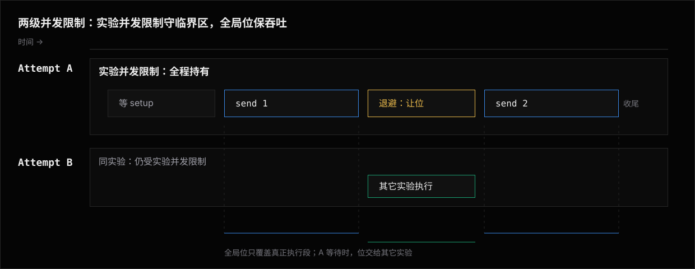
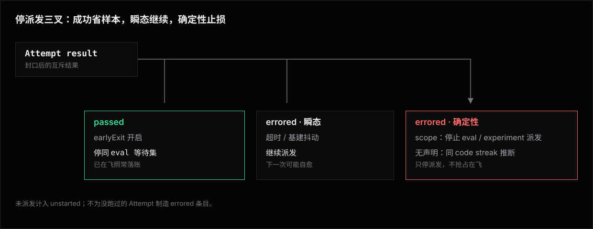

# Runner —— 执行引擎

运行器把「一批 eval」变成「一份结果」。
它拥有对所有被测对象都一样的部分:发现、有界并发、首过即停、缓存、报告编排。
被测对象的差异它一概不管——只对着 `Agent` 接口(统一动词 `send`)驱动。

## 职责边界

| | 内容 |
|---|---|
| **做** | 发现 eval、算指纹决定跳过、建 attempt 列表、有界并发调度、首过即停、把结果交给报告器、落盘 artifact、定退出码 |
| **不做** | 怎么驱动 agent(Agent / Adapter)、怎么声明 Assertion 或调用 Judge、结果存成什么格式(Record writer / Reporter) |

它是协调者,不是执行者。

## 发现

`runner/discover.ts` 扫 `evals/`,找所有 `*.eval.ts` 与 `*.eval.tsx`,`import` 后看默认导出。
两种扩展名同等对待,`.tsx` 供要在 eval 里写 JSX 的场景。
默认导出的三种形态各有 id 规则:

| 默认导出 | id | 排序 |
|---|---|---|
| 单个 eval | 文件 id | — |
| 数组 | 按位置生成 attempt,加零填充索引(`sql/0000`) | 数组顺序 |
| keyed record | 按合法业务 key 生成 attempt(`swelancer/15193`) | key 字典序 |

**发现顺序**是全仓唯一的 eval 排序口径:先按项目根相对路径升序排文件,文件内再按上表展开。
字典序即逐字符比较 Unicode 码位——不走 locale 排序,也不识别数字大小,`10-` 因此排在 `2-` 前面。
靠文件名定顺序时数字前缀要零填充到同样位数(`01-` / `02-` / `10-`)。

排完再应用过滤:位置参数(id 前缀,`weather` 命中 `weather/*`)与 `--tag`。
过滤只删条目,不改剩下条目的相对次序。

发现顺序有三个用处:id 稳定、[结果输出可比](#调度有界并发),以及[串行下的执行顺序](#确定的执行顺序把有效并发降到-1)。

`niceeval exp` 另从 `experiments/` 扫实验文件(默认导出 `defineExperiment` 的 `.ts`),据路径推导实验 id;目录路径只支持批量选择。
实验的 `evals` 谓词遍历发现结果、筛出这个实验要跑的 eval(展成多少 attempt 见[矩阵展开](#矩阵展开))。

没有另一种基于目录约定的隐式发现——沙箱型 eval 也必须有一个 eval 文件。

## 调度:有界并发

核心是 `Effect.forEach({ concurrency: "unbounded" })` 加**两级并发限制**。
每个 attempt 立刻有自己的 fiber,执行体要先过实验级并发限制、再拿到全局并发位,才真正开跑。
两级并发限制按**持有期**分工,这也是各自的用途边界:



| | ① 实验级并发限制 | ② 全局并发位 |
|---|---|---|
| 管什么 | 正确性,以及本实验自己的节奏 | 吞吐 |
| 什么时候取 | 进入 attempt(先于沙箱创建与两层作者 layer 的 `sandbox.prepare` 链) | 真正开始执行时 |
| 什么时候还 | Attempt 收尾完成之后 | 执行结束,或进入内部等待时 |
| 内部等待(退避睡眠、等实验级 `setup`) | 不释放 | 让位给别的 attempt |
| 名额域 | 该实验,每条 Invocation 自己 | 每条 Invocation 自己 |
| 撞限流时对外的压力 | 不向本实验放行更多 attempt | 让出的位立刻派给排队者,总压力不降 |

由此得到三条语义:

- `maxConcurrency: 1` 保证本 Invocation 内上一条 Attempt 收尾后才开始下一条。
- 实验级并发限制只让该实验自己的 attempt 排队,同批其它实验照常并发。
  串行化有共享状态的实验(如跨 eval 累积记忆)不拖慢整批的其它实验。
- 两条 Invocation 的实验并发限制不互相夹低。需要保护跨 Invocation checkpoint 时声明 `sharedState`，它取的是整段状态租约，不是 Attempt 名额。

全局位是纯调度参数,不承诺任何互斥语义。
「被限流时不加压」是单条 Invocation 内实验级并发限制的语义。多开终端后对外服务的总压力是各 Invocation 之和，配额仍归用户或外部编排。

报告回调走 **permit=1 的信号量串行化**,不阻塞执行 fiber。
结果最后按**发现顺序**排序(而非完成顺序),让输出稳定可 diff。

**全局上限的取值链**:`--max-concurrency` → 配置 `maxConcurrency` →**该沙箱 provider 的推荐默认值**。
取胜的那一层随值一起出现在 `PLAN` 行(`concurrency 19 (from flag)`),契约见[CLI · live 面板](feature/experiments/cli.md#运行中的-live-面板)。

| provider | 推荐值 | 为什么是这个数 |
|---|---|---|
| `docker` | 10 | 本地 daemon 建容器有开销 |
| `e2b` | 20 | 账户配额的保守估计 |
| `vercel` | 1 | sandbox session 并发限制严,再高就 429 |
| `local` | 1 | 独占串行,见下 |
| 自定义 | 它自己声明的 `recommendedConcurrency`(省略则 5) | provider 自己最清楚 |

「云的就能开大」这个直觉是错的。
推荐值反映的是 **provider 侧**约束(daemon 容量、API 配额、session 池大小),不是你的 agent API 限额。
后者按限额类型自己压:速率型与并发型该调哪个限制、贴线配置为什么压不住,见[限制全局并发](feature/experiments/use-case/并发/限制全局并发.md)。
实验文件里的 `maxConcurrency` 不参与这条全局取值链,只在该实验内部限流。

**独占串行(`exclusive`)**:provider 可以声明它的所有 attempt 共享同一份不可并发的底层资源,如 `local` 的同一棵真实工作树。
runner 对它加一道 provider 级串行限制,显式 `--max-concurrency` 或实验级 `maxConcurrency` 都不解除,同批其它 provider 照常并发。

这是正确性约束,不是调度参数。
声明是中性的 provider 元数据,核心不按 provider 名分支(契约见 [Sandbox · 本地执行](feature/sandbox/local.md))。

### 派发前的判分预检

计划里存在要真派发且会执行 judge 断言的 eval 时,派发开始前先对判分端点做一次最小探测。
预检失败只作废需要 judge 的那些 eval——它们的 attempt 不派发、逐条落成 `errored`(`error.phase: "judge.precheck"`),其余 eval 照常派发,与实验级 setup 失败的「派发前确定性失败」同一语义家族。
探测预算、重试与失败反馈的契约单源在[Judge · 派发前预检](feature/judge/library.md#派发前预检)。

## 派发顺序:瓶颈优先,追求最小总耗时

attempt 的**派发**顺序(全局并发位分配给谁的顺序)按**整批跑完的总耗时最短**这个目标排,不是发现顺序,也不是请求先后。
这一层不影响结果排序——结果仍按发现顺序输出。

**瓶颈由轮次数判定,不由 `maxConcurrency` 判定。**
`maxConcurrency: 1` 但只有 1 个 attempt 的 run 谈不上瓶颈,`maxConcurrency: 5` 但有 500 个 attempt 的 run 才是。
两者合起来才是这个 run 要跑多少**轮次**。

轮次越多,越该早、越该连续地占用并发位,总时长才接近「瓶颈自身的串行耗时」,而不是「瓶颈耗时 + 排在它前面的其它 run 先跑完的耗时」。
轮次少或不设实验级上限的 run 不构成瓶颈,随时见缝插针补进空出来的并发位,晚发不拖尾。

```text
effectiveWidth(run) = min(run.maxConcurrency ?? globalMaxConcurrency, globalMaxConcurrency)
priority(run)       = rounds(run) = ceil(attemptsOf(run).count / effectiveWidth(run))

onSlotFree():   # 初始 globalMaxConcurrency 个并发位视为同样多次空出
  grant(等待集中排序最前者)   # priority 降序 → run 发现顺序 → run 内 attempt 顺序
```

**run 内 attempt 顺序**按轮次排:`(attempt 序号, eval 发现顺序)`。
全部 eval 的第 0 次排在任何一条 eval 的第 1 次之前,一轮就是这批 eval 各跑一遍。

另一种排法是让同一条 eval 的 N 次 attempt 相邻,否决它是因为[首过即停](#首过即停earlyexit)会几乎省不下钱:并发一宽,这 N 次就一起派出去了,earlyExit 只能中止已经在跑的。
按轮次排时第 0 轮通过的 eval,后续轮次大多还没进等待集就被跳过。

优先级绑定在**并发位的分配**上,不是 fiber 的创建顺序上,「谁先开始等」不参与裁决。
这样定是因为 attempt 在请求并发位之前可能还有别的事要做,最典型是[实验级 `setup`](feature/experiments/architecture.md#实验级生命周期setup-与-teardown)的宿主机等待。

而瓶颈 run 恰恰常是带慢 setup 的实验(隧道、共享记忆服务)。
若按先来后到分配,它等完 setup 时队伍早被无 setup 的宽并发 run 排满,优先级在最需要生效的场景恰好失效。

`priority` 只在建 attempt 列表时算一次,用规划阶段已知的「每个 run 有多少 attempt」。
它不随运行中 earlyExit / fail-fast / budget 实际提前收尾而重算——那是动态优先级调整,复杂度不值得为一个尽力而为的启发式引入。

实验级并发限制不参与这条纪律,先来后到即可:同一 run 的 attempt 优先级相同,它们内部谁先谁后不影响总耗时。
等待中的 attempt 被中止(earlyExit、fail-fast、用户中断)时退出等待集,不占用后续分配。

**与实验级 setup 的组合是工作保全(work-conserving)的。**
等待 setup 的 attempt 不持有也不预留并发位,期间空位照常发给低优先级 run 见缝插针;setup 完成后该 run 按原优先级参与下一次分配。

代价是一次有界的起步延迟:setup 结束时若并发位全满,要等在飞 attempt 中最先完成的那个。
上界是一个 attempt 的耗时,且每个实验整场只付一次——第一个 attempt 挤进去之后,该 run 后续 attempt 一直按优先级拿位。

两个否决过的替代做法:

| 替代做法 | 为什么否决 |
|---|---|
| 为 setup 中的瓶颈 run **预留**并发位 | setup 耗时事先不可知,也可能失败(隧道冷启动重试、服务拉不起来)。预留等于拿一个并发位押注一段长度未知、可能白等的等待,真烧起来没有上界,失败时那个位是纯亏。相比之下 backfill 的代价有上界、可预测,也不因 setup 失败而放大 |
| **抢占**在飞的 attempt | 已花的沙箱与 token 成本不可回收 |

算法出处:单次 attempt 耗时未知且假设同批内大致均匀时,轮次数就是耗时的代理指标——这是把 identical-machine 调度的 LPT 规则推广到「moldable job」场景的标准做法。
「空位给最高优先级等待者 + 低优先级见缝插针」即批调度器的 backfilling;每个 attempt 只要一个并发位,不需要多资源预留式 backfill 的复杂度。

快慢实验混在一次命令里跑时看到的行为,见[快慢实验混跑](feature/experiments/use-case/并发/快慢实验混跑.md)。

### 确定的执行顺序:把有效并发降到 1

并发 > 1 时不承诺任何执行顺序。
派发按上面的瓶颈优先排,拿到并发位也不等于同时开跑——沙箱创建与各层 setup 的耗时本来就不同。
运行器只承诺三件事:

- **发现顺序稳定**:同一份工作副本上每次运行排出来都一样。
- **结果按发现顺序输出**:与本次开了多大并发无关。
  只要求读起来有序的场景到此为止,不必付串行的吞吐代价。
- **有效并发为 1 时,执行顺序等于 attempt 列表顺序**:上一条 attempt 收尾完成后下一条才开始,次序即 `(attempt 序号, eval 发现顺序)`——`attempts` 默认 1 时就是发现顺序本身。
  指纹命中而[携带](#缓存携带上一轮的结果)的 attempt 不派发,不进这条队列。

所以「`01-` 跑完再跑 `02-`」靠的是实验的 `maxConcurrency: 1`,加上这个实验只有一条 Invocation 在跑;命名只决定这条串行队列怎么排。
多开终端时两条 Invocation 各按自己的队列认领 eval,合起来的先后不再由发现顺序决定。
`sharedState` 可以防止两段 restore/save 交错，但不会合并两个选择集(见[并发 Invocation](feature/experiments/architecture.md#并发-invocation用例锁与共享状态租约))。
全局 `--max-concurrency 1` 只压当次 Invocation,压不住这一点。

搭配与前提见[固定执行顺序](feature/experiments/use-case/并发/固定执行顺序.md)。

### 矩阵展开

一次 `exp` 运行把按路径选中的多个单一配置展成 attempt,再 ×`eval × attempts`;每个配置先用自己的 `evals` 谓词遍历发现结果。
比如 2 个实验配置 × `attempts: 5` × 3 个 eval = 30 个 attempt。

汇总按 `(agent, model, eval)` 分组,给出**通过率** + 平均耗时 / token / 成本:

```text
fixtures/button   claude-code   pass@5 = 4/5 (80%)   mean 34s · 58k tok · $0.44
fixtures/button   codex         pass@5 = 3/5 (60%)   mean 41s · 72k tok · $0.39
```

用于衡量 agent 的稳定性(一次过 ≠ 可靠),以及跨 agent 的**质量 × 成本**对比。
不写实验时退化成单 agent × `attempts`。

## 首过即停(earlyExit)

取通过率本可以跑满 N 次,但若只关心「能不能做到」,先过一次即可停其余。

默认关,`attempts` 因此默认跑满 N 次,给出完整通过率分布——这是这个工具的核心指标(衡量 agent 稳不稳,见[矩阵展开](#矩阵展开)),默认不该被无声截断。
只想知道「能不能做到」、不在乎分布时,显式 `earlyExit: true`(或 `--early-exit`)打开。

三条停止派发的机制各管一类结果,互不混用:



- **只有 `passed` 触发首过即停。**
  每个 eval 配一个 `AbortController`,某 attempt 通过且 `earlyExit` 开就 `abort()` 同 eval 其余 attempt。
- **`errored` 不触发。**
  因一次 errored 停掉其余样本等于放弃重试机会,还会把基建抖动放大成整题无结果。
- **声明的致命错误熔断与 streak 推断并存、互不替代。**
  声明是作者背书下的第一次即停,streak 是无声明时的保守回退(熔断的契约见[执行失败分类](feature/error-classification/README.md#自愈阶梯与止损阶梯))。
- **send 执行层的瞬时故障不进这条判定。**
  可证明未受理的限流、连接建立失败在这之前已被有界重试吸收；streak 看到的 `agent-send-failed` 是重试耗尽或受理状态不安全后的最终 Attempt error。可信的 `Turn{status: "failed"}` 是可评分领域结果，不进入执行错误重试或 streak 推断(契约见[执行失败分类](feature/error-classification/README.md))。
- **earlyExit 不改变派发节奏,只减少已派发的浪费。**
  同一个 eval 的多个 attempt 该不该并发跑,由[有界并发](#调度有界并发)的并发位数决定,与 earlyExit 是否开无关:`attempts: N` 建的 N 个 fiber 一起进等待集,有几个位就并发跑几个,不会等前一个出结果再决定要不要派发下一个。
- **abort 只作用于还在等待集里的 fiber。**
  已经在跑的不受影响,跑完照样计入,除非 provider / adapter 自己接了 abort signal 提前终止。

「探到一次能过就停,过不了才继续跑下一次」这种严格串行的重试语义,是 `maxConcurrency: 1` 与显式 `earlyExit: true` 组合出的效果,搭配与可观察行为见[严格顺序重试](feature/experiments/use-case/并发/严格顺序重试.md)。
flag 的全流程见[`--early-exit` 用例](feature/experiments/use-case/首过即停.md)。

## 预算护栏(budget)

budget 按**域**计,不是全局总上限:

- 每个 experimentId 一个域,没有 experiment 时按 agent 名。
- 实验的 `budget` 字段与 `--budget` 替换设定的都是**每个域各自**的上限。
- 一次运行选中 N 个实验,就是 N 份各自独立的上限,总花费上界是各域之和。

判据只有一条:**已完成 attempt 的实测花费**。

- 一个域的已完成花费一旦到顶,就停止向该域派发新 attempt。
  已经在飞的照常跑完,不会被中途打断。
- 到顶之前不做任何预测性节流,并发完全由 `--max-concurrency` 与实验级 `maxConcurrency` 决定。
- 已花 + 在飞未结算的总花费因此可能短暂超出 budget。
  这是有意的取舍:budget 是防止无限烧钱的安全网,不是精确计费上限,不应该反过来限制吞吐。

拿不到成本数据时分两种:

- 连续多个**已经发起 agent turn** 的 attempt 都拿不到成本数据(agent 不报用量)→ budget 对该域不可执行,给一条去重后的 warning,不每个 attempt 重复提示。
- `sandbox.create`、setup 等发生在首个 agent turn 之前的错误没有成本事实 → 只报告其结构化 attempt error,不额外产生 budget warning。

预算耗尽而导致的未派发 attempt 数量计入运行[完成状态](#完成状态)的 `unstarted`,让整次运行的完成状态落在 `incomplete`,不能在 CI 里伪装成全绿。

命令行用法与面板读法见[`--budget` 用例](feature/experiments/use-case/预算上限.md)。

## Sandbox 预热与 Sandbox 复用:冷启动移出关键路径

沙箱冷启动的优先级排序(先预构建镜像或 template、再小准备、最后才是池化)在[Sandbox · 性能](feature/sandbox/architecture.md)。
provider 侧提供「创建、重置、销毁」的能力;什么时候预创建、什么时候复用是运行器的调度决策,契约如下:

- **Sandbox 预热**:开启后,运行器在调度开始时按近期可派发量预先创建同 spec Sandbox。
  Attempt 到达 `sandbox.create` 阶段时先领取预创建实例,领到则该阶段只计领取耗时,没有可领取实例时回落到即时创建。
- **Sandbox 预热不改准备链的执行顺序**:领到的 Sandbox 仍在 Attempt 里按[固定调用链](#准备链不进运行器但按顺序调它)走一遍两层作者 layer 的 prepare 链与分类账记账起点。
  预创建实例只在同一次 Run 内存活,Run 结束时未被领用的 Sandbox 一并销毁。
- **Sandbox 复用(`sandboxReuse: true`)**：Experiment 作者声明多条 Attempt 可以共用 Sandbox。
  每个 Sandbox 内部串行，Sandbox 之间可以并行。
  Case 创建与 Provider finalizer 每个 Sandbox 成对一次;两层作者 prepare、agent.ensure 循环与 Agent 生命周期逐 Attempt 执行,复用时 reset 后重新执行。
- **复用派发**：同时执行数不超过全局并发位和实验并发限制的最小值。
  `maxConcurrency: 1` 时本次 Invocation 同时最多运行一个 Sandbox。
  每次派发前确认 Sandbox 复用寿命不小于 Attempt deadline 与收尾预留时间；不足时续期,不能续期时停止旧 Sandbox 并创建替代 Sandbox。
  题间 reset、`SandboxReuseCapability` 与故障淘汰见[Sandbox 复用](feature/sandbox/reuse.md)。
- **复用与指纹缓存**:复用和普通 Experiment 使用同一套按指纹携带与 `--rerun` 规则；携带 Attempt 不创建 Sandbox，之后真实派发的 Attempt 照常走复用生命周期。
- **[`--keep-sandbox`](feature/sandbox/cli.md) 与 `sandboxReuse: true` 互斥**，组合在创建 Sandbox 前报错：留存的现场必须属于那一次 Attempt，不能被题间 `git reset` 抹掉后再当现场留下。
  Sandbox 预热不受影响——Run 结束时未被领用的预创建 Sandbox 照常销毁,留存只作用于跑过 Attempt 的 Sandbox。

## 缓存:携带上一轮的结果

规划阶段,运行器对每条 eval 算 `(eval 代码 + 相关配置)` 的指纹(`runner/fingerprint.ts`),据此决定哪些已落盘的 attempt 直接携带合入本次 Run、哪些要真派发。
派发的只是过不了判据的那些,所以「改一个 case 重跑」只花那一个 case 的时间,而不是全量。

指纹的输入清单、携带要过的门(条目侧的终态 / 指纹 / `timeoutMs` 资格,调用侧的 `--rerun` 口径与留存模式)、attempt 粒度与并发多开下的重规划,完整契约单源在[Experiments · 缓存与携带](feature/experiments/cache.md)。

## 超时:双层保护

- **Adapter 内层超时** —— agent CLI 自己的超时。
- **运行器外层超时** —— attempt deadline 用 Effect 的 interruption 中断 Scope 里的 verdict-producing 工作 fiber。
  超时折成 `errored` draft:`error.code = "timeout"`,`error.phase` = 中断时已打开的生命周期阶段。
- **外层 Scope 不关闭。**
  有界收尾(收尾链、留存决策)仍在同一个 Scope 的 release 里照常完成,与[Sandbox 的 Scope / finalizer 模型](feature/sandbox/architecture.md#留存keep与注册表)同一套语义:即使 agent 卡死也能强行收尾。

外层是回退,保证一个卡死的 case 不会挂起整批。

**deadline 从 `sandbox.create` 起算,不含等并发位的排队。**
一条 eval 拿到的执行预算因此只由 `timeoutMs` 决定,不随本次开了多大并发、队列排多长而缩水。
把排队算进去,同一条命令在 `--max-concurrency 2` 和 `20` 下就会产出不同的 `errored` 集合,还会加剧下面那条删失偏差——排得久的条件被系统性更早截断。

落盘侧按同一口径记 `executionMs`(见[Results · result.json](feature/record/architecture.md#resultjson)),[携带资格判据](feature/experiments/cache.md#携带资格timeoutms-不进哈希)拿它跟 `timeoutMs` 比,两侧量的是同一段时间。

**超时不丢证据。**
中断终止的是「继续执行」,不撤销「已经观察到的事实」。
事件接收器、usage 累计与 timing recorder 都归属 attempt 的外层 Scope,不随 body fiber 一起消失——这与[结果封口发生在 Scope release 之后](feature/record/architecture.md#resultjson)是同一条纪律,从 timing 推广到全部证据通道。

超时 attempt 的落盘因此与正常 errored 同构:

| 证据通道 | 超时下落什么 |
|---|---|
| `events.json` | 截至中断时刻已归一化的全部事件。进行中一轮已收到的部分照常保留,不新增事件种类,中断事实由 `error` 表达 |
| `usage` | 已累计轮次的如实值 |
| `sources` | 照常 |
| `diff.json` | 收尾链开始之前照常折叠一次 `workspace.diff`——沙箱此刻仍然活着,而「agent 走到了哪」正是超时诊断最需要的证据(计时记入收尾段,不入 `durationMs` 口径) |
| `artifacts` | 如实声明实际写出的文件 |

`show @<locator> --execution` 对超时 attempt 展示的是被打断前的真实执行过程,不是空壳。

## 证据采集失败

Runner 不按“发生在评分前还是评分后”粗分致命性，而是在采集前读取 Assertion collector 登记的证据需求。
非 optional 断言依赖的通道是 required；optional 断言和没有断言消费的报告 artifact 是 supplemental。

- required 采集失败不伪造空值，对应断言记 `unavailable`，最终按 Verdict 规则进入 `errored`。
- supplemental 采集失败追加带原 phase 的 diagnostic，省略没有成功写出的 artifact，继续 finalize 其它断言。
- OTel span 不参与断言，因此 `telemetry.configure` 与 `telemetry.collect` 失败始终走 supplemental 分支。
- 已存在致命错误时，后续收尾或 supplemental 采集只能追加 diagnostic，不能替换第一条 `AttemptError`。

例如 Terminal-Bench 只把 `run-tests.sh` 的 `CommandResult` 交给 `commandSucceeded()`。
Sandbox 在命令返回后消失、导致 diff 导出失败时，Runner 保留命令断言的 Verdict，并记下 `workspace-diff-unavailable`。
同一条 Eval 若声明 `t.sandbox.fileChanged()`，diff 就是 required，导出失败必须 `errored`，不能把空 diff 判成文件没改。

**超时线是删失线,不是中立的公平线。**
`timeoutMs` 压在耗时分布上沿时,测出的是「谁先撞线」而不是「谁做得完」。
对每个 attempt 背着固定协议开销的条件(记忆检索、额外收尾轮),同一条线系统性地更早截断它们;被截断的样本又从完成耗时统计中消失,让慢条件反而显得快(幸存者偏差)。

超时线应显著高于全部条件的自然耗时上沿。
耗时作为对比指标时按[删失口径](feature/reports/library/measures.md#官方-calculation)呈现,不把线值当实测。

## 准备链不进运行器,但按顺序调它

运行器不承载准备逻辑的内容,只固定各生命周期步骤的**调用点与顺序**,步骤内部做什么全部交给对应的作者或 Adapter 决定。
调用点从外到内:

| 层 / 步骤 | 调用点 | 紧邻的前后步 |
|---|---|---|
| 实验级 setup | `ExperimentDefinition.setup` | 第一个可派发 Attempt 之前;全部 Attempt 共用,宿主机侧 |
| 主 Sandbox 实例创建 | Provider 按配对唯一的 template 做 build / start / ready | 实验级 setup 之后;复用周期内的后续 Attempt 改为 reset 到题间重置点 |
| 两层作者 prepare | Eval 与 Experiment `sandbox` layer 的 `prepare()` 命令 | Case 就绪之后,每条 Attempt 完整重新执行;template owner 的命令先,另一 owner 随后 |
| Agent 安装 | agent.ensure 循环(`agent.ensure`) | 两层作者 prepare 之后;探测、缺失时配对安装层 install、复检 |
| 变更分类账记账起点 | `workspace.baseline` | Agent CLI 就绪之后;记账起点之后的写入才进入归因视图 |
| agent runtime setup | `SandboxAgent.setup`(`agent.setup`) | 记账起点之后;`test(t)` 之前 |
| Eval 主体 | `test(t)` | 作者按普通顺序上传文件、驱动 Agent、运行命令与断言;send 区间决定归因 |
| agent runtime teardown | `SandboxAgent.teardown` | Verdict 定稿后的第一段收尾 |
| 已登记 cleanup | 两层作者 layer 经 `context.onCleanup()` 登记的命令 | Agent teardown 之后;按全局准备顺序逆序执行 |
| Provider finalizer | Provider Case finalizer(整组关闭 service、volume 与日志) | 复用周期关闭时;fresh Sandbox 每 Attempt 一次 |
| 实验级 teardown | `ExperimentDefinition.teardown` | 全部 Attempt 与 Sandbox 收尾之后;中断和强清退出也执行 |

需要跨 Attempt 连续目录、服务或外部 checkpoint 时，`SandboxLayer.setup()` 在实际 Sandbox 创建后恢复，`teardown()` 在其退休、Provider finalizer 前回存；新 run 也从同一条 `setup()` 边界恢复。
完整时序、fresh / reuse 次数表与失败归属单源在[三方准备时序](feature/sandbox/lifecycle.md);题间重置点与多实例交错见[Sandbox 复用](feature/sandbox/reuse.md#完整生命周期)。

跨层收尾顺序固定为 Agent teardown → 已登记 cleanup 逆序 → reset / 退休决策 → 复用周期关闭时 Provider finalizer。
cleanup 只在 command 成功取得资源后经 `context.onCleanup()` 登记,未执行的命令不产生虚假 cleanup。

各层的形态并不相同,不能都套 `beforeAll` / `afterAll` 心智:

| 层 | 挂载点 | 节奏 | 管什么 |
|---|---|---|---|
| 实验级 | `ExperimentDefinition.setup` / `.teardown` | 每实验整场成对至多一次,宿主机侧 | 每实验一份的共享服务:隧道、mock server |
| 两层作者 layer | Eval / Experiment `sandbox` 字段上的 `.prepare(command)` | prepare 每 Attempt 重新执行,已登记 cleanup 逆序执行 | 实验准备与题目准备:装二进制、预热、checkout 题目仓库 |
| Agent 安装 | Adapter 的 ensure 声明与配对安装层,Runner 组装的 agent.ensure 循环 | 每 Attempt 重探,命中快速返回 | 装 Agent CLI:payload、平台探测、install 与复检 |
| agent runtime | `SandboxAgent.setup` / `.teardown` | 每 Attempt 成对一次 | 协议层:写鉴权与运行时配置 |

三条全局规则:

- **实验级与 agent runtime 是成对 Hook。**
  `teardown` 当且仅当同层 setup 时点已走到才执行,`setup` 抛错不豁免——半初始化的现场同样要扫尾。
- **两层作者 layer 没有成对 teardown。**
  cleanup 在 command 成功取得资源后经 `context.onCleanup()` 就地登记,Runner 按全局准备顺序逆序执行。
- **prepare 每条 Attempt 完整重新执行。**
  命令不能依赖「上一条 Attempt 已经运行过我」;昂贵动作由真实检查命中,预装 template 只让检查更快,不删除命令。

各层的语义与写法单源在各自的文档:

- 实验级:[Experiments · 实验级生命周期](feature/experiments/architecture.md#实验级生命周期setup-与-teardown),执行带 30s cleanup 超时上限。
- 两层作者 layer:[Sandbox Layer](feature/sandbox/layers.md)与[三方准备时序](feature/sandbox/lifecycle.md)。
- Agent 安装:[Agent Ensure](feature/adapters/architecture/agent-ensure.md)。
- agent runtime:[Agent 契约](feature/adapters/architecture/agent-contract.md#生命周期不变量)。

写在哪层容易错位,见[预置与收尾怎么放](feature/experiments/use-case/生命周期/)。

跨实验共享、生命周期长于一次 run 的外部服务(共享 DB、公司内网服务本体)仍然用外部编排(`docker compose` / CI 脚本)起停、经 env 传入——这类资源跨进程共享,不属于任何一次 run 的生命周期。
完整分工表见[Sandbox library](feature/sandbox/library.md)。

**下游分析**(二次评分、自定义指标)走 [reporter](observability.md#reporters),不另设运行 Hook。
这是从 agent-eval 的 `onRunComplete` 收敛过来的(见[设计参照](feature/experiments/reference/agent-eval.md#niceeval-没跟什么));NiceEval 自己的对应回调名是 `onInvocationComplete`。

## Reporter 与运行器事件

`Reporter` 是运行器与外部系统之间唯一的公开回调面:三个生命周期 Hook 加一条结构化事件流。
跨 Experiment 的边界是当次 Invocation,不是持久化 Run。

```ts
interface Reporter {
  onEvent?(event: ReporterEvent): void | Promise<void>;
  onInvocationStart?(evals: { id: string }[], shape?: InvocationShape): void | Promise<void>;
  onEvalComplete?(result: EvalResult): void | Promise<void>;
  onInvocationComplete?(summary: InvocationSummary): void | Promise<void>;
}
```

`onInvocationStart` 只接收 `evals` 与 `shape`,不接收单一 `agent`。
一次 Invocation 可能横跨多个 `(agent, model, flags)` 配置(`compare` 多 agent、一次运行选中多个实验文件),塞一个顶层 `agent` 参数只能代表其中一份配置,对其余配置是谎言。
需要知道这次 Invocation 涉及哪些 agent 时,从陆续到达的逐条 `EvalResult.agent` 去重派生,不读启动参数里的单值。

```ts
/** onInvocationStart 的运行规模:去重后 eval 数 × 配置(agent×model×flags)数 → 总 attempt 数。 */
interface InvocationShape {
  /** 去重后实际要跑的 eval 数(= evals.length)。 */
  evals: number;
  /** (agent, model, flags) 配置组合数;compare 多 agent 时 > 1。 */
  configs: number;
  /** 总 attempt 数(evals × configs × attempts);逐行输出与汇总计数都按它。 */
  totalAttempts: number;
  /** 本次运行实际生效的全局并发数(flag/env/config/sandbox 默认值解析后的结果);
   *  实验级 maxConcurrency 只在该实验内部限流,不改这个全局值。 */
  maxConcurrency: number;
  /** 本次 Invocation 的展示时间锚点；不承担 Run 或 Attempt 身份。 */
  snapshotStartedAt?: string;
}

/** 一次 Invocation 的纯运行时内存聚合(reporter 契约用);落盘格式契约在 niceeval/record 的 RunMeta / AttemptRecord,见 [Results · Architecture](feature/record/architecture.md)。 */
interface InvocationSummary {
  /** 项目名(来自 config.name),透传给 `niceeval view` 顶部 hero 显示。 */
  name?: LocalizedText;
  startedAt: string;
  completedAt: string;
  passed: number;
  /** 断言不通过的数量;不包含 errored。 */
  failed: number;
  skipped: number;
  /** 环境、超时、adapter、agent runtime 等执行错误数量;与 failed 互斥。 */
  errored: number;
  durationMs: number;
  usage?: Usage;
  estimatedCostUSD?: number;
  results: EvalResult[];
}
```

`InvocationSummary` 同样不携带顶层 `agent` / `model`:跨配置的一次 Invocation 没有单一身份可填。
每条 `EvalResult` 自带 `agent` / `model`,需要按 agent 分组或统计时从 `results` 派生,不读一个必然对某些行撒谎的顶层值。

这条裁决对内建与自定义 reporter 一视同仁——例如 Braintrust reporter 的 experiment 级 metadata 从收到的逐条 `EvalResult` 去重得到当次涉及的 agent 集合,而不是从启动参数读单一 agent。

`onEvent` 收到的结构化事件流:

```text
invocation:start           { evals, shape }
eval:start                 { eval, agent, model, attempt, experimentId }
eval:complete               { result }                # EvalResult,fresh 结果此时已带最终 locator(见下)
invocation:earlyExit        { evalId, experimentId }
invocation:budgetExceeded   { experimentId, budget, spent }
invocation:saved            { summary }
invocation:summary          { summary }
experiment:complete         { experimentId, completedAt, carriedResults, diagnostics, name? }
```

判别式联合逐条对应上表。
`eval:start` 仍带单一 `agent`——它是单个 eval 这一次派发实际用的那份配置,不是跨配置汇总,不受上面顶层单值裁决约束。

```ts
type ReporterEvent =
  | { type: "invocation:start"; evals: { id: string }[]; shape: InvocationShape }
  | { type: "eval:start"; eval: { id: string }; agent: Agent; model?: string; attempt: number; experimentId?: string }
  | { type: "eval:complete"; result: EvalResult }
  | { type: "invocation:earlyExit"; evalId: string; experimentId?: string }
  | { type: "invocation:budgetExceeded"; budget: number; spent: number }
  | { type: "invocation:saved"; summary: InvocationSummary }
  | { type: "invocation:summary"; summary: InvocationSummary }
  | {
      type: "experiment:complete";
      experimentId: string;
      completedAt: string;
      carriedResults: EvalResult[];
      diagnostics: readonly DiagnosticRecord[];
      /** 项目名(来自 config.name),同一 Invocation 内所有 Experiment 共享同一个值。 */
      name?: LocalizedText;
    };
```

`verdict` 是互斥的判定分类:`passed` / `failed` / `errored` / `skipped`,没有 `scored` 中间态。
`invocation:summary.failed` 只统计断言或评分不通过,宿主运行条件、超时、adapter 或 agent runtime 问题统计到 `errored`。

fresh attempt 的最终 `locator` 在构造调度计划时就由预先分配的 `runId` 与 `{evalId, attempt}` 算好、完成 Record root 碰撞登记，再传入执行体。
所以留存注册表、feedback、`eval:complete` 与落盘 `result.json` 从第一次观察起就是同一个值,reporter 不需要等 artifact 落盘。

终端反馈(human dashboard 与 `--json` 的单一 stdout 事件流)不消费这条 `Reporter` 事件流。
它们由一个独立的反馈 coordinator 消费另一条内部事件通道,只服务当前输出形态,不对外暴露,详见[CLI · 反馈 coordinator](cli.md#反馈-coordinator一个-run-只有一个终端协调者)。

## Experiment 收尾协议

一次 Invocation 可以横跨多个 Experiment,但落盘的完整性单位是 Run——每个 Experiment 一份、各自独立收尾(见[Results · run.json](feature/record/architecture.md#runjson))。

`experiment:complete` 是比 `invocation:summary` 更早、比单个 `eval:complete` 更粗的事件,标记「这一个 Experiment 已经彻底跑完」。
它让内建 Artifacts 精确地在那一刻封口对应的 Run,而不是等整个 Invocation 结束才一次性封全部 Run。

- **触发时机**:该 Experiment 的 `ExperimentDefinition.teardown`(若声明)完成之后、`invocation:summary` 之前。
- **谁消费**:内建 `Artifacts` reporter 订阅它,对每个 experimentId 各自调用它自己 Run 的 `snap.finish({ completedAt, diagnostics, name })`(见 [Results · Library](feature/record/library.md))。
- **`name`**:整次 Invocation 共享的项目名(来自 `config.name`),随每个 Experiment 各自的收尾一并落盘,不必等到 `invocation:summary` 才补写。
- **`carriedResults`**:该 Experiment 本次携带合入(fingerprint 命中、未真实执行)的历史终态结果,随收尾一并落盘。

跨 Experiment 共享的事实(用户中断、reporter 写失败、provider 级并发提示)不属于任何单个 Experiment,不走这条事件。
它们只出现在 `InvocationCompletion.reporterErrors` 或反馈流的运行级 diagnostic 里。

## 实验域诊断持久化

有一类操作性事实**属于某次 Run 整体、但定位不到单个 Attempt**——teardown 失败、budget 不可执行、实验级 Hook 超时。
这类事实必须落进对应 Run 的 `diagnostics`(见[Results · run.json](feature/record/architecture.md#runjson))。
只出现在运行期的终端反馈里不算完:反馈是这一次运行的即时通知,`run.json` 才是这次运行「发生过什么」的持久化事实。

产生处必须显式给出:

```ts
interface ExperimentDiagnosticInput {
  experimentId: string;
  code: string;
  level: "warning" | "error";
  message: string;
  /** 只能是产生处真实打开的生命周期阶段,实验域诊断通常是 "experiment.setup" / "experiment.teardown"。 */
  phase: LifecyclePhase;
  data?: Readonly<Record<string, JsonValue>>;
  command?: string;
  /** 同一 Run 内的折叠键;省略时以 code 折叠。 */
  dedupeKey?: string;
}
```

`experimentId` 只用于把这条诊断路由到正确的 Run,不进入持久化的 `DiagnosticRecord`。
持久化形状与 attempt 级 `DiagnosticRecord` 完全一致(见 [Results · run.json](feature/record/architecture.md#runjson)),因为归属已经隐含在该事实所属的 `run.json` 身份里,不重复存。

相同 `dedupeKey`(或省略时的 `code`)只在同一个 Run 内折叠、`count` 递增;不同 Experiment、不同 Run 各自独立计数,不跨 Run 合并。

这条持久化通路与运行期的即时反馈通路(`ctx.diagnostic` → 反馈流 →人读文本 / `--json` 展示)相互独立、互不派生:运行期反馈让操作者第一时间看到问题,持久化让读者事后从 `run.json` 回顾。

消费方(内建 Artifacts reporter、自定义 reporter)不得靠读反馈流通知的 key 或 message 反推该往哪个 Run 写。
每个产生处直接构造上面的 `ExperimentDiagnosticInput`,由运行器在该 Experiment 域内按 Run 累计,再通过 [`experiment:complete`](#experiment-收尾协议) 事件整批交给 Artifacts,由它在对应 Run 封口时一次写入。

## 完成状态

verdict 计数回答「每条 eval 判定成什么」,不回答「这次运行是否把计划全部跑完」。
完成状态是独立于 verdict 计数的第二个判定结果:

```ts
type CompletionStatus = "complete" | "incomplete" | "interrupted";

interface InvocationCompletion {
  status: CompletionStatus;
  /** budget 耗尽、run 级 fail-fast 或止损闸落下导致未派发的 attempt 数。 */
  unstarted: number;
  /** 首过即停在已知 verdict 下主动省略的计划次数——省下的重复验证,不算"未完整覆盖"。 */
  earlyExitUnstarted: number;
  reporterErrors: readonly ReporterError[];
}
```

- budget 耗尽、确定性错误触发 run 级 fail-fast(见[首过即停](#首过即停earlyexit)),或作者声明的致命错误熔断触发(见[执行失败分类 · 止损语义](feature/error-classification/README.md#止损语义))而停止派发时 → `incomplete`,`unstarted` 是这几类未派发 attempt 的合计。
- 用户或平台中断(Ctrl+C / SIGTERM)→ `interrupted`。
- 任一 [required reporter](cli.md#required-reporter) 写失败 → 非 `complete`;失败明细进 `reporterErrors`,`required` 字段区分它是否让整体判红。
- 首过即停省略的重复验证次数单独计入 `earlyExitUnstarted`,不进入 `unstarted`——它是已知 verdict 下主动省下的成本,不是遗漏。

CI 的最终判定(退出码、`result` 事件)必须读当场的 `InvocationCompletion`,不能只看 `passed` / `failed` / `errored` 计数:预算耗尽但零 `failed` / `errored` 的一次 Invocation 仍然不是「全绿」。

这个判定结果不自动进入 `.niceeval/`;需要留档时配置 `Json(path)` reporter 写 `InvocationSummary`。

## 退出码

退出码由 `InvocationCompletion.status` 与按 `(experiment, eval)` 折叠后的 verdict 共同决定。
两种输出形态(见[Experiments · CLI 反馈模型](feature/experiments/cli.md))共用同一套语义:

- `0` —— `status: "complete"`,且没有任一 `(experiment, eval)` 组合判定为 `failed`(含 `--strict` 下 soft 未达标而改判的)或 `errored`。
- `1` —— 至少一个组合 `failed` / `errored`;或 `status: "incomplete"`(budget 未跑完全部计划);或存在 required reporter 写失败。
- `2` —— CLI / 运行器未捕获的崩溃。
- `130` —— `status: "interrupted"`(用户或平台中断)。

退出码按 eval 折叠,不按 attempt 折叠:同一个 eval 被 `attempts` + `earlyExit` 重试吸收的失败(先挂一次、后来某次通过)不会让进程判红,只有该 eval 最终判定为 `failed` / `errored` 才计入。

## 相关阅读

- [Architecture](architecture.md) —— 运行器在四段数据流里的位置与端到端时序。
- [并发怎么配](feature/experiments/use-case/并发/) —— 两级并发限制的搭配速查:串行 / 降速 / 严格重试 / 快慢混跑。
- [Experiments · 缓存与携带](feature/experiments/cache.md) —— 指纹输入、携带判据与 `--rerun` 三档的单源。
- [Experiments · CLI 反馈模型](feature/experiments/cli.md) —— 人读文本与 `--json` 怎样展示这篇讲的调度、预算与完成状态。
- [CLI](cli.md) —— `exp` 怎么把这些调度行为接进 Effect 核心与反馈 coordinator。
- [Sandbox](feature/sandbox/README.md) —— 预热与复用的 provider 支持,以及预置逻辑放哪。
- [Observability](observability.md) —— 运行器产出的 artifact 与报告。
