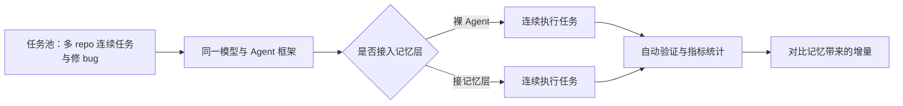

今天，我们发布 MemoryBench：一套把主流 memory 产品接上 Agent 后，在真实编程任务中检验其表现的基准。

过去两年，模型本身的单次能力已经被测得很透：问答、代码生成、单文件修改，各种 leaderboard 排得密密麻麻。但真正把 Agent 推向生产环境的，是另一个问题：当任务横跨多个仓库、持续数小时，Agent 还记不记得自己做过什么、查过什么、为什么这么做？

MemoryBench 想回答的就是这个问题。它用同一模型、同一任务，唯一变量是"接不接记忆层"，在连续的真实开发任务里量化记忆机制到底起了多少作用。

## 为什么 Agent 记忆突然成为焦点

先看发生了什么。Agent 的用法正在快速变化：从单次问答、单文件补全，走向跨仓库调研、连续修 bug、跑完一个数小时的多步骤工程任务。在这个尺度上，上下文窗口再怎么扩容也装不下全部历史，Agent 必须把信息存下来、再取回来。

于是记忆层成为长时程工作的关键组件。mem0、Zep、Letta、MemGPT 等 memory 产品在过去一年集中爆发，各家都在讲自己的存取策略、压缩算法、检索方案。问题是：这些设计在演示里都很好看，可一旦接上真实 Agent、面对真实任务，到底谁真的有用？

这正是当前最缺的一环：产品在快速迭代，评测却停在原地。

## 现有 memory 评测测错了东西

现有的 memory 基准，比如 LoCoMo、LongMemEval，测的是"回忆准确率"：喂一段很长的对话，然后问模型能不能把里面的某个事实、某个时间点、某个约束捞出来。

回忆准确率当然重要，但它回答的是"记忆保真度"问题，不是"记忆有用性"问题。一个能把十万 token 对话里的每句话都背下来的记忆系统，未必能让 Agent 在下一个 repo 里少走一次弯路、更快修好一个 bug。真实开发里的记忆是拿来用的：查过的 API 约定、改过的函数、踩过的坑、下一步的计划，这些信息在关键时刻被正确取用，才算有效。

换句话说，回忆准确率高，不等于下一个 bug 修得更快。我们需要一个直接回答"记忆在真实开发里起了多少作用"的基准，而不是"记忆存了多少东西"的基准。

## MemoryBench 是什么

MemoryBench 就是为这个问题设计的。它的核心设定只有一条：同一模型、同一 Agent 框架、同一组连续任务，唯一变量是是否接入记忆层。

任务不是单轮的。Agent 要在多个 repo 之间连续解决真实的开发任务、修复真实的 bug，整个过程持续多个步骤、跨越多份代码。在这个设定下，我们对比裸 Agent 和接了记忆层的 Agent，看记忆机制到底带来了多少增量。

短任务 benchmark 回答的是"能不能做"，MemoryBench 回答的是"记忆让连续任务做得更好吗？"它和 Terminal-Bench Challenges 同源：都是长时程、token 密集、跑在真实环境里的评测，只是 MemoryBench 把"记忆层"作为被考察的变量。

## 怎么测：任务设计与指标

任务池由真实的开发任务构成：多 repo 连续任务、修 bug、按 issue 实现功能。每个任务都要在真实环境里跑通验证，Agent 的产出会被自动化检查，而不是靠人眼打分。

控制变量是整套设计的核心。模型固定、Agent 框架固定、任务顺序固定，唯一变化的是记忆层。这样观察到的差异才能归因于记忆机制本身。

指标上我们关注三件事：任务完成率，看能不能跑完；一次通过率，看第一遍就做对的比例；修复 bug 数，看单位时间内修掉多少。具体数字会在后续版本中逐步公布，本文先讲方向性结论。

## 初步发现（方向性）

第一批结果已经能看出一些方向，具体数字会在后续公布。

第一，记忆确实提升完成率，但幅度因任务类型而异。在跨仓库、需要反复回看历史信息的任务上，记忆层的增益最明显；在单文件、一次性就能做完的任务上，增益趋近于零。

第二，存在反直觉的情况：部分任务上，记忆反而拖慢 Agent。检索命中无关信息、把过时的记忆当成当前事实，都会让 Agent 在错误的方向上多花时间。记忆不是加了就一定好，质量与时机同样重要。

第三，产品排名与回忆准确率排名不完全一致。在回忆类基准上得分最高的产品，并不总是在真实任务里带来最大提升。这从侧面印证了：回忆准和用得好，是两件事。

## 如何参与

我们欢迎各种 memory 方案来接受检验。提交方式与 Terminal-Bench Challenges 相同：提供一个包含最终产出物和完整 agent logs 的公开仓库，说明你用的记忆产品、接入方式与运行配置，我们会在同一套任务上复跑并更新 leaderboard。

Leaderboard 会持续更新。随着任务池扩充，历史成绩也可能因任务集变化而重新排序，我们会保留每次运行的完整日志以保证可复现。

期待看到更多 memory 产品、更多接入思路出现在榜上。记忆是 Agent 长时程工作的下一个瓶颈，我们一起把它测清楚。
