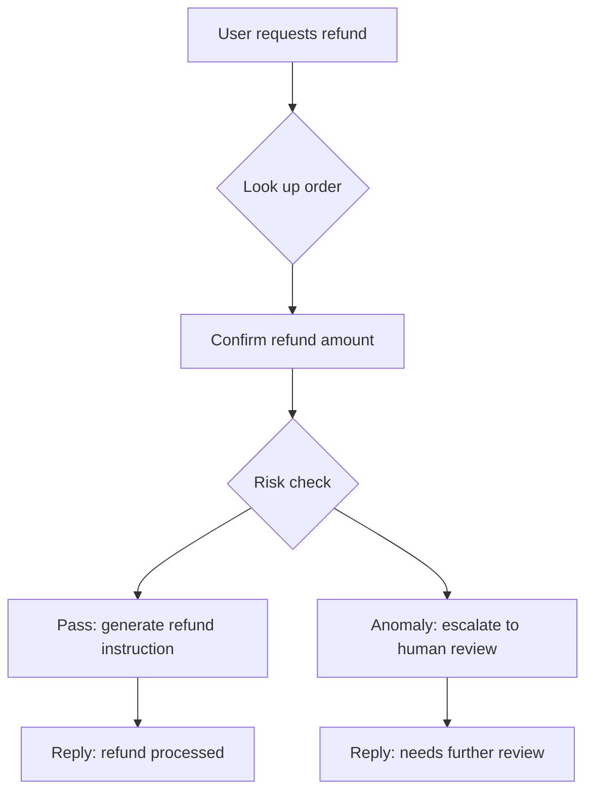

If you're building an AI application with LangChain or a similar framework, you've probably hit this: your prompt looks perfect in the playground, but the moment you wire up tools and run multi-turn conversations, behavior turns unpredictable. You start writing tests, and quickly discover that the approach you used to test prompts doesn't transfer to agents at all.

That's not a mistake on your part. The root cause is that prompt evaluation and agent evaluation are two fundamentally different paradigms.

## Prompt evaluation: single-turn, static, outcome-driven

Prompt evaluation is intuitive. You give the model an input, it returns an output, and you judge whether that output is good. It's like grading a fill-in-the-blank quiz: an answer is either right or wrong.

Typical metrics include answer relevance, factual accuracy, and format compliance, sometimes with toxicity or hallucination detection layered on top. A mature set of tools has grown up around this paradigm — DeepEval, Promptfoo, LangFuse — and they all do the job well, as long as all you need is to evaluate a prompt.

In one line: prompt evaluation asks whether the output is correct.

## Agent evaluation: multi-turn, dynamic, process-driven

An agent isn't a student handing in a filled-out quiz. It's a clerk who has to get through an entire process. It calls tools, reads back results, decides what to do next, loads skills, switches states — and none of that intermediate behavior is visible to a prompt evaluation tool.

In other words, the question agent evaluation asks isn't "was the final answer correct," it's "was the path taken correct."

Take an example. You have a refund agent. A user requests a refund, the agent looks up the order, confirms the amount, generates a refund instruction, and replies "your refund has been processed." The final output is completely correct. But afterward you discover it skipped the risk check. This refund amount exceeds the user's total spend over the past six months — an anomaly. Prompt evaluation would give this run a perfect score, because the output text is flawless. Agent evaluation would fail it outright, because a critical node is missing from the decision path.



This is the extra dimension agent evaluation adds: whether tool calls happen at the right time with the right arguments, whether state transitions across multiple turns make sense, whether skill loading fires as expected. These aren't nice-to-haves — they're the baseline.

## The core difference

Put the two paradigms side by side and the difference becomes clear:

| Dimension | Prompt evaluation | Agent evaluation |
|---|---|---|
| Unit of evaluation | Single input/output pair | Full session trace |
| Time dimension | Static snapshot | Multi-turn dynamic process |
| What's evaluated | Output text quality | Decision path (tool choice, arguments, skills, state) |
| Cost of failure | A sentence in the output is wrong | A wrong action already had side effects (sent an email it shouldn't have, called an API it shouldn't have) |
| Typical tools | DeepEval, Promptfoo, LangFuse | NiceEval |

The key difference is in the last row. The tools on the left don't transfer to the right — not because they lack features, but because the underlying model is entirely different. They were built to look at output, and they can't see an agent's execution trace.

## NiceEval

NiceEval makes a clear design tradeoff: it evaluates only an agent's execution behavior, not the prompt text itself.

### A real evaluation case

Here's the code:

```ts
import { defineEval } from "niceeval";
import { includes } from "niceeval/expect";

export default defineEval({
  description: "Test that the agent looks up the account, confirms entitlements, and executes cancellation correctly in a subscription-cancellation scenario",
  async test(t) {
    const turn = await t.send("I want to cancel my Pro subscription");

    t.toolOrder(["lookup_account", "get_subscription", "cancel_subscription"]);

    t.check(turn.message, includes(/cancel|refund|subscription/i));

    t.judge.autoevals
      .closedQA("Did the assistant confirm the refund amount and entitlement changes with the user before executing the cancellation?")
      .atLeast(0.7);
  },
});
```

There's no "what the expected output should be" in this code. No golden dataset, no pre-written canonical answer. What it asserts is the agent's behavior: is the tool-call order correct (`toolOrder` — or `eventOrder` if you care about the raw event stream underneath)? Did it confirm the entitlement change before executing the cancellation? Then, as a final step, an independent judge LLM makes an open-ended quality call. That's where prompt evaluation and agent evaluation diverge at the implementation level.

The evaluation logic is decoupled from the agent under test. Swapping models or switching prompt configurations is just a flag change in the experiment file — the evaluation side doesn't move.

## How to choose

If your product today is a single-turn chatbot, a text classifier, or a summarizer, prompt evaluation tools are enough. DeepEval or Promptfoo, plus a handful of test cases, will cover your quality needs.

But the moment your system starts calling tools, running multi-turn conversations, and loading skills, you need agent evaluation. That's not a feature upgrade — it's a paradigm shift. What you need isn't a stronger prompt scorer; it's an evaluation framework that can trace the full decision path.

The two aren't a replacement relationship — they're a progression. The value NiceEval gives you is this: on the day you move from a prompt product to an agent product, you won't find your evaluation setup is a blank page.
