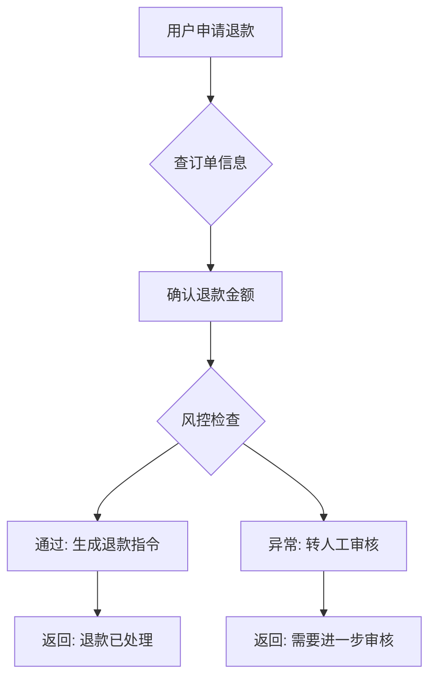

如果你正在用 LangChain 或类似的框架构建 AI 应用，你一定遇到过这个问题：你的提示词在 playground 里表现完美，但一接上工具、一跑多轮对话，行为就变得不可预测。你会开始写测试，然后很快发现：原本用来测 prompt 的那套方法，放到 Agent 上根本不灵。

这不是你的问题。根本原因在于，Prompt 评估和 Agent 评估是两个完全不同的范式。

## Prompt 评估：单轮、静态、结果导向

Prompt 评估的思路非常直观。你给模型一个输入，它返回一个输出，你评判这个输出好不好。就像批改一份填空题答卷：答案对就是对，错就是错。

典型的评估指标包括回答相关性、事实准确性、格式合规，偶尔加上毒性检测或幻觉检测。围绕这套范式已经长出了一批成熟的工具：DeepEval、RAGAS、LangFuse，它们都做得不错，在你只需要评估 prompt 的时候。

一句话总结：Prompt 评估问的是"输出对不对"。

## Agent 评估：多轮、动态、过程导向

Agent 不是一个填完就交卷的学生。它是一个需要走完完整流程的办事员。它要调用工具、读回结果、判断下一步、加载技能、切换状态，这些中间行为，prompt 评估工具根本看不见。

换句话说，Agent 评估的关键不是"最终回答对不对"，而是"走的路对不对"。

举个例子。你有一个退款 Agent，用户申请退款，它查了订单、确认了金额、生成了退款指令、返回了"退款已处理"。最终输出完全正确。但你事后发现，它跳过了风控检查这一步。这笔退款金额超过了用户过去半年的消费总额，属于异常行为。Prompt 评估会给这次执行判满分，因为输出文本毫无破绽。Agent 评估会直接判不及格，因为决策路径上少了一个关键节点。



这就是 Agent 评估多出来的维度：工具调用的时机和参数对不对、多轮对话中的状态转换是否合理、技能加载是否按预期触发。这些不是锦上添花，是底线。

## 两者的核心差异

把这两个范式放在一起，差异会变得非常清晰：

| 维度 | Prompt 评估 | Agent 评估 |
|---|---|---|
| 评估单位 | 单次输入输出 | 完整会话轨迹 |
| 时间维度 | 静态快照 | 多轮动态过程 |
| 评估对象 | 输出文本质量 | 决策路径（工具选择、参数、技能、状态） |
| 失败代价 | 输出一句话说错了 | 错误动作已产生副作用（发了不该发的邮件、调了不该调的 API） |
| 典型工具 | DeepEval、RAGAS、LangFuse | NiceEval |

关键区别在于最后一行。左边的工具很难直接搬到右边，不是功能不够，而是模型完全不同。它们天生是为了看"输出"而设计的，看不到 Agent 的执行轨迹。

## NiceEval

NiceEval 做了一个清晰的设计取舍：它只评估 Agent 的执行行为，不评估 prompt 文本本身。

### 一段真实的评估用例

先看代码：

```ts
import { defineEval } from "niceeval";
import { includes } from "niceeval/expect";

export default defineEval({
  description: "测试 agent 在取消订阅场景中正确查询账户、确认权益、执行取消",
  async test(t) {
    const turn = await t.send("我想取消我的 Pro 订阅");

    t.toolOrder(["lookup_account", "get_subscription", "cancel_subscription"]);

    t.check(turn.message, includes(/取消|退款|订阅/));

    t.judge.autoevals
      .closedQA("助手是否在执行取消前向用户确认了退款金额和权益变更？")
      .atLeast(0.7);
  },
});
```

这段代码里没有"期望输出应该是什么"。没有 golden dataset，没有预先写好的标准答案。它断言的是 Agent 的行为：工具调用的顺序对不对（`toolOrder`，如果关心更底层的原始事件流也可以用 `eventOrder`）？有没有在执行取消前确认权益变更？最后再用一个独立的裁判 LLM 做开放式质量判断。这就是 Prompt 评估和 Agent 评估在实现层面的分野。

测评逻辑和被测评的 Agent 是分离的，想换模型或切换 prompt 配置，改 experiment 文件的 flag 就行，评估侧不用动。

NiceEval 是 CorrectRoadH 开发的开源项目，瞄准的正是 Prompt 评估工具够不着的那片空白：当你的系统不再是一个黑盒，而是一串工具调用、多轮对话和状态转换的链条时，你需要的不是一个更强的 prompt 打分器，而是一个能追踪完整决策轨迹的评估框架。

## 开发者怎么选

如果你现在的产品是一个单轮 chatbot、文本分类器或摘要生成器，Prompt 评估工具完全够用。DeepEval 或 RAGAS 加上几组测试用例，足以覆盖你的质量需求。

但一旦你的系统开始调用工具、跑多轮对话、加载技能，就必须上 Agent 评估。这不是功能升级，是范式切换。你需要的不是一个更强的 prompt 打分器，而是一个能追踪完整决策轨迹的评估框架。

两者不是替代关系，是递进关系。NiceEval 给你的价值在于：当你从 prompt 产品走到 agent 产品的那一天，你不会发现自己的评估体系是张白纸。
